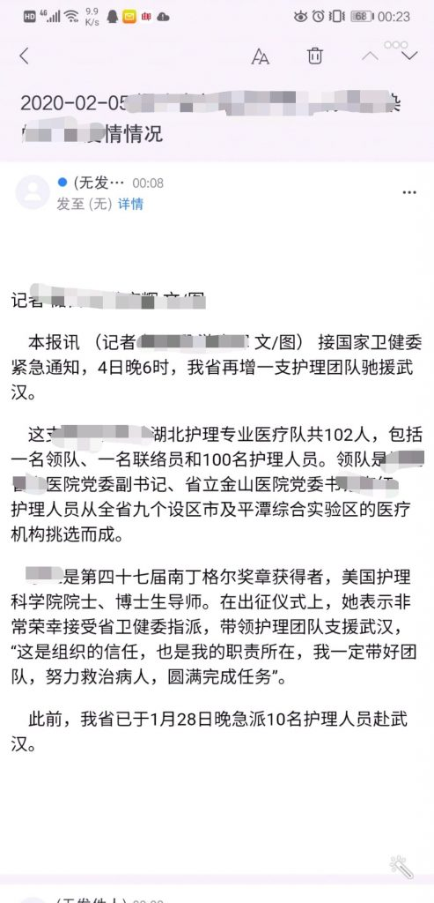

这是一个python项目。

使用到的技术包括爬虫和发邮件
<!--more-->
代码如下：
``` python
#!/usr/bin/env python
# -*- coding: utf-8 -*-
# @Time    : 2020/2/5 22:49
# @Author  : Johnathan Lin
import time
import requests
import random
import json
import re
from bs4 import BeautifulSoup
import smtplib
from email.mime.text import MIMEText
from email.header import Header
from urllib.parse import urljoin
from bs4.element import NavigableString

# 第三方 SMTP 服务
mail_host = "smtp.163.com"  # 设置服务器
mail_user = "你的邮箱"  # 用户名
mail_pass = "你的密码"  # 口令

# 发送人和接收人
sender = '你的邮箱' # 自己发给自己就可以了，
receivers = ['你的邮箱']  # 接收邮件，可设置为你的QQ邮箱或者其他邮箱

# 爬虫请求头
headers = {
    'User-Agent': 'Mozilla/5.0 (Windows NT 10.0; Win64; x64) AppleWebKit/537.36 (KHTML, like Gecko) Chrome/77.0.3865.90 Safari/537.36'
}


def send_mail(date, msg):
    """
    发送邮件
    :param date: 日期
    :param msg: XX内容
    :return:
    """
    mail_msg = msg
    message = MIMEText(mail_msg, 'html', 'utf-8')
    message['From'] = Header("我的发件邮箱", 'utf-8')
    message['To'] = Header("我的收件邮箱", 'utf-8')

    subject = date + ' ' + 'XXXXXXX情况'
    message['Subject'] = Header(subject, 'utf-8')

    try:
        smtpObj = smtplib.SMTP()
        smtpObj.connect(mail_host, 25)  # 25 为 SMTP 端口号
        smtpObj.login(mail_user, mail_pass)
        smtpObj.sendmail(sender, receivers, message.as_string())
        print("邮件发送成功")
    except smtplib.SMTPException as e:
        print("Error: 无法发送邮件")
        print(repr(e))


def regular_res(res):
    """
    把不规则json转为规则json
    :param res: 请求得到的字符串
    :return: 合法的json字符串
    """
    res = re.sub(r'\n', '', res)
    res = re.sub(r'\t', '', res)
    res = re.sub(r'chnldesc', '\"chnldesc\"', res)
    res = re.sub(r'recordCount', '\"recordCount\"', res)
    res = re.sub(r'docs', '\"docs\"', res)
    res = re.sub(r'docid', '\"docid\"', res)
    res = re.sub(r'title', '\"title\"', res)
    res = re.sub(r'url', '\"url\"', res)
    res = re.sub(r'time ', '\"time\"', res)
    return res


def crawl_data(date):
    """
    爬取文档
    :param date: 日期，用于测量是否是当天的
    :return: 目标页面的url
    """
    url = 'http://xxxxxxxxxx?r=' + str(random.random())
    response = requests.get(url, headers=headers)
    res = str(response.content, encoding='utf-8')
    response.close()
    res = regular_res(res)
    json_obj = json.loads(res)
    for doc in json_obj['docs']:
        if doc['title'] == 'XXXXXXXX情情况' and doc['time'] == date:
            return doc['url']
    return ''


def timestamp_to_date(timestamp):
    """
    时间戳转时间年-月-日
    :param timestamp: 时间戳
    :return: 时间字符串
    """
    return time.strftime(time.strftime("%Y-%m-%d", time.localtime(timestamp)))


def crawl_content(res_url):
    response = requests.get(res_url, headers=headers)
    html = str(response.content, encoding='utf-8')
    response.close()
    html_content = BeautifulSoup(html, 'lxml')
    news_content = ''
    news_block = html_content.select('div.TRS_Editor')[0]
    [s.extract() for s in html_content.select('style')]
    [s.extract() for s in html_content.select('script')]
    for block in news_block.contents:
        if not isinstance(block, NavigableString):
            del block['style']
            del block['class']
            del block['align']
            # print(block.name)
            if block.name == 'a':
                block['href'] = urljoin(res_url, block['href'])
            if block.name == 'h2' or block.get_text().strip() == '':
                continue
        news_content += str(block).replace('\r', '').replace('\n', '').replace('\t', '').strip()
    return news_content


if __name__ == '__main__':
    # # 2.6的时间戳
    timestamp = 1580918400
    while (True):
        # 每隔60秒爬一次
        time.sleep(60)
        # 获取下次需要的日期
        date = timestamp_to_date(timestamp)
        # 请求得到目标url
        res_url = crawl_data(date)
        if res_url == '':
            continue
        # 找到相应的请求，爬取内容
        news_content = crawl_content(res_url)
        # 发送邮件
        send_mail(date, news_content)
        # 爬取下一天的内容
        timestamp += 86400
        # 2.9之后停止
        if timestamp == 1581264000:
            break
```
使用网易邮箱app，可以第一时间接到自己发的邮件。

这里测试过QQ邮箱，把我的邮件判定为垃圾邮件，直接被退回了。

测试结果：

（我做完然后发现爬不动的时候，感觉到了自己在吃人血馒头，故将人名隐去）

在本地测试通过后，放到服务器上，使用
```shell
nohup python3 main.py &
```
放在后台执行，本以为万事大吉，结果才爬了一小会人报了错。
```
ConnectionResetError: [Errno 104] Connection reset by peer
```
服务器把我的连接请求关闭了。

网上查找资料的结果是，爬取过频，对面关闭服务器我还继续请求。

但我一分钟请求一次，也不算特别快了。

我当然可以写个方法，在读取异常之后继续爬，如：
```python
def request_while_response(url, type, headers, data, open_proxy, sleep_time):
    """
   发送请求,规避10054错误，直至请求成功
   :param url: 请求路径
   :param type:  请求类型（get或post）
   :param headers: 请求头
   :param data: 请求参数对象
   :param open_proxy:  是否使用代理
   :return:  请求得到的文本
   """
    r = ''
    while True:  # 循环
        try:
            # request()是发送请求的方法，我将requests包封装成了
            r = request(url, type, headers, data, open_proxy)
        except (requests.exceptions.SSLError, requests.exceptions.ConnectionError, requests.exceptions.ReadTimeout) as e:
            if 'bad handshake' in str(e) or '10054' in str(e) or 'Read timed out' in str(e):  # 上述2种异常
                time.sleep(sleep_time)
                continue  # 继续发请求
            else:
                raise Exception(e)  # 其他异常，抛出来
        break  # 无异常就跳出循环
    return r  # 返回响应结果
```
但总归是做贼心虚，还是罢了。