## 系统及软件配置
### 系统配置
内存：16g 2400
cpu：i5 9400F
### 软件配置 
 - Windows 10 1903版本
 - VMware workstation 15.10
 - CentOS centos-release-7-7.1908.0.el7.centos.x86_64
- Java jdk-8u241-linux-x64.tar.gz
- Scala  scala-2.11.8.tgz
<!--more-->
值得一提的是，win10 1903版本与VMware 15.10之前的版本不兼容，会出现卡死（虚拟机繁忙）的问题，该问题在15.10版本解决。
资源来源于网络：
**VMware 15.10** 链接：https://pan.baidu.com/s/1bpF3M1V3qPydQgGl-hUC1g 提取码：sb8t 
**CentOS 7.7** 链接：https://pan.baidu.com/s/1xFOlCvNrmXXwciVNOL2Pew 提取码：wxdx
**Java jdk-8u241-linux-x64.tar.gz** 链接：https://pan.baidu.com/s/1E1TyObvyO6iQUW44lTCqDQ  提取码：6xw9 
**Scala scala-2.11.8.tgz** 链接：https://pan.baidu.com/s/1TQB-wnffHh0i2aqzzfSi6A 提取码：iowh

## 安装前的准备
### 查看Windows下的网络配置
以Windows 10 1903为例（windows下控制台输入“winver”可以看自己windows版本），在控制面板->网络和Internet->网络连接中，可以看到本机上的网络配置。本次搭建这个集群，我们需要虚拟机和物理机（也就是windows）共用一个网络，所以需要使用桥接模式。
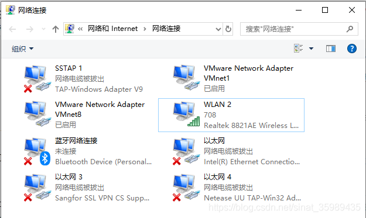
本人电脑联网时使用的是这个WLAN 2，它使用的网卡是Realtek 8821AE .... 的，记住这个名字。
### 配置VMware 虚拟网络编辑器
**使用管理员权限**打开VMware，菜单栏的编辑->虚拟网络适配器：将桥接模式的“桥接到”指向刚才记下的Realtek 8821AE，点击确定保存配置。
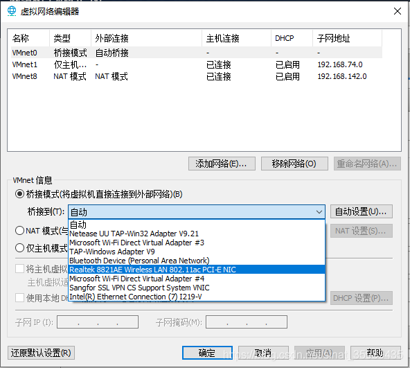
同时还要记住我WLAN 2这张网卡的网络配置信息：（windows cmd输入ipconfig查看）
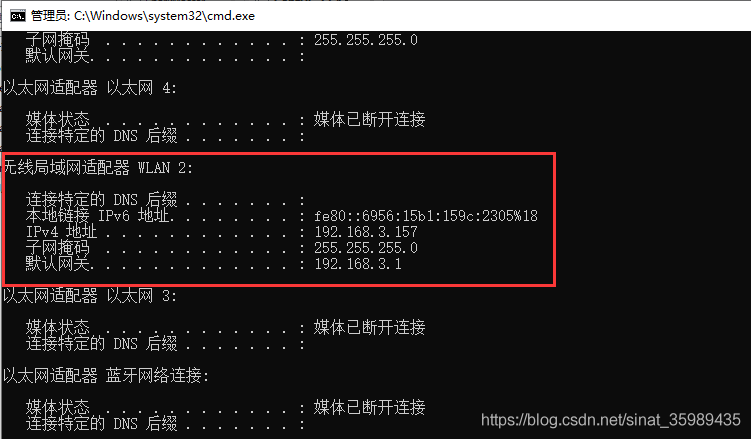
## 集群及网络配置
根据刚才WLAN 2网络配置信息可知，我的虚拟机的网卡只能配置为192.168.3.***。
你得根据自己网卡上的网络配置去修改虚拟机网卡配置。
| 序号 | IP地址 | 机器名| 运行进程| 核数/内存 | 用户名 | 
|----    | -----      |--         |--              |--               |--         | 
| 1  | 192.168.3.30|master |NN/SNN/DN/RM<br>Master/Worker|1核/3G|spark  | 
|2  | 192.168.3.31|slave1|DN/NM/Worker|1核/2G|spark  | 
| 3  | 192.168.3.32|slave2|DN/NM/Worker|1核/2G|spark |
用到的目录：
/app,/app/soft,/app/compile,/app/spark,/home/spark
## 开始安装
### 搭建集群样板机
#### 在VMware中安装CentOS
##### 新建虚拟机
菜单栏，文件->新建虚拟机
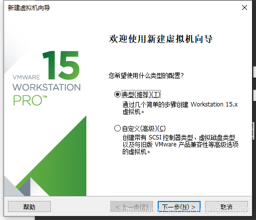
选择刚才下载的CentOS镜像：
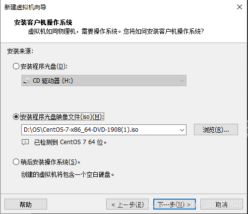
一路下一步到这里，点击“自定义硬件”把内存调成3G，网络适配器调成桥接模式，然后完成并启动。
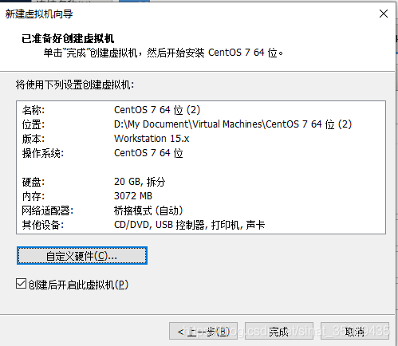
按↑键，选中Install CentOS 7，再按Enter键开始安装。
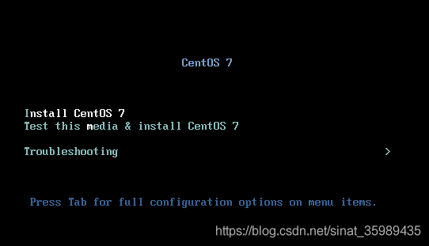
##### 安装CentOS 7
选择语言简体中文后，进入到这个界面：
点击这个“软件选择”，进入选择界面：
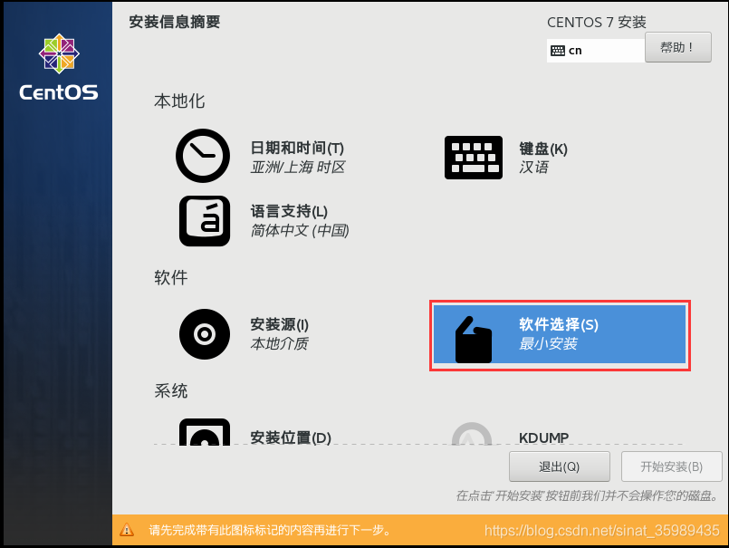
勾选GNOME桌面，然后自定义勾选需要的附加选项，我这里只选了“兼容性程序库”和“系统管理工具”，之后如果有缺少软件的话，之后再补装就好。点击左上角完成。
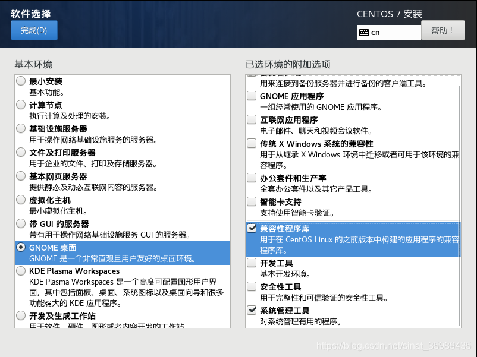
选择网络和主机名，可以配置网络。
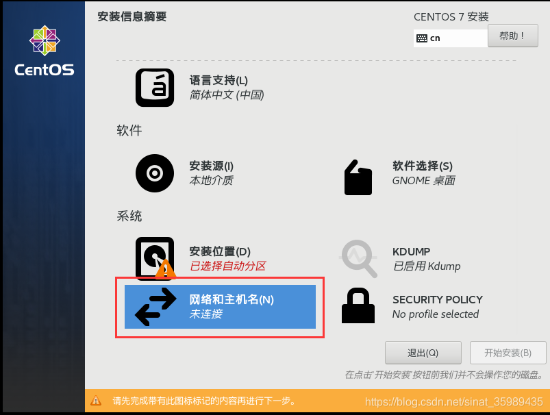
##### 配置网络
打开以太网的连接，然后点击“配置”，切到IPv4设置，输入刚才我定义的第一台虚拟机的ip地址192.168.3.30，子网掩码255.255.255.0，网关和物理机windows一样192.168.3.1（见前文），最后附加DNS服务器填入谷歌提供的8.8.8.8。
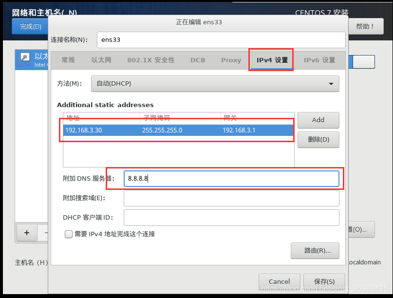
然后点一下安装位置，选择自动分区，再回来就可以点“开始安装”了。
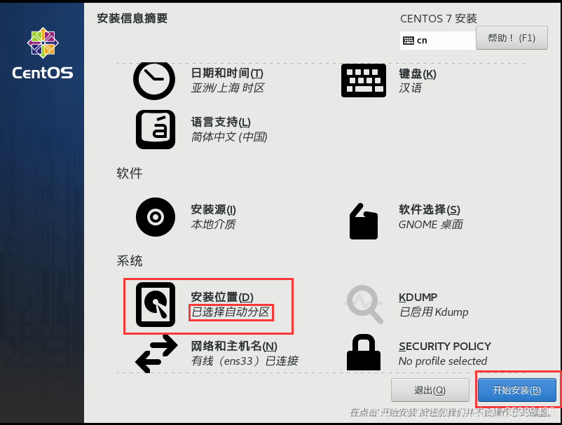
##### 设置用户
安装过程中，可以设置root和用户，简单设置吧以免忘记密码。
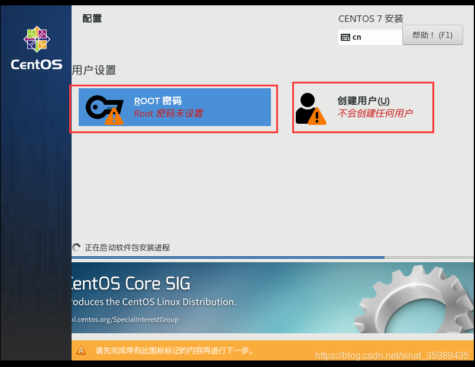
以下是我设置的root和用户（仅做学习之用，也以防忘记密码）：
| 用户 | 密码 |
|--|--|
| root | root |
| spark | spark |
由于密码太过简单，我们需要多按一次左上角的“完成”。
值得一提的是，如果不在这里设置root和用户，在安装结束后设置的话，系统会要求你设置比较复杂的密码。
静静等待其安装完。

重启，然后接受许可证，点完成，使用spark用户登录，再简单配置下，就正式进入系统。
##### 测试网络
点击应用程序->Firefox，然后访问百度，如果成功则网络连接正常。
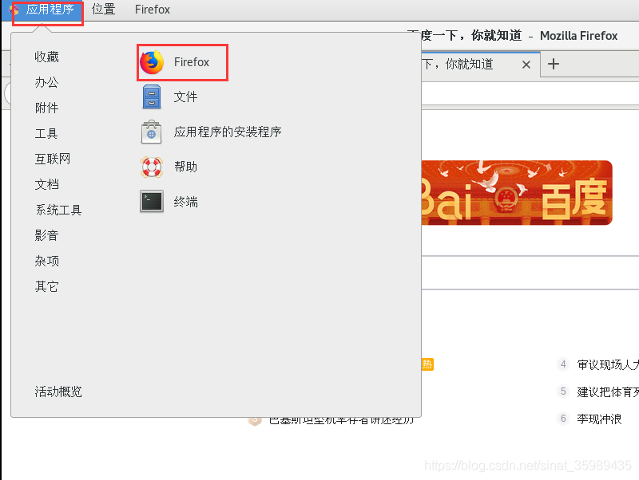
##### 设置机器名
用root使用vi /etc/sysconfig/network中设置内容如下：

```bash
NETWORKING=yes
HOSTNAME=master
```

至此，CentOS安装完成。
#### 设置Host映射文件
/etc/hosts内保存了网址域名/机器名与其对应的ip地址建立关联的一个“数据库”，我们根据集群规划配置：
以root的身份（先su root然后输入root的密码）在命令行用#vi /etc/hosts打开配置文件，然后按小写字母i，输入以下内容然后按Esc + :wq回车保存：
```bash
192.168.3.30 master
192.168.3.31 slave1
192.168.3.32 slave2
```
设置完毕后，用#ping master看看master是否连通及检测服务器响应速度。
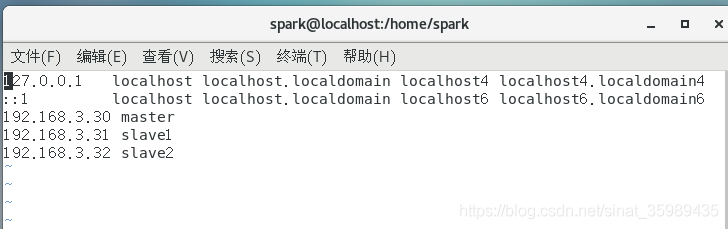
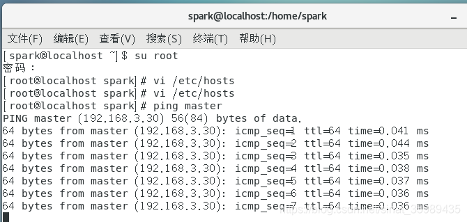
#### 关闭防火墙和SELinux
关闭防火墙和SELinux的原因在于Hadoop和Spark运行过程中需要使用端口进行通信，而这些安全设施会阻拦。关闭方法：
关闭iptables时，使用root登录，在命令行终端使用#service iptables status查看iptables状态，如果显示“iptables: Firewall is not running”则iptables已关闭，如果显示iptables的配置信息，则使用如下命令关闭iptables：
```bash
chkconfig iptables off
```
同样，用root用户在终端使用#vi /etc/SELinux/config打开配置文件，设置SELINUX=disable，注意需要重启才生效。
然而在我们虚拟机上并没有iptables：
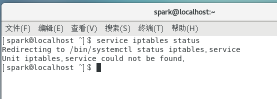
SELinux设置为disable。
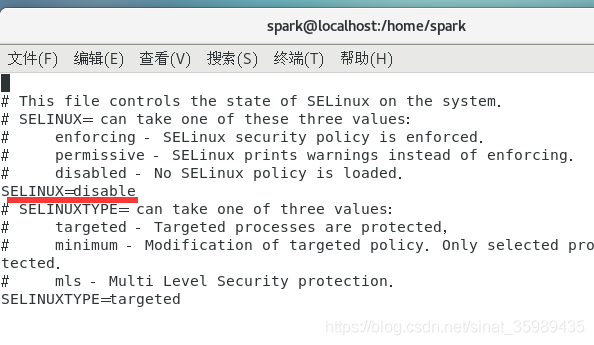
#### 配置运行环境
##### 更新OpenSSL
CentOS自带的OpenSSL存在bug，所以我们使用如下命令更新

```bash
yum update openssl
```
当然了我自己跑了一下并没有看到需要更新，也许centos7修复了。
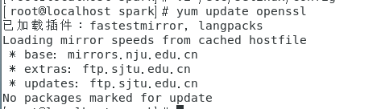
#### 修改OpenSSH配置
在集群环境中需要SSH进行免密码登录，需要修改OpenSSH配置文件，确认使用RSA算法进行公钥加密并确认私钥存放文件等，需要使用root用户，使用vi /etc/ssh/sshd_config打开配置文件，打开以下三个配置项：
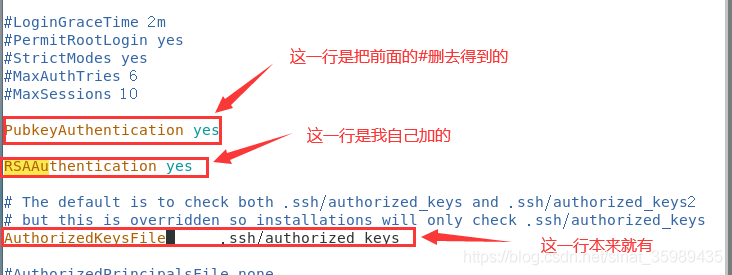
保存修改后使用systemctl restart sshd.service重启服务。
#### 将用户spark加入sudoers中
后面执行中需要使用sudo命令，故将spark加入sudoers文件中，先修改配置文件的权限：chmod u+x /etc/sudoers，再使用vi /etc/sudoers打开文件，在root ALL=(ALL)ALL后加入：

```bash
spark ALL=(ALL) ALL
```
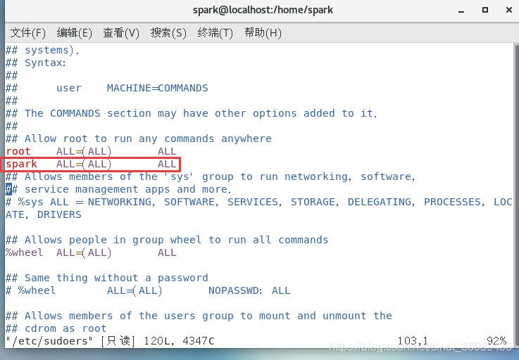
他虽然说是只读，但是你可以用root编辑，然后使用wq! 加感叹号保存。
#### 创建运行环境所需要的目录结构

```bash
mkdir /app
chown -R spark:spark /app
mkdir /app/soft
mkdir /app/compile
mkdir /app/spark
mkdir -p /home/spark/work
chown -R spark:spark /home/spark/work
```
### 安装Java和Spark环境
#### 安装和配置JDK
安装一下vmware tools，然后把jdk的包拖进去，放到/home/spark/work中。（这个找一找centos虚拟机安装vmware tools教程吧）
解压该文件并移动到/app/soft中

```bash
cd /home/spark/work
tar -zxf jdk-8u241-linux-x64.tar.gz
mv jdk1.8.0_241 /app/soft
ll /app/soft
```
然后以root执行vi /etc/profile，设置JDK相关配置如下：
```bash
export JAVA_HOME=/app/soft/jdk1.8.0_241
export PATH=$JAVA_HOME/bin:$PATH
export CLASSPATH=.:$JAVA_HOME/lib/dt.jar:$JAVA_HOME/lib/tools.jar
```
保存后回到终端，输入source /etc/profile更新全局变量，然后输入java和javac看看是否安装成功。
#### 安装Scala
把scala安装包放入/home/spark/work中。解压该文件并移动到/app/soft中。
```bash
cd /home/spark/work
tar -zxf scala-2.11.8.tgz
mv scala-2.11.8 /app/soft
ll /app/soft
```
然后以root执行vi /etc/profile，设置JDK相关配置如下：
```bash
export SCALA_HOME=/app/soft/scala-2.11.8
export PATH=${SCALA_HOME}/bin:$PATH
```
保存后回到终端，输入source /etc/profile更新全局变量，然后输入scala -version看看是否安装成功。
## 参考文献
- 《图解Spark：核心技术与案例实战》https://item.jd.com/12021791.html
- VMware设置centos7共享文件夹 https://blog.csdn.net/nesxiaogu/article/details/85274626
- vmware-hgfsclient结果为空解决办法 https://blog.csdn.net/qq_43371004/article/details/103101426
