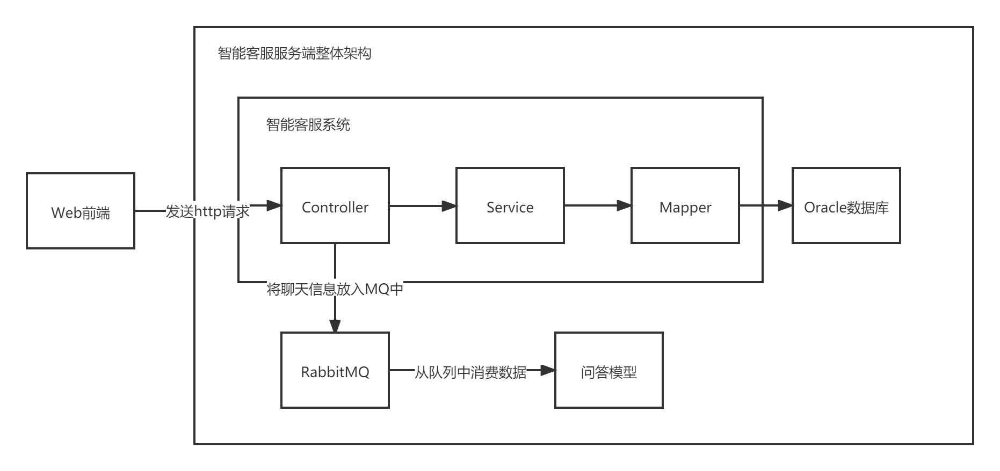
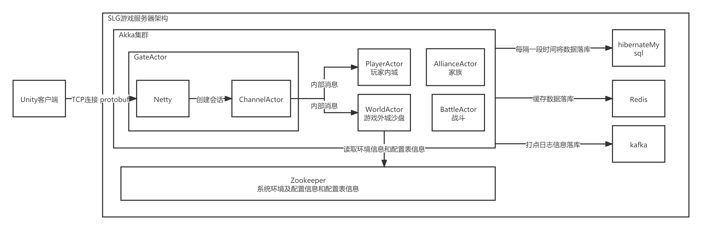
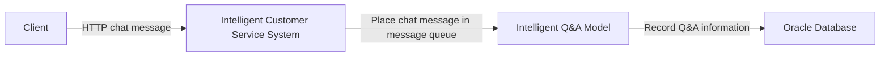
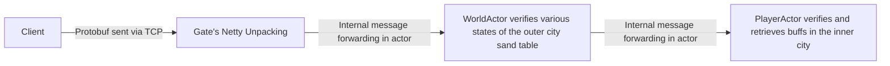

| Project | Intelligent Customer Service | Web Crawler | SLG Game |
|:-------:|:---------------------------:|:-----------:|:--------:|
| Language | Java | Python | Kotlin |
| Model | Asynchronous Event Driven | There may not be a discernible model | Actor Model |
| Transmission Protocol | HTTP | HTTP | TCP + Netty |
| Transmission Structure | JSON | JSON | Protobuf |
| Database | Oracle, Redis | MongoDB | MySQL, Redis |
| Database Framework | MyBatis | Python Library (similar to JDBC) | Hibernate |
| Cache Architecture | Redis for Admin Login Status | Possibly only caching page numbers | All game data is cached, periodically written to the database |
| Configuration Information | Only `application.properties` | `config.ini` | Zookeeper, pre-loading design table information into ZK |
| Concurrency | No concurrency (so no need for locks) | Python multi-threading for simultaneous web crawling | No concurrency, Actor model ensures only one task at a time |
| Hot Reload | Directly restart | N/A | Inherit a method from a certain class, replace the online class |
<!--more-->
## Architecture Overview
### Intelligent Customer Service Server Overall Architecture

### Deployment of Soldiers in SLG Game

## Typical Case
### Intelligent Customer Service Chat

### Deployment of Soldiers in SLG Game

Both WorldActor and PlayerActor retrieve the required data by reading from memory, and do not directly read from the MySQL database. The data in memory is updated to MySQL using Hibernate methods for changes every certain period of time (around 30 seconds).

## Configuration Information Loading

For the intelligent customer service, due to low concurrency and business volume (because there are relatively few platforms for deployment, and almost no one uses it in the early morning, and the restart speed is very fast), some configuration values on demand (such as how many times "transfer to human" needs to be sent before entering the human transfer channel) are hard-coded directly into the business logic. Some configuration information, such as the request address URLs of other systems, will be placed in `application.properties`. Excel is not used to centrally store configuration information for various functional modules, and it is indeed not necessary.

However, for the game, configuration values are crucial, closely related to gameplay, rewards, and the in-game ecosystem. Therefore, in the game server, almost all values need to be read from the configuration table. Currently, Excel is probably the most powerful software for handling data, and designers can quickly set up values through Excel.

When starting the server, you need to read the configuration table into memory (in a broad sense). However, with tools like Zookeeper, configuration table data can be stored in ZK and retrieved when needed.

## Advantages of Game Servers
### Transmission Structure is Protobuf
The data received and sent by the server are all in binary format converted from ProtoBuf, thereby achieving a unified transmission structure between the client and server. ProtoBuf has its own functionality for encoding and decoding binary data, which minimizes the size of message data. Encoding and decoding are executed by Netty, so all you need to do is pass the objects generated by ProtoBuf to Netty. The ProtoBuf version used here is v2, which includes three keywords: `required`, `optional`, and `repeated`, each providing constraints on the properties within the transmitted message.

### Akka Actor Architecture
The Actor architecture implements single-threaded business logic, eliminating the need to lock common properties during development. Through internal message communication, data processing proceeds in an orderly manner. Akka cluster provides dynamic load balancing, allowing for parallel expansion. In other words, if a server can't handle the concurrency, simply configure one or more new servers and add them to the cluster for load balancing.

### Configuration Table Information Stored in Zookeeper
By reading Excel data table information into Java code, converting it into binary, and placing it in Zookeeper, configuration table hot updates can be achieved, making it possible to read it at any time.

### Data Cached in Memory after Server Startup, Periodically Flushed into the Database
The game server does not directly manipulate the database, but rather operates on data in memory. The data in memory is updated to the database at regular intervals. Consequently, even in cases of very high concurrent I/O, modifications are made only to the data in memory and do not directly affect the database.

## Problems Existing in Both Systems
### Intelligent Customer Service
#### Inefficient Oracle Joins for Extracting Reports, Lack of Read-Write Separation
The reports in the intelligent customer service system are real-time and are written in a very long SQL query using `union`. As a result, the query speed is very slow. In the production environment, selecting a time interval of more than 14 days and checking multiple report evaluation items leads to a query time of over 30 seconds. This means the SQL query took nearly 30 seconds to execute. We always talked about optimizing it, but in the end, we didn't come up with any effective solutions.

Later, I also encountered some reports. Generally, raw and unprocessed data is sent to another log collection library through a message queue, which may be called a data warehouse. Then, another system extracts and aggregates data from the data warehouse.

Another approach is to only query data before today when extracting reports, and then execute a scheduled task after 24:00 at the end of each day to update report data.

Of course, all of these measures result in the inability to display the latest report data in real time, which is also a trade-off.
#### Poorly Designed Chat Record Logging
Each row in the chat record table contains various information about the sender and the chat session, storing too many states (because there are special messages like chat record evaluations, the structure has undergone significant changes). It is possible that initially only text was considered, then images were added (which support HTML and have HTML injection risks), and later the "Guess You Want to Ask" bubbles were introduced. However, "Guess You Want to Ask" itself is not included in the chat record, requiring special handling.

Due to a lack of refactoring, both the front-end and back-end code became very messy as development progressed.

### SLG Game Server
#### Hot Update Issues
The larger the project, the more problems we encounter. The more problems there are, the faster we want to fix and update them in the production environment. Thanks to Java's inheritance feature, we can achieve seamless hot updates for online players by inheriting a class with business logic, rewriting a problematic function, and correcting it with the correct business logic. However, this cannot cover every online problem. In addition to business logic classes, there are also data processing and storage classes, which cannot be hot updated because they are closely associated with the logic of scheduled data writing. Some business logic written by developers in data processing and storage classes cannot be hot updated.

Additionally, some properties have been marked with the `private` identifier, making it impossible to directly retrieve them. Reflection must be used to access them.

#### Communication Between Nodes
Akka Actor is single-threaded, but this does not mean the entire system is single-threaded. To improve efficiency, we have divided the system into different Actors based on business logic and functionality modules, such as the gateway `Gate`, the outer city sandbox `World`, the inner city player `Home`, the alliance `Alliance`, and the global ranking `Rank`. However, as a result, some data that should have been shared by multiple nodes needs to be synchronized using internal messages.

For example, there is an operation activity related to a person attacking a monster on the sandbox, which adds points to themselves and their alliance. In this case, the `World`, `Home`, and `Alliance` nodes each need to store a copy of the activity's start and end times. Of course, there is another way, which is to allocate a JSON object on Zookeeper to store the current activity information. However, if all complex activities use this method, Zookeeper will end up storing too much rarely used data.

## Other Systems
### Intelligent Customer Service Edge System: Knowledge Base System
The original intention was to extract the linguistic information of the intelligent customer service as a separate subsystem. However, due to the tight association between the linguistic information and the core of the intelligent customer service, it was not possible to separate them.

To implement fuzzy queries, Elasticsearch (ES) was used as the storage database. However, there is a contradiction between relational databases and non-relational databases. Relational databases are convenient for managing data and reducing data redundancy but lose the ability to perform fuzzy queries and inverted indexing in ES. Using only a non-relational database would prevent direct associations with tables in other databases within the system, necessitating the use of services to obtain resources and increasing system overhead. If both a relational database like Oracle and a non-relational database like ES store a copy, the problem of data synchronization arises. It would require scheduled tasks to synchronize the two databases, and even the need for discrimination between the two databases, similar to version control systems like Git and SVN.

### Game Server: Operations GM
- Sending patches to the live servers, replacing the implementation of a specific method in a specific class on the live servers, thereby achieving seamless hot updates for players.
- Sending Groovy scripts to the live servers and executing business logic written in Groovy on the live servers.