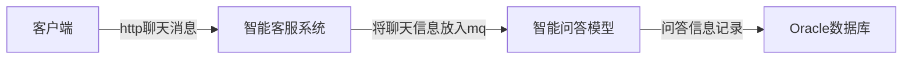
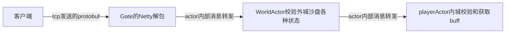

|项目|智能客服|爬虫|SLG游戏|
|:---|:---|:---|:---|
|语言|java|python|kotlin|
|模型|异步事件驱动|可能没什么模型可言|actor模型|
|传输协议|http|http|tcp + netty|
|传输结构|json|json|protobuf|
|数据库|oracle，redis|mongodb|mysql,redis|
|数据库框架|mybatis|python库（类似jdbc）|hibernate|
|缓存架构|管理员登录状态用redis|可能只缓存了页码|所有游戏用的数据全部缓存，每隔一段时间写到数据库中|
|配置信息|只有application.properties|config.ini|zookeeper，启动前需要将策划表信息刷到zk|
|并发|无并发（所以根本没用到锁）|python多线程同时爬多个网站|无并发actor模型保证一次只做一件事|
|热更|直接重启|无|继承某个类的某个方法，替换掉线上的类|
<!--more-->

## 架构一览
### 智能客服服务端整体架构

### SLG游戏整体架构

## 典型案例
### 智能客服聊天

### SLG游戏士兵出征

其中worldActor和playerActor都通过读取内存的方式读取到需要的数据，并不直接读取mysql数据库。
内存里的数据每隔一段时间（30秒左右）将变化的数据通过hibernate的方法更新到mysql中。

## 配置信息读取
对于智能客服来说，由于并发量业务量很少（因为投放的平台比较少，且晚上凌晨基本没什么人使用，且重启速度很快），有一些需求上的配置数值（比如发送几次“转人工”才进入转人工通道）是直接硬写在业务里的；也有一些配置信息是其他系统的请求地址url，会配在application.properties里。没有使用excel统一存储各个功能模块的配置信息，也确实不需要。

但对于游戏来说，数值这块的配置至关重要，与玩法，奖励，游戏内生态息息相关。因此在游戏服务器里，所有的数值几乎都要从配置表中读取。目前Excel应该是处理数据能力最强的软件了，策划可以通过Excel非常快速的把数值配好。
启动服务器的时候要读取配置表到内存（广义上的）里。但在有了zookeeper这样的工具出现之后，配置表数据可以放在zk中，需要的时候再取出来。

## 游戏服务器优势
### 传输结构为protobuf
服务器接收和发送的数据都是ProtoBuf转成的二进制，从而实现客户端服务器端统一的传输结构。protobuf自己有编码解码二进制的功能，从而实现消息数据的大小达到最小，编码解码是由netty执行的，使用上只需要将protobuf生成的对象传给netty即可。这边用的protobuf是v2版本的，有required，optional和repeated三种关键字，分别对传输message里的属性作出了约束。

### Akka Actor架构
Actor架构实现单线程的业务逻辑，开发过程中不需要对一些公用的属性上锁；通过内部消息的通讯，让数据处理有序进行。Akka cluster集群有动态负载均衡的功能，可以进行平行扩展，也就是说，如果一台服务器扛不住并发，只要再配置一台或几台新服务器，加入集群就可以完成负载均衡。

### 配置表信息Zookeeper存储
通过将Excel数据表信息读取到java代码中，再转成二进制放入zk里，随时读取，从而完成了配置表的热更新。

### 数据在服务器启动后，缓存在内存中，间隔一定时间刷入库中
游戏服务器不直接操作数据库，而是操作内存中的数据。内存中的数据每隔一段时间，将数据变化更新到数据库中。如此一来，并发IO特别大的时候，也只是对内存中的数据进行修改，不会直接操作数据库。

## 两个系统中存在的问题
### 智能客服
#### 抽取报表时直接用Oracle关联查询，效率太低，且没有读写分离
智能客服的报表是实时的，是通过一个特别长的，用union拼接的sql写的。所以查询速度非常慢。在线上环境，选定一个超过14天的时间区间，勾选多个报表评估项，查询时间超过30秒。也就是说sql执行了近30秒。当时一直说要优化优化，但是最后也没想出什么办法。

后来我也接触了一些报表，一般是将生的，未处理过的数据通过消息队列发给另一个日志收集库，可能会叫它数据仓库。然后另外有一个系统从数据仓库里抽取并统计数据。
另一种是抽取报表时只查询今天以前的数据，然后每天结束时24点之后执行某一个定时任务，统计更新报表数据。

当然了这些举措都导致了不能实时展示最新报表数据了，这也是一种取舍。
#### 聊天记录日志设计不合理
聊天记录表每一行记录都包含了发送人和聊天会话的各种信息，存储了过多的状态（因为存在聊天记录评价这种特殊消息，所以结构发生了很大变化）。
有可能是最初只考虑了文字，后面加入了图片（支持html又有html注入风险），后面又出了“猜你想问”气泡，但猜你想问本身不计入聊天记录，又需要特殊处理。

由于没有安排重构，导致开发到后期，前后端代码都非常混乱。

### SLG游戏服务器
#### 热更问题
项目越庞大，遇到的问题就会越多。问题越多，修复更新到线上的速度当然要越快越好。得益于java的继承功能，我们可以通过继承某个装有业务逻辑的类，重新重写某个之前有问题的函数，修正为正确的业务逻辑，以完成线上玩家无感知的热更新。但是这并不能完全覆盖每一个线上问题。除了业务逻辑类之外，还有数据处理存储类，而数据处理存储类是不能热更的，因为它们是与定时落库逻辑强关联的类。有的业务逻辑被开发人员写在数据处理存储类中，就不能热更修改了。
还有一些属性被加上了private标识符，导致没办法直接取出来，只能用反射拿。
#### 节点之间通信
Akka Actor是单线程，但不意味着整个系统都是单线程的。为了提高效率，我们根据业务逻辑，按照功能模块，分出了维护不同数据的Actor，比如网关Gate，外城沙盘World，内城玩家本身Home，联盟Alliance，全服排行榜Rank....但是这么一来，会有一些本应该由多个节点共享的数据，不得不需要用服务器内部消息来回同步。

比如说有一个运营活动，是关于某个人打沙盘上的某个怪，然后给自己和联盟增加积分。那么这时候，World，Home，Alliance三个节点都需要各自保存一份活动的开启时间和关闭时间。当然还有一种办法，是在zookeeper上分配一个json对象，存储当前的活动信息。但是这么一来，如果所有比较复杂的活动都使用这种方式，到最后zookeeper会存储过多的不常用的数据。

## 其他系统
### 智能客服边缘系统：知识库系统
本来的目的是将智能客服的语料信息单独抽出作为一个独立的子系统，但后来由于语料信息与智能客服本体关联太紧，导致没有办法抽出来。

为了实现模糊查询，使用了es作为存储数据库。
其中存在一个问题，就是关系型数据库与非关系型数据库的矛盾之处。
大概是用关系型数据库可以方便管理数据，减少数据冗余，但失去了es模糊查询倒排索引的能力。
但直接用菲关系型数据库的话，会让系统中其他数据库的表无法直接关联，被迫需要用服务的方式来获取资源，增加系统开销
如果在关系型的oracle和非关系型的es各存一份，则会出现数据不同步的问题，被迫需要定时任务去同步两个库，甚至还需要从两个库中作出鉴别，类似于git，svn等做版本管理。

### 游戏服务器：运维GM
- 发送补丁到线上服务器，替换线上服务器的某个类的某个方法的实现，从而完成玩家无感知的热更新
- 发送groovy脚本到线上服务器，在线上服务器上执行一段通过groovy编写的业务逻辑

