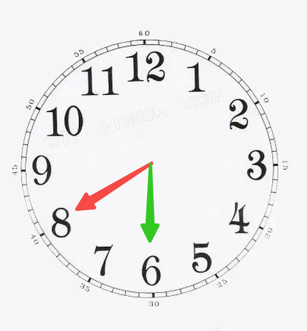
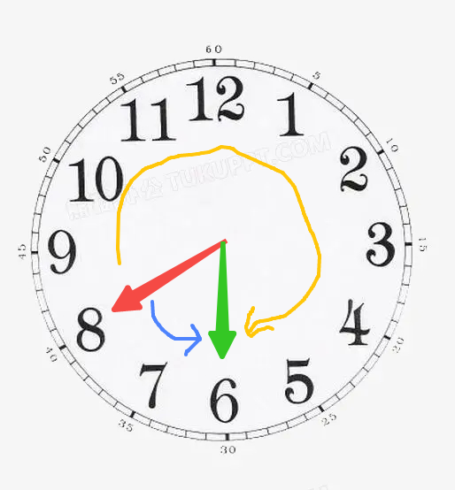
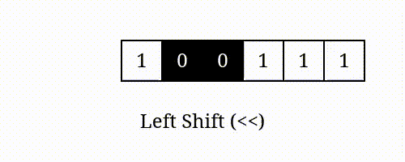
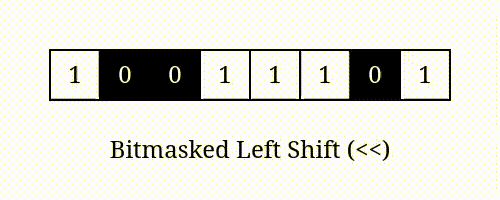
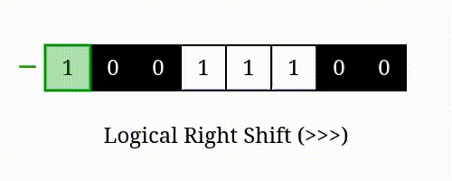
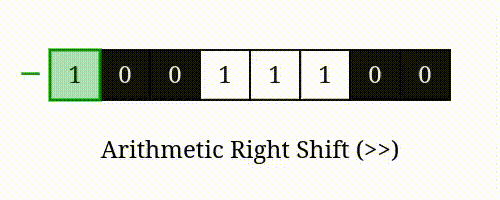
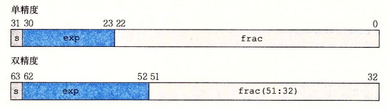
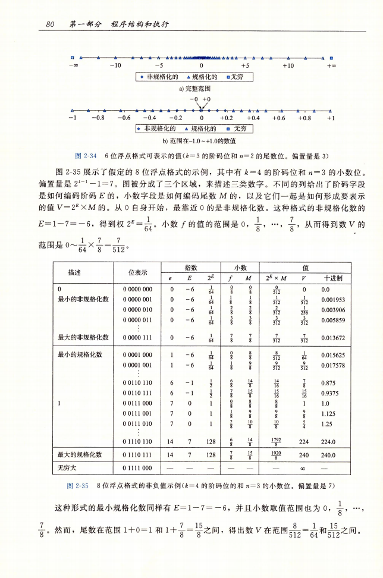
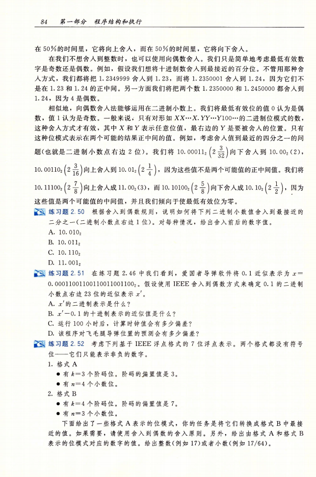

>23年3月23日，我在公司进行了一次分享会，内容是本文的内容。在分享前，我重新对文章知识点进行了梳理，补充了很多细节。现将补充的细节重新编写到本文中。
<!--more-->
# 什么是二进制数？
- 我们日常使用的是十进制，数字包括0,1,2,3,4,5,6,7,8,9 再往下数，就得向前进一位，变成10，然后从个位数开始继续增加11,12,13…19
- 计算机最底层使用的是二进制，数字包括0和1，再往下数，也是前进一位，变成10。注意，这个10并不是十进制的十，而是十进制的二。

# 如何用二进制来表示一个整数？
|二进制|十进制（无符号）|
|:--|:--|
|0000|0|
|0001|1|
|0010|2|
|0011|3|
|0100|4|
|0101|5|
|0110|6|
|0111|7|
|1000|8|
|1001|9|
|1010|10|
|1011|11|
|1100|12|
|1101|13|
|1110|14|
|1111|15|

# 二进制如何表示负数？
## 原码
我们把最高位(最左边的位)作为符号位，后面剩余的位代表的数作为数值具体的大小。
比如：四位原码二进制表示数字 

<span style="color:red">—</span> 3

<span style="color:red">1</span> 011

开头的1代表负号，后面的011表示3。这样拼起来就是负3了
但是这么表示可能会有什么问题？

### 原码表示负数存在的问题
1. 0000和1000，都是表示数字0，但是一个是正0，一个是负0。这显然不符合我们对零的理解。
2. 无法进行加减运算：观察以下式子1(0001) + (-3(1011)) = -4(1100)
&nbsp;&nbsp;0001
+1011
\--------
&nbsp;&nbsp;1100

那么如何用二进制表示一个数字，才能处理加减操作呢？

## 补码
以时钟为例，拨动时钟理解补码

把红色指针从指向“8”拨动到“6”，
有几种方式？

有两种方式，如图所示：

以此图为例，如果指针目前指向8(红色指针)，要把它拨到6（绿色指针），有两种方式：

1. 把8往逆时针方向旋转到6（蓝色）这种方式就是进行8-2=6
2. 把8往顺时针方向旋转到6（黄色）这种方式是进行8+10=18，但是时钟只能显示12个数字，所以18-12=6

补码减法的逻辑是：**通过加法，给数字加上一个超过表示上限的数，使其最高位“丢失”的方式来实现减法。**

如同我们调整时钟的时针，如果调整时针的转轴只能向顺时针方向调整，那么我们可以通过多转大半圈的方式来实现任意小时的调整。

### 尝试用补码进行运算
考虑求解一个方程: 1 + x = 0


&nbsp;&nbsp;0001


\+&nbsp;&nbsp;&nbsp;&nbsp;&nbsp;&nbsp;x


\---------


&nbsp;&nbsp;0000

X只能表示正数的话，那么这是一个无解的方程。
但是如果我们假设答案存在第五位的1，那么就可以进行运算


&nbsp;&nbsp;0001


\+&nbsp;&nbsp;&nbsp;&nbsp;&nbsp;&nbsp;x


\---------


<span style="color: blue">1</span>0000

计算结果 x = 1111。
由此，我们可以推断一件事：**十进制的-1 ，可以用二进制的1111表示。**

让我们再做一题：
2 + x = -1 (十进制)


&nbsp;&nbsp;0010


\+&nbsp;&nbsp;&nbsp;&nbsp;&nbsp;&nbsp;x


\---------


&nbsp;&nbsp;1111

对于二进制数，1111 > 0010，
所以我们不需要假设有“第5位”的存在，直接运算得到x = 1101,而其十进制答案为-3。

### 找到规律了吗？
至此我们发现了以下4个数的十进制和二进制的表示：
|二进制|十进制|
|:----|:-----|
|1111|-1|
|0001|1|
|1101|-3|
|0011|3|

我们发现，**对负数的二进制，取反，再加1，就能得到负数的数值。**

如-3的二进制数1101取反为0010, 0010再加1得到0011，0011是3。

解决问题的关键是我们人为划定了二进制表示整数的范围仅有4位，对于更高的第5位自然舍弃。


> 提问：在四位二进制下，所有数字的相反数都能被表示吗？
> 
> 答：不是的，二进制1000这个数字，在四位二进制时没有办法被表示。

至此，我们可以总结得到四位二进制下表示十进制（无符号）和十进制（补码）的情况：
|二进制|十进制（无符号）|十进制（补码）|
|:--|:--|:--|
|0000|0|0|
|0001|1|1|
|0010|2|2|
|0011|3|3|
|0100|4|4|
|0101|5|5|
|0110|6|6|
|0111|7|7|
|1000|8|-8|
|1001|9|-7|
|1010|10|-6|
|1011|11|-5|
|1100|12|-4|
|1101|13|-3|
|1110|14|-2|
|1111|15|-1|

### 补码表示的新理解
关于补码，为了计算某个正数的相反数，可以用过取反+1的方式计算得到负数的补码表示。但是还有另一种方式能够更好的理解补码。
如果用5位来表示一个数：
|下标|4|3|2|1|0|代表的十进制数|
|:--|:--|:--|:--|:--|:--|:--|
|每个下标的数值|-16|8|4|2|1||
|二进制数1|0|1|1|0|1|13|
|二进制数2|1|1|1|0|1|-3|
|二进制数3|1|1|1|1|1|-1|
|二进制数3|0|1|1|1|1|15|

可以看到其实如果按照补码的逻辑，当使用5个位来存储数字时，最高位第5位作为符号位，它的数值为-16，其他第1到4位的数值为1、2、4、8，然后再对二进制数的各个位，乘以其对应的数值，再累加，就能得到十进制数的大小。
比如二进制数1，其十进制数=0\*(-16) + 1\*8 + 1\*4 + 0\*2 + 1\*1 = 13。
而负数二进制2，其十进制数=1\*(-16) + 1\*8 + 1\*4 + 0\*2 + 1\*1 = -3。

我们现在已经知道-3的二进制补码表示是：11101，很容易能通过这个数值表得到正3的二进制补码表示是00011。
使用上面的“取反后+1”的公式，也可以将-3转为正3：~11101 + 1 = 00010 + 1 = 00011

另外，还有两个比较有意思的内容：
1. 想获得某个二进制补码表示的最小的数，只需要让其符号位为1，其他位为0即可。
    比如在5位表示数的情况下，最小的数是-16，即10000。
2. 想获取-1，只需要让所有位都为1即可，那么想获得-1，可以直接用0按位取反。

# 二进制数的加法和乘法
## 二进制数的加法

- 二进制的加法与十进制的计算规则是一样的，当某一位的数大于1时，往前进一位。
- 对于无符号二进制数和补码二进制数，将数的每一位进行加法运算。
- 在不溢出的情况下，考虑两个4位无符号二进制数的加法：4+6=10：


&nbsp;&nbsp;0100


\+0110


\---------


&nbsp;&nbsp;1010
## 加法溢出
再考虑两个四位无符号二进制数的加法


&nbsp;&nbsp;1000


\+1000


\---------


&nbsp;10000

但是最高位的1要被舍去，得到的二进制结果是0000，所以计算机在经过运算后，得到的结果是0。
## 二进制数的乘法
二进制的乘法与十进制数的乘法的计算规则是一样的。

### 十进制乘法

&nbsp;&nbsp;12


x&nbsp;34


\---------


&nbsp;&nbsp;48

36

\---------


&nbsp;408

### 二进制乘法
&nbsp;&nbsp;&nbsp;0011


x&nbsp;0101


\---------


&nbsp;&nbsp;&nbsp;0011

0011

\---------


&nbsp;001111

发生溢出，开头的00被舍弃。


# 二进制按位左移和右移
## 按位左移
按位左移运算符 ( <<) 将其第一个操作数的位向左移动其第二个操作数中指定的位数。它还负责插入足够的零位以填充新位模式右边缘出现的间隙：

如图所示，100111 << 1, 按位左移后，在最右侧补0，得到1001110

对于无符号二进制数，左移n位，可以视为其乘以2的n次方(不考虑溢出情况)

## 左移后，最高位丢失
但是一个数的位数是有限的，比如之前我们在讨论补码的时候，认为规定了是四位二进制数。
按位左移会丢失那些超过左边界的位，如图：


在这个由8个位组成的二进制数中，左移1位后，
最左边的1丢失，在最右边补0。
## 逻辑右移
逻辑右移，也称为无符号右移或零填充右移，移动整个二进制序列，包括符号位，并用零填充左边的结果间隙：



## 算数右移
算数右移，有时称为有符号右移运算符，通过在向右移动位之前复制其符号位来保持数字的符号：

- 在右移一位后，左边的符号位被复制之后保留下来。原来是负数的数，现在依旧还是负数
- 对于补码二进制数，算数右移n位，视为除以2的n次方（整除）。如1100(-4) >> 1 = 1110(-2)；1100 >> 2 = 1111(-1)


## 按位移动位的数量，系统默认帮你取模
来源：[https://www.jianshu.com/p/304bfdda6b6a](https://www.jianshu.com/p/304bfdda6b6a)
控制硬件时，常涉及打开/关闭特定的位或查看他们的状态，一般都会使用到按位运算符技术。

一个面试题：
``` C
int a = 1, b = 32;

print("%d, %d", a<<b, 1<<32);
```
答案是 1，0

a << b 的结果是1，是因为运行时会将操作数b对32取模，然后在进行移位操作。


# 布尔代数
所谓布尔代数，就是按位与（&），或（|），非（~），异或（^）。
需要注意和强调的是（应该已经强调无数遍了），&和&&不一样，|和||不一样，~和负号-不一样。

- 按位与

一假即假

0 & 0 = 0；1 & 0 = 0；0 & 1 = 0；1 & 1 = 1。
- 按位或

一真即真

0 | 0 = 0；1 | 0 = 1；0 | 1 = 1；1 | 1 = 1。
- 按位非

~1 = 0；~0 = 1。
- 按位异或

相同为假，不同为真

0 ^ 0 = 0；1 ^ 0 = 1; 0 ^ 1 = 1; 1 ^ 1 = 0。

比较有意思性质：
1. 异或有一个性质是：a ^ a = 0， (a ^ b) ^ a = b（因为0 ^ b = b）
2. (x | -x) >> 31 ，当x为0时依旧为0，当x不为0时，为-1

# 小端和大端字节序
简单记的话，就记一个数 0x12345678
存储地址从小到大依次从左到右（有语病，但意思是那个意思）
大端存的是12 34 56 78
小端存的是78 56 34 12

# C语言unsigned int，会导致问题
一般来说数组的长度是大于等于0的，所以在设计过程中，为了能多获得一位存储空间，有的人会设计使用unsigned int存储。在C语言有一个size_t类型，其定义就是long unsigned int
但在遍历过程中，有可能会出现肉眼难以察觉的bug。

正常的代码：
``` C
   
    int a[5] = { 1, 2, 3, 4, 5 };

    int cnt = 5;
      printf("show values\n");
    for (int j = 0;j < cnt;j++) {
        printf("a[%d]=%d\n", j, a[j]);
    }

    int i;
    printf("start loop\n");
    for (i = cnt -2;i >= 0;i--) {
        printf("in loop,%u %u\n", i, cnt);
        a[i] += a[i+1];
    }
    printf("end loop\n");

    printf("show values\n");
    for (int j = 0;j < cnt;j++) {
        printf("a[%d]=%d\n", j, a[j]);
    }

```

此段代码给出一个数组a，该数组有5个元素。然后进行的操作是从数组的后面往前累加，最终a数组的第一个元素是之前a数组各元素的总和。

其运行结果如下：
``` shell
show values
a[0]=1
a[1]=2
a[2]=3
a[3]=4
a[4]=5
start loop
in loop,3 5
in loop,2 5
in loop,1 5
in loop,0 5
end loop
show values
a[0]=15
a[1]=14
a[2]=12
a[3]=9
a[4]=5
```

如果我们把代码“int i”改成“size_t i”会如何呢？
需要修改的错误代码：
``` C
   
    int a[5] = { 1, 2, 3, 4, 5 };

    int cnt = 5;
      printf("show values\n");
    for (int j = 0;j < cnt;j++) {
        printf("a[%d]=%d\n", j, a[j]);
    }

    size_t i;
    printf("start loop\n");
    for (i = cnt -2;i >= 0;i--) {
        printf("in loop,%u %u\n", i, cnt);
        a[i] += a[i+1];
    }
    printf("end loop\n");

    printf("show values\n");
    for (int j = 0;j < cnt;j++) {
        printf("a[%d]=%d\n", j, a[j]);
    }

```
输出结果：
``` shell
show values
a[0]=1
a[1]=2
a[2]=3
a[3]=4
a[4]=5
start loop
in loop,3 5
in loop,2 5
in loop,1 5
in loop,0 5
in loop,4294967295 5
in loop,4294967294 5
Segmentation fault (core dumped)
```
根据文章[https://blog.csdn.net/wang93IT/article/details/72782379](https://blog.csdn.net/wang93IT/article/details/72782379)所说：
> 有些时候我们在一段 C/C++ 代码的时候，由于对一个非法内存进行了操作，在程序运行的过程中，出现了“Segmentation fault (core dumped)”——段错误。

可以看到当i为0的时候，i--操作使i变成了一个特别大的数字，然后取a[i]时没有找到了非法内存，于是报错。
解决办法就是不要用size_t，也就是不要用无符号类型去作为下标索引。但如果a数组本身非常大呢？因为sizeof()函数的返回值类型就是size_t。

不要担心，在CSAPP课上，老教授给出了一种解决方案，虽然不是很符合正常逻辑：
修改后的正常代码：
``` C
   
    int a[5] = { 1, 2, 3, 4, 5 };

    int cnt = 5;
      printf("show values\n");
    for (int j = 0;j < cnt;j++) {
        printf("a[%d]=%d\n", j, a[j]);
    }

    size_t i;
    printf("start loop\n");
    for (i = cnt -2;i < cnt;i--) {
        printf("in loop,%u %u\n", i, cnt);
        a[i] += a[i+1];
    }
    printf("end loop\n");

    printf("show values\n");
    for (int j = 0;j < cnt;j++) {
        printf("a[%d]=%d\n", j, a[j]);
    }

```
仔细对比可以发现，在第二个for循环`for (i = cnt -2;i < cnt;i--)`中，其第二格判断条件从`i >= 0`改成了`i < cnt`。

运行结果：
``` shell
show values
a[0]=1
a[1]=2
a[2]=3
a[3]=4
a[4]=5
start loop
in loop,3 5
in loop,2 5
in loop,1 5
in loop,0 5
end loop
show values
a[0]=15
a[1]=14
a[2]=12
a[3]=9
a[4]=5
```
输出结果正常了。这是因为它借助了“无符号数减到（有符号数意义下的）负数时，会变成一个非常大的数”的性质。

为什么无符号的0再减一个正数就会变成很大的数呢？
以无符号0减去1为例：
假设有一个5位表示的数00000，如果这个数是二进制补码，则当00000减去1时，会得到11111。
11111在二进制补码中，指的是-1，但如果在无符号数中，它指的是UMax，也就是无符号数能表示的最大数。

# 浮点数
浮点数，翻译自英文floating point，中文意思是漂浮不定的点。这里的“点”是“小数点”的意思。与浮点数相对应的是定点数。
## 什么是定点数？
定点数，也就是固定好小数点的位置，然后小数点前的位都用来表示整数部分，小数点后的位都用来表示小数部分。

假设我们有1个字节，里面有8个二进制位：

|二进制位的数字|0|1|1|0|0|1|0|0|
|:--|:--|:--|:--|:--|:--|:--|:--|:--|:--|
|对应十进制的值|8|4|2|1|0.5|0.25|0.125|0.0625|

现在，我用八位二进制表示了一个小数: 6.25

## 十进制的科学计数法
浮点数表示小数的方式，使用了和十进制的科学计数法相似的思路，让我们先来复习一下十进制的科学计数法：
1234 -> 1.234 * 10<sup>3</sup>
87.65 -> 8.765 * 10<sup>1</sup>
-214.748 -> -2.14748 * 10<sup>2</sup>
0.00314 -> 3.14 * 10<sup>-3</sup> 

可以看到通过乘以10的n次方，小数点被移动，可以被规范化的定义为：

 a  * 10<sup>b</sup>

## IEEE754规范下的浮点数

在IEEE754规范中，二进制小数也被定义为类似科学计数法的形式。
(-1)<sup>s</sup> * M * 2<sup>E</sup>

其中：
- s是符号位，0为正数，1为负数
- M是尾数，是一个二进制小数。在规格化的浮点数中，1<=M<2；在非规格化的浮点数中，0<=M<1。
- E是阶码，是一个有符号整数


## 十进制与二进制对比
- 十进制

公式： a  * 10<sup>b</sup>
要求：1≤|a|<10，a不为分数形式，n为整数

- 二进制
公式：(-1)<sup>s</sup> * M * 2<sup>E</sup>
要求：
  - s 用来表示符号，0正1负
  - M 尾数，是二进制小数，规格化浮点数下，1 ≤ M <2
  - E 阶码 是一个整数

## 二进制表示
将浮点数的位表示划分为三个字段，分别对这些值进行编码：
- 一个单独的符号位s直接编码符号s
- n位的小数字段frac编码尾数M，但编码出来的值也依赖于解码字段的值是否等于0
- k位的阶码字段exp编码阶码E




## 符号位s
公式：(-1)<sup>s</sup> * M * 2<sup>E</sup>

当s为0时，此浮点数为正数；当s为1时，此浮点数为负数。

因为M≥0，所以表示正负的特征就转移到s上。
## 尾数M
在规格化浮点数下，1 ≤M<2，即M是一个1.xxxxx(2)的数，其中xxxxx代表小数部分。

IEEE754规定，在计算机内部保存M时，默认这个数的整数部分总是1，所以可以被舍去，只保留后面的xxxxx小数部分。

比如当M=1.01(2)时，只需要保存01(2)，等到读取的时候再把1加上去。

这么做是为了节省一个位的空间。
### 尾数M具体怎么表示？

M在二进制中存储在frac区域，其读数方式，是假定在frac位部分前已经有一个固定的小数点。

由此读出下图绿色部分，frac位部分的小数的数值。

最后在计算M时，将1 +frac部分代表的小数。

比如，当M = 1.75<sub>(10)</sub>时，frac部分为110000…..00<sub>(2)</sub> 

frac为110000…00<sub>(2)</sub> ，计算 .110000..00<sub>(2)</sub> 的十进制值为0.75<sub>(10)</sub>,再加上1，为1.75<sub>(10)</sub>

|二进制位|符号位s|阶码位exp|Frac位|Frac位|Frac位|Frac位|
|:------|:------|:-------|:-----|:-----|:-----|:-----|
|对应十进制小数的值|......|......|0.5|0.25|0.125|0.0625|

## 阶码E
阶码E可能是正数、0和负数。

在IEEE754规定，计算机内部保存E时，存储的区域exp是表示一个无符号二进制数。

如果exp的位数为8位，那么exp能表示的十进制值在0-255之间。为了能表示负数，IEEE754规定，exp的值需要减去一个中间数。

对于8位exp，这个中间数是127。
### 阶码E具体怎么表示？
E在二进制中存在exp区域，其读数方式是将其作为一个无符号二进制数读出数值。

之后再减去一个“中间数”，也叫偏置(bias)。

Bias = 2<sup>k-1</sup> – 1 , 其中k是exp区域的位数。当k为8时，bias=127

E = exp – bias

比如，当E=10时，exp区域有8位，bias=127，则exp要存储的十进制数位137(10), 对应的无符号二进制数为10001001

### 阶码E的几种情况
exp部分表示的位，在以下几种不同的情况，表示的数和计算方式略有不同。
1. exp不全为0也不全为1时，浮点数采用之前的读数方式，减去bias得到E。（规格化的数）
2. exp全为0时，这时候的计算E的公式变为E=1-bias，与此同时，计算M的公式也改为M=frac。这么做是为了表示0，和数值非常接近于0的数。（非规格化的数）
3. exp全为1时，当frac部分全为0时，表示无穷大；当frac部分不全为0时，表示“不是一个数”

#### 无穷大
IEEE754浮点数可以表示无穷大，当exp 的所有位全为1，frac的所有位全为0时即可表示无穷大。

如果s为0则表示正无穷大，s为1为负无穷大。

通常用于处理一些无法用实数表示的结果，比如 1/0 = 无穷大。
#### 不是一个数（NaN）
当exp 的所有位全为1，frac的所有位不全为0时表示“不是一个数”。用于表示一个无法表示的数，如“根号下的-1” 或者 “无穷 - 无穷”。

### 为什么会有非规格化的数？
规格化的数无法表示0

浮点数公式：(-1)<sup>s</sup> * M * 2<sup>E</sup>

其中， 1 ≤ M <2，M不会等于0，因此IEEE754另外定义了非规格化的数，M=frac，使M的区间为0 ≤ M s< 1。如此一来，M就可以等于0了。

接着，在二进制补码中，我们做到了用00000…000来代表0。因此我们希望在s和exp都为0时，浮点数的00000…000也代表0

因此，在IEEE754有两种计算浮点数的规则，非规格化和规格化。

在这两种数中，规格化的最小数为，exp为00000001，E为-126，M为1.0，即 1.0 * 2<sup>-126</sup>

在非规格化的数中，M的最大值为0.11111(2)。如果按照规格化的数来计算阶码E，那么exp为00000000，E为-127，这样得到的值为

0.111…111* 2<sup>-127</sup>

比较0.111…111* 2<sup>-127</sup> 和1.0 * 2<sup>-126</sup>  ，我们发现这两个数如果不看E，只看M的话，是非常接近的。如果非规格化的数的E是-126的话，在最大的非规格化数与最小的规格化数之间，可以实现比较平滑的过渡。因此，IEEE754规定非规格化数的E=1-bias

## 关于浮点数，非常形象的一张图
浮点数有五部分：
1. 0
2. 非规格化部分
3. 规格化部分
4. 无穷
5. 不是一个正数（NaN）


图片来自《深入理解计算机系统》第三版第80页。

## 举个例子计算浮点数
### 计算规格化的值

前提：当exp的位模式既不全为0，也不全为1时。（既不是0000....0000，也不是1111....1111）
此时：
- 尾数M=1+frac
- 阶码E=exp-Bias
- 其中偏置Bias = 2<sup>k-1</sup> - 1 ， 注意，这里的k是指exp阶码位的位数
如0.875在8位浮点数（s符号-1位 exp阶码位-4位 frac尾数位-3位）中，如下表可查二进制位表示为：

00110110

以下是计算过程：
列出公式：

(-1)<sup>s</sup> * M * 2<sup>E</sup>
#### 第一部分，符号位s
符号位直接从二进制中读取：

s=0
#### 第二部分：尾数M
尾数计算公式：

尾数M=1+frac

其中需要计算frac的具体数值：

frac位=110。我们假设在110前方有一个二进制的小数点，那么frac为 .110
|1|1|0|
|:-|:-|:-|
|0.5|0.25|0.125|

frac 二进制.110=十进制0.5+0.25=0.75
M = 1 + frac = 1 + 0.75 = 1.75

#### 第三部分：阶码E
阶码计算公式：

E=exp-Bias

k = 4（因为exp阶码是4位）；

Bias = 2<sup>k-1</sup> - 1 = 2 <sup>4-1</sup> -1 = 8-1=7

exp = 0110 = 6

E = exp - Bias = 6 - 7 = -1

#### 进行计算
至此，对于公式

(-1)<sup>s</sup> * M * 2<sup>E</sup>

我们有：
- s = 0
- M = 1.75
- E = -1

代入计算，V = (-1)^0 * 1.75 * 2 ^(-1) = 1.75 * 0.5 = 1.75 / 2 = 0.875

## 计算非规格化的值
前提：当exp的位模式全为0时
此时：
- 尾数M=frac
- 阶码E=1-Bias
- 偏置Bias = 2^（k-1） - 1

如0.005859在8位浮点数（s符号-1位 exp阶码位-4位 frac尾数位-3位）中，如下表可查二进制位表示为：

00000011

以下是计算过程：

列出公式：

(-1)<sup>s</sup> * M * 2<sup>E</sup>
### 第一部分，符号位s
符号位直接从二进制中读取：
s=0
### 第二部分：尾数M
在非规格化的值中，尾数计算公式：
尾数M=frac
需要计算frac的具体数值：
frac位=011。我们假设在011前方有一个二进制的小数点，那么frac为 .011

|0|1|1|
|:-|:-|:-|
|0.5|0.25|0.125|

frac 二进制.110=十进制0.25+0.125=0.375

M =  frac = 0.375

### 第三部分：阶码E
非规格化数中，exp部分为0。

公式为：

阶码E=1-Bias

k = 4（因为exp阶码是4位）；

Bias = 2<sup>k-1</sup> - 1 = 2 <sup>4-1</sup> -1 = 8-1=7

因此：

E = 1-7 = -6

进行计算

至此，对于公式

(-1)<sup>s</sup> * M * 2<sup>E</sup>
我们有：
- s = 0
- M = 0.375
- E = -6

代入计算，V = (-1)^0 * 0.375 * 2 ^(-6) =0.375  * 0.015625 = 0.005859375。

## 浮点数的“舍入”
因为浮点数有精度限制，所以在运算中，需要进行一定的舍入，从而用有限的位来表示最接近目标实数的浮点数。
IEEE标准要求使用“向偶数舍入”，不是我们常说的四舍五入，而是四舍六入，五向偶数舍入。
四舍六入下：
1.4 -> 1
1.6 -> 2

向偶数舍入下：
1.5 -> 2
-1.5 -> -2
因为1.5两边的数字是1和2，要向偶数舍入，所以取2；同理，-1.5两边的数字是-1和-2，向偶数舍入，取-2。
关于二进制向偶数舍入，书上描述为：


图片来自《深入理解计算机系统》第三版第84页。

之所以这么做，是因为如果全部向上舍入/向下舍入，会出现统计偏差。而向偶数/奇数舍入，则有50%的几率向上舍入，50%向下舍入，从而避免统计偏差。

## 关于溢出
不管是二进制补码、无符号数或者浮点数，都会存在溢出的情况。而溢出这个行为本身，C语言不会给出任何警告。所以只能通过良好的编程习惯和思维去避免。

溢出部分在计算机中会舍去。这带来了一些问题。比如加法和乘法，很有可能超过了Tmax或者Umax。

## 关于除法
除法运算是十分消耗资源和时间的。计算机发展到现在，除法依旧需要消耗大量的CPU时钟。
但由于我们存储整数使用的是二进制补码/无符号数，所以如果我们的除数是2的幂，则可以通过位移来进行除法运算。

当负数需要进行除2的幂的时候，需要加上偏移量，来保证舍入正确。
