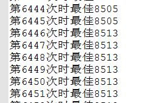

作业要求实现《一种求解多维背包问题的混合分布估计算法_王凌》

[百度学术路径](http://xueshu.baidu.com/s?wd=paperuri:(43e8c4d78e8a6d2f44bc6cf5f5724c68)&filter=sc_long_sign&sc_ks_para=q%3D%E4%B8%80%E7%A7%8D%E6%B1%82%E8%A7%A3%E5%A4%9A%E7%BB%B4%E8%83%8C%E5%8C%85%E9%97%AE%E9%A2%98%E7%9A%84%E6%B7%B7%E5%90%88%E5%88%86%E5%B8%83%E4%BC%B0%E8%AE%A1%E7%AE%97%E6%B3%95&tn=SE_baiduxueshu_c1gjeupa&ie=utf-8&sc_us=17828901901562222937)

写这篇文章主要是因为，这论文的数据集实在是找不到，但最后我还是找到了。

[CSDN下载地址](http://download.csdn.net/download/sinat_35989435/10163694)

然后我还是实现了该论文的算法，虽然感觉还是有错，而且结果并不是很好看，但我就是要厚脸皮发出来给大家嘲笑。

我实现的是SENTO2.DAT，最佳值为8722。
<!--more-->
```java

package eda2;

import java.io.BufferedReader;
import java.io.BufferedWriter;
import java.io.File;
import java.io.FileInputStream;
import java.io.FileWriter;
import java.io.InputStreamReader;

import java.io.IOException;
import java.util.ArrayList;
import java.util.Collections;
import java.util.Comparator;
import java.util.HashMap;
import java.util.HashSet;
import java.util.List;
import java.util.Map;
import java.util.Random;
import java.util.Set;
import java.util.Map.Entry;

public class eda {
    private int N;//最佳个体数
    private int s;//搜索时的
    private int Y;//初始步长
    private int M;//种群规模
    private double alpha;//学习因子
    private int n;//物体个数
    
    private double []p;//概率向量
    private int[][] population;
    private int[][] popValue;
    
    private int bagNum;//维度(背包数)
    private int []bagCapacity; //核重
    private int [][]r;//物体在不同维度上的价值   第一个  维度    第二个    维度值
    
    private int []weigh;
    private int []popWeigh;
    
    private Map<Integer,Integer> collection;
    //10 2 50 40 0.1
    public eda(int N,int s,int Y,int M,double alpha){
        this.N = N;
        this.s = s;
        this.Y = Y;
        this.M = M;
        this.alpha = alpha;
    }
    
    //初始化读取数据
    public void init(String filename)throws IOException{
        
        //这里用来存放用于排序的Map，键为下标，值为权重和
        collection = new HashMap<Integer,Integer>();

        //读取文件内容所需要的两个参数，strbuff读取一行的内容，
       //strcol数组存储被空格键切割后的字符串
        String strbuff;
        String []strcol;
        
        //将要读取的行数
        int line;
        
        //读取数据的工具data初始化
        BufferedReader data = new BufferedReader(new InputStreamReader(
                new FileInputStream(filename)));
        
        //读取第一行，背包数bagNum 和物体个数n
        strbuff = data.readLine();
        strcol = strbuff.split(" ");
        bagNum = Integer.valueOf(strcol[0]);
        n = Integer.valueOf(strcol[1]);
        
        //利用这两个数字初始化将要用到的数组
        p = new double[n];
        population = new int[M][n];
        r = new int[bagNum][n];
        bagCapacity = new int[bagNum];
        popValue = new int[M][bagNum];
        weigh = new int[n];
        popWeigh = new int[M];
        
        //文件中的第二部分为物体对应权重表
        //找到行数有多少行
        if(n % 10 == 0){
            line = n / 10;
        }else{
            line = n / 10 + 1;
        }
                
        int weighIndex = 0;
        for(int l = 0;l < line;l++){
            strbuff = data.readLine();
            strcol = strbuff.split(" ");
            for(int index = 0;index < strcol.length;index++){
                weigh[weighIndex] = 
                        Integer.valueOf(strcol[index]);
                weighIndex++;
            }
        }
        
        //文件第三部分为背包容量大小表
        if(bagNum % 10 == 0){
            line = bagNum / 10;
        }else{
            line = bagNum / 10 + 1;
        }
        int bagIndex = 0;
        for(int l = 0;l < line;l++){
            strbuff = data.readLine();
            strcol = strbuff.split(" ");
            for(int index = 0;index < strcol.length;index++){
                bagCapacity[bagIndex] = Integer.valueOf(strcol[index]);
                bagIndex++;
            }
        }
        
        //文件的第四部分为，各背包的维度值（有很多，两层循环呢）
        if(n % 10 == 0){
            line = n / 10;
        }else{
            line = n / 10 + 1;
        }
        for(int b = 0;b < bagNum;b++){
            int thingIndex = 0;
            for(int l = 0;l < line;l++){
                strbuff = data.readLine();
                strcol = strbuff.split(" ");
                for(int index = 0;index < strcol.length;index++){
                    r[b][thingIndex] = Integer.valueOf(strcol[index]);
                    thingIndex++;
                }
            }
        }
        data.close();
    }
    
    //Step1.初始化概率向量p(x)
    private void initP(){
    //    System.out.println("Step1.初始化概率向量p(x)");
        for(int i = 0;i < n;i++){
            p[i] = 0.5;
        }
    }
    
    //Step2.对p(x)进行随机采样，产生M个个体
    private void sampling(){
    //    System.out.println("Step2.对p(x)进行随机采样，产生M个个体");
        Random R = new Random();
        for(int i = 0;i < M;i++){
            for(int j = 0;j < n;j++){
                if(R.nextDouble() < p[j]){
                    population[i][j] = 1;
                }else{
                    population[i][j] = 0;
                }
            }
        }
    }
    
    //修复不可行解，计算适应值
    private void repairAndCalculate(){
    //    System.out.println("修复不可行解，计算适应值");
        //对每个个体实施遍历
        for(int i = 0;i < M;i++){
            //每个个体对应bagNum个维度
            for(int b = 0;b < bagNum;b++){
                //每个维度的值求和
                popValue[i][b] = 0;
                for(int j = 0;j < n;j++){
                    //x * r
                    popValue[i][b] += population[i][j] * r[b][j];
                }
                //如果在某个维度上非法，则将某些物体扔掉
                int index = 0;
                while(popValue[i][b] > bagCapacity[b]){
                    if(population[i][index] == 1){
                        population[i][index] = 0;
                        popValue[i][b] -= r[b][index];
                    }
                    index++;
                }
            }
            //补维度值，趋近最优
            //从后往前遍历物体
            for(int j = n - 1;j >= 0;j--){
                //如果没被选上，则尝试选上它，观察是否会超过某个维度，
                //如果通过，则加上去。
                if(population[i][j] == 0){
                    boolean ok = true;
                    for(int b = 0;b < bagNum;b++){
                        //非法
                        if(bagCapacity[b] < popValue[i][b] + r[b][j]){
                            ok = false;
                            break;
                        }
                    }
                    if(ok == true){
                        for(int b = 0;b < bagNum;b++){
                            popValue[i][b] += r[b][j];
                        }
                    }
                }
            }
            
            //权重求和
            popWeigh[i] = 0;
            for(int j = 0;j < n;j++){
                if(population[i][j] == 1){
                    popWeigh[i] += weigh[j];
                }
            }
            collection.put(new Integer(i),new Integer(popWeigh[i]));
        }
        
    }
    
    private void repair(int i){
//System.out.println("修复第"+i+"行");
        for(int b = 0;b < bagNum;b++){
            //每个维度的值求和
            popValue[i][b] = 0;
            for(int j = 0;j < n;j++){
                //x * r
                popValue[i][b] += population[i][j] * r[b][j];
            }
            //如果在某个维度上非法，则将某些物体扔掉
            int index = 0;
            while(popValue[i][b] > bagCapacity[b]){
                if(population[i][index] == 1){
                    population[i][index] = 0;
                    popValue[i][b] -= r[b][index];
                }
                index++;
            }
        }
        //补维度值，趋近最优
        //从后往前遍历物体
        for(int j = n - 1;j >= 0;j--){
            //如果没被选上，则尝试选上它，观察是否会超过某个维度，
            //如果通过，则加上去。
            if(population[i][j] == 0){
                boolean ok = true;
                for(int b = 0;b < bagNum;b++){
                    //非法
                    if(bagCapacity[b] < popValue[i][b] + r[b][j]){
                        ok = false;
                        break;
                    }
                }
                if(ok == true){
                    for(int b = 0;b < bagNum;b++){
                        popValue[i][b] += r[b][j];
                    }
                }
            }
        }
    }
    
    private void choose(){
    //    System.out.println("选择新解");
        List<Map.Entry<Integer,Integer>> list = 
                 new ArrayList<Map.Entry<Integer,Integer>>(collection.entrySet());
        collection.clear();
        Collections.sort(list,new Comparator<Map.Entry<Integer,Integer>>() {
             //降序排序
             @Override
             public int compare(Entry<Integer, Integer> o1,
                                   Entry<Integer, Integer> o2) {
                 return o2.getValue().compareTo(o1.getValue());
             }       
         });
         int [][]tempPop = new int[N][n];
         int index = 0;
         for(Map.Entry<Integer, Integer> mapping    : list){
             if(index < N){
                 for(int i = 0;i < n;i++){
                     tempPop[index][i] = population[mapping.getKey().intValue()][i];
                 }
                 index++;
             }else{
                 break;
             }
         }
         for(int i = 0;i < N;i++){
             for(int j = 0;j < n;j++){
                 population[i][j] = tempPop[i][j];
             }
         }
    }
    
    private void updateProbability(){

        for(int j = 0;j < n;j++){
            int bags = 0;
            for(int i = 0;i < N;i++){
                if(population[i][j] == 1){
                    bags++;
                }
            }
            p[j] = ((1 - alpha)*p[j])+(alpha * ((double)bags / N));
        }
    }
    
    private void bestSelect(){
    //    System.out.println("查找第一行");
        Random R = new Random();
        int one = 0,zero = 0;
        Set<Integer> integers = new HashSet<Integer>();

        while(true){
            int id = R.nextInt(n);
    
            if(!integers.contains(new Integer(id))){
            //    System.out.println("未存在"+id);
                if(population[0][id] == 0){
                    population[0][id] = 1;
                    if(zero < (s+1))
                        zero++;
                    integers.add(new Integer(id));
                }else{
                    population[0][id] = 0;
                    if(one < s){
                        one++;
                    }
                    
                    integers.add(new Integer(id));
                }
            }

            //s个从1到0  s+1个从0到1
            if(one == s && zero == (s+1)){
                break;
            }
        }
        
        repair(0);
    }
    
    public int getWeigh(int i){
        int theWeigh = 0;
        for(int j = 0;j < n;j++){
            if(population[0][j] == 1){
                theWeigh += weigh[j];
            }
        }
        return theWeigh;
    }
    
    public void print(){
        System.out.println(bagNum + " "+n);
        for(int i = 0;i < n;i++){
            System.out.print(weigh[i]+" ");
            if((i+1) % 10 == 0){
                System.out.println();
            }
        }
        for(int i = 0;i < bagNum;i++){
            System.out.print(bagCapacity[i]+" ");
            if((i+1) % 10 == 0){
                System.out.println();
            }
        }
        for(int b = 0;b < bagNum;b++){
            for(int j = 0;j < n;j++){
                System.out.print(r[b][j] + " ");
                if((j+1) % 10 == 0){
                    System.out.println();
                }
            }
            if(n % 10 != 0){
                System.out.println();
            }
        }
    }
    
    public void start(String filename,int endTimes) throws IOException{
        BufferedWriter writer = new BufferedWriter(
                              new FileWriter(new File(filename)));
        initP();
        int maxWeigh = 0;
        for(int time = 0;time < endTimes;time++){
            sampling();
            repairAndCalculate();
            choose();
            int nowWeigh = getWeigh(0);
            if(maxWeigh < nowWeigh){
                maxWeigh = nowWeigh;
            }
            writer.write("第"+(time+1)+"次时最佳"+maxWeigh);
            writer.newLine();
            for(int i = 0;i < 50+(time/20);i++){
                bestSelect();
            }    
            updateProbability();
        }
        writer.close();
    }
    
    public static void main(String[] args) throws IOException {
        //10 2 50 40 0.1
        eda e = new eda(10,2,50,40,0.1);
        e.init("d://SENTO2.DAT");
        e.start("d://result.txt",20000);
    }
}
```
最后我实现的结果大概在8400到8600之间。

实验结果截图：


结果一般，但还是收获良多。本次主要是提供数据集的下载。谢谢大家。

如对代码有疑惑可以前往 联系我们 和我交流，评论已经关闭，首页置顶的帖子不要理。