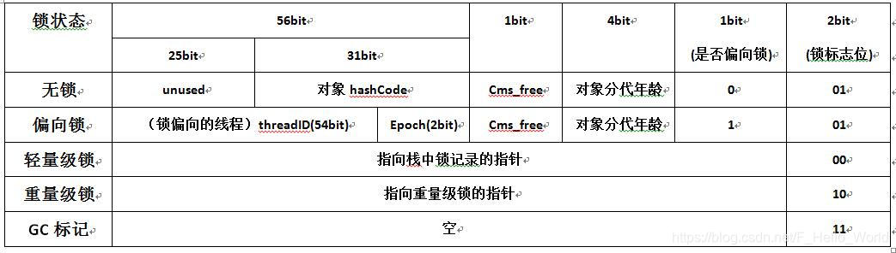

> 前言：本文想要介绍Synchronized，ReentrantLock和ReentrantLock的Condition的相关用法。
<!--more-->
# Synchronized上锁
Synchronized可以修饰实例方法、静态方法和代码块。修饰代码块时，可以对具体的对象上锁，也可以对某个类(.class)上锁。

## Synchronized是非公平锁
以下代码是通过给一个多线程能访问到的变量使用synchronized进行上锁，实现有序打印数字的功能。并且在最后会统计不同线程打印数字的次数：
```java
package com.windypath.lockcondition;

public class Syn {
    int count = 0;
    final Object sth = new Object();
    void play() {
        int loopTimes = 1000;
        SynThread t1 = new SynThread(loopTimes, "t1");
        SynThread t2 = new SynThread(loopTimes, "t2");
        SynThread t3 = new SynThread(loopTimes, "t3");
        SynThread t4 = new SynThread(loopTimes, "t4");
        t1.start();
        t2.start();
        t3.start();
        t4.start();
    }

    public static void main(String[] args) {
        Syn syn = new Syn();
        syn.play();
    }
    class SynThread extends Thread {
        int loopTimes;

        public SynThread(int loopTimes, String threadName) {
            super(threadName);
            this.loopTimes = loopTimes;
        }
        @Override
        public void run() {
            int times = 0;
            while (count <= 200000) {
                synchronized (sth) {
                    count++;
//                    System.out.println(getName() + " 输出 " + count);
                    times++;
                }
            }
            System.out.println(getName() + "一共输出了 " + times + " 次");
        }
    }
}
```
输出结果如下：
```
t2一共输出了 103061 次
t1一共输出了 37174 次
t4一共输出了 33751 次
t3一共输出了 26018 次
```
可以看到线程t2输出的次数比其他三个线程加起来还要多。因为synchronized是非公平锁。
## synchronized的等待队列
使用synchronized上锁的对象的等待队列位于ObjectMonitor中的_waitSet。这个ObjectMonitor是底层native(也就是C/C++)的内容。

## synchronized锁升级
但并不是一开始就上重量级锁，而是先优化成偏向锁，如有竞争才会升级为轻量级锁，大量的线程参与锁的竞争时，才会从轻量级锁升级到重量级锁。

上锁的对象使用其对象头中的MarkWord来存储锁的信息。

一个Java对象在内存中的存储结构包括三个部分：
- 对象头
- 实例变量
- 填充字节

其中对象头中主要存储一些运行时的数据：
- MarkWord 
- Class Metadata Address (指向对象类型数据的指针)
- Array Length (是数组的话，记录长度)

锁的信息记录在对象头的MarkWord中。下图是不同的锁的MarkWord的不同位的信息：



- 偏向锁（biased lock）
偏向锁是为了避免在非多线程环境下，执行synchronized上锁时使用轻量级锁等更高等级的锁消耗资源。

偏向的意思是，被上锁的对象偏向于某个线程。其对象头会存储偏向的线程id。


- 轻量级锁（lightweight lock）
轻量级锁并不是用来代替重量级锁的，它的本意是在没有多线程竞争的前提下，减少传统的重量级锁使用产生的性能消耗。在解释轻量级锁的执行过程之前，先明白一点，轻量级锁所适应的场景是线程交替执行同步块的情况。

## 轻量级锁和偏向锁的区别
轻量级锁的加锁过程需要多次CAS操作，而偏向锁仅需要一次CAS操作。
轻量级锁所适应的场景是线程交替执行同步块的情况。而偏向锁则是在只有一个线程执行同步块时进一步提高性能。


## synchronized锁升级观察
尝试使用一个对象，多个线程在不同的时间段为其上synchronized锁，来观察其锁状态。
thread1:马上获取，马上释放
thread2:等500ms获取，然后使用1500毫秒再释放
thread3:等待1000ms获取，然后马上释放。

此时，thread2和thread3会出现锁竞争。

源代码如下：
```java
package com.windypath;

import org.apache.logging.log4j.LogManager;
import org.apache.logging.log4j.Logger;
import org.openjdk.jol.info.ClassLayout;

/**
 * 观察synchronized从偏向锁 -> 轻量级锁 -> 重量级锁 的过程
 * 项目使用log4j2
 */

public class BiasdLock {
    final static Logger log = LogManager.getLogger();
    public static void main(String[] args) throws InterruptedException {
        log.debug(Thread.currentThread().getName() + "最开始的状态:\n"
                + ClassLayout.parseInstance(new Object()).toPrintable());
        // HotSpot 虚拟机在启动后有个 4s 的延迟才会对每个新建的对象开启偏向锁模式
        Thread.sleep(4000);
        // 创建一个对象，用于多个不同的线程上锁用
        Object obj = new Object();
        log.debug(Thread.currentThread().getName() + "等待4秒后的状态（新对象）:\n"
                + ClassLayout.parseInstance(obj).toPrintable());
        //线程1，马上上锁马上释放
        new Thread(() -> {
            log.debug(
                    Thread.currentThread().getName() + "开始执行准备获取锁:\n" + ClassLayout.parseInstance(obj).toPrintable());
            synchronized (obj) {
                log.debug(Thread.currentThread().getName() + "获取锁执行中:\n"
                        + ClassLayout.parseInstance(obj).toPrintable());
            }
            log.debug(Thread.currentThread().getName() + "释放锁:\n" + ClassLayout.parseInstance(obj).toPrintable());
        }, "thread1").start();
        // 线程2，等线程1释放锁后再上锁
        new Thread(() -> {
            try {
                Thread.sleep(500);
            } catch (InterruptedException e) {
                throw new RuntimeException(e);
            }
            log.debug(
                    Thread.currentThread().getName() + "开始执行准备获取锁:\n" + ClassLayout.parseInstance(obj).toPrintable());
            synchronized (obj) {
                log.debug(Thread.currentThread().getName() + "获取锁执行中:\n"
                        + ClassLayout.parseInstance(obj).toPrintable());
                try {
                    Thread.sleep(1500);
                } catch (InterruptedException e) {
                    throw new RuntimeException(e);
                }

            }
            log.debug(Thread.currentThread().getName() + "释放锁:\n" + ClassLayout.parseInstance(obj).toPrintable());
        }, "thread2").start();
        // 线程3，在线程2拥有锁的时候尝试上锁
        new Thread(() -> {
            try {
                Thread.sleep(1000);
            } catch (InterruptedException e) {
                throw new RuntimeException(e);
            }
            log.debug(
                    Thread.currentThread().getName() + "开始执行准备获取锁:\n" + ClassLayout.parseInstance(obj).toPrintable());
            synchronized (obj) {
                log.debug(Thread.currentThread().getName() + "获取锁执行中:\n"
                        + ClassLayout.parseInstance(obj).toPrintable());
            }
            log.debug(Thread.currentThread().getName() + "释放锁:\n" + ClassLayout.parseInstance(obj).toPrintable());
        }, "thread3").start();
        //主线程等待所有线程运行结束，查看状态
        Thread.sleep(5000);
        log.debug(Thread.currentThread().getName() + "结束状态:\n" + ClassLayout.parseInstance(obj).toPrintable());
    }
}
```
输出如下(精简之后):
```
15:53:58.436 [main] main最开始的状态:non-biasable
15:54:02.854 [main] 等待4秒后的状态（新对象）:biasable
15:54:02.858 [thread1] thread1开始执行准备获取锁:biasable
15:54:02.858 [thread1] thread1获取锁执行中:biased
15:54:02.859 [thread1] thread1释放锁:biased
15:54:03.367 [thread2] thread2开始执行准备获取锁:biased
15:54:03.368 [thread2] thread2获取锁执行中:thin lock
15:54:03.869 [thread3] thread3开始执行准备获取锁:thin lock
15:54:04.872 [thread3] thread3获取锁执行中:fat lock
15:54:04.872 [thread2] thread2释放锁:fat lock
15:54:04.873 [thread3] thread3释放锁:fat lock
15:54:07.868 [main] main结束状态:non-biasable
```
可以分析得到以下结论：
- 对于hotspot虚拟机，刚启动时创建的对象是不可偏向(non-biasable)的
- 4秒后创建的对象，状态为可偏向(biasable)
- thread1获取锁时，由于仅有一个线程为此对象上synchronized锁，因此转为偏向锁状态(biased)
- thread1释放锁时，锁对象状态依旧为偏向锁(biased)，并不会回到可偏向(biasable)
- 500ms后，thread2获取锁时，锁对象的状态会升级为轻量级锁(thin lock)
- 再过500ms后，thread3也开始获取锁，未执行到synchronized代码块时，状态为轻量级锁(thin lock)，执行到synchronized时，阻塞，直到thread2释放的同时马上获取锁(倒数第三第四行的日志时间一模一样都是15:54:04.872)
- thread3马上释放锁，这一刻还是重量级锁(fat lock)
- 主线程等待5秒后，锁状态恢复，但是是变为不可偏向(non-biasable)状态。
- 可以尝试把前面的等待4秒注释，这样的话一上来就会获取轻量级锁

# ReentrantLock上锁
ReentrantLock是轻量级、可重入锁。在创建时可指定是否是公平锁。
ReentrantLock可以和Condition配套使用。
ReentrantLock提供了多个并发编程相关的函数可供使用，相比于synchronized而言，灵活性更高。
- ReentrantLock可支持锁是否是公平锁
- ReentrantLock提供了常规的lock()上锁的函数之外，还提供了用于轮询使用的tryLock()函数和可被打断的lockInterruptly()函数
- ReentrantLock上锁之后，可以根据业务等待不同的Condition

## ReentrantLock，可以是公平锁
```java
package com.windypath.lockcondition;

import java.util.concurrent.locks.ReentrantLock;

public class Reen {
    int count = 0;
    final ReentrantLock lock = new ReentrantLock(true);
    void play() {
        int loopTimes = 1000;
        ReenThread t1 = new ReenThread(loopTimes, "t1");
        ReenThread t2 = new ReenThread(loopTimes, "t2");
        ReenThread t3 = new ReenThread(loopTimes, "t3");
        ReenThread t4 = new ReenThread(loopTimes, "t4");
        t1.start();
        t2.start();
        t3.start();
        t4.start();
    }

    public static void main(String[] args) {
        Reen reen = new Reen();
        reen.play();
    }
    class ReenThread extends Thread {
        int loopTimes;

        public ReenThread(int loopTimes, String threadName) {
            super(threadName);
            this.loopTimes = loopTimes;
        }
        @Override
        public void run() {
            int times = 0;

            while (count <= 200000) {
                try {
                    lock.lock();
                    count++;
//                    System.out.println(getName() + " 输出 " + count);
                    times++;
                } finally {
                    lock.unlock();
                }
            }
            System.out.println(getName() + "一共输出了 " + times + " 次");
        }
    }
}
```
输出结果如下：
```
t3一共输出了 49953 次
t4一共输出了 49988 次
t1一共输出了 50077 次
t2一共输出了 49986 次
```
可以看到4个线程的输出基本都在50000左右。

## ReentrantLock不使用Condition模拟哲学家就餐
哲学家就餐问题，即5个哲学家围在一个圆桌吃饭，但桌上只有5只筷子。哲学家思考结束后，需要同时获取左手边的筷子和右手边的筷子才能吃饭。
在这里，我们使用线程来模拟哲学家，使用ReentrantLock模拟筷子。
```java
package com.windypath;

import java.util.concurrent.locks.Condition;
import java.util.concurrent.locks.Lock;
import java.util.concurrent.locks.ReentrantLock;

public class DiningPhilosopher {
    public static void main(String[] args) {
        int numPhilosophers = 5;
        Philosopher[] philosophers = new Philosopher[numPhilosophers];
        Chopstick[] chopsticks = new Chopstick[numPhilosophers];

        for (int i = 0; i < numPhilosophers; i++) {
            chopsticks[i] = new Chopstick();
        }

        for (int i = 0; i < numPhilosophers; i++) {
            Chopstick leftChopstick = chopsticks[i];
            Chopstick rightChopstick = chopsticks[(i + 1) % numPhilosophers];
//            philosophers[i] = new Philosopher(i, leftChopstick, rightChopstick);
            if (i % 2 == 0) {
                philosophers[i] = new Philosopher(i, leftChopstick, rightChopstick);
            } else {
                philosophers[i] = new Philosopher(i, rightChopstick, leftChopstick);
            }
            Thread thread = new Thread(philosophers[i]);
            thread.start();
        }
    }

    static class Philosopher implements Runnable {
        private final int id;
        private final Chopstick leftChopstick;
        private final Chopstick rightChopstick;

        private int eatTimes = 0;

        public Philosopher(int id, Chopstick leftChopstick, Chopstick rightChopstick) {
            this.id = id;
            this.leftChopstick = leftChopstick;
            this.rightChopstick = rightChopstick;
        }

        private void think() throws InterruptedException {
            System.out.println("Philosopher " + id + " is thinking.");
            Thread.sleep((long) ( 1000));
        }

        private void eat() throws InterruptedException {
            leftChopstick.pickUp();
            rightChopstick.pickUp();

            System.out.println("Philosopher " + id + " picks up both chopsticks and eats.");
            Thread.sleep((long) ( 1000));
            System.out.println("Philosopher " + id + " puts down both chopsticks.");

            rightChopstick.putDown();
            leftChopstick.putDown();
            eatTimes++;
            if (eatTimes % 10 == 0) {
                System.out.println("Philosopher " + id + " 目前吃了" + eatTimes + "次");
            }
        }

        @Override
        public void run() {
            try {
                while (true) {
                    think();
                    eat();
                }
            } catch (InterruptedException e) {
                Thread.currentThread().interrupt();
            }
        }
    }

    static class Chopstick {
        private final Lock lock = new ReentrantLock();

        public void pickUp() {
            lock.lock();

        }

        public void putDown() {
            lock.unlock();
        }
    }
}
```
在上面的代码中，筷子只需要在被哲学家拿起时调用lock()函数，在放下时调用unlock()函数即可完成“同时拥有左手边的筷子和右手边的筷子”的目标。

### 使用Condition的代码：
```java
package com.windypath;

import java.util.concurrent.locks.Condition;
import java.util.concurrent.locks.Lock;
import java.util.concurrent.locks.ReentrantLock;

public class DiningPhilosophers {
    public static void main(String[] args) {
        int numPhilosophers = 5;
        Philosopher[] philosophers = new Philosopher[numPhilosophers];
        Chopstick[] chopsticks = new Chopstick[numPhilosophers];

        for (int i = 0; i < numPhilosophers; i++) {
            chopsticks[i] = new Chopstick();
        }

        for (int i = 0; i < numPhilosophers; i++) {
            Chopstick leftChopstick = chopsticks[i];
            Chopstick rightChopstick = chopsticks[(i + 1) % numPhilosophers];
//            philosophers[i] = new Philosopher(i, leftChopstick, rightChopstick);
            if (i % 2 == 0) {
                philosophers[i] = new Philosopher(i, leftChopstick, rightChopstick);
            } else {
                philosophers[i] = new Philosopher(i, rightChopstick, leftChopstick);
            }
            Thread thread = new Thread(philosophers[i]);
            thread.start();
        }
    }

    static class Philosopher implements Runnable {
        private final int id;
        private final Chopstick leftChopstick;
        private final Chopstick rightChopstick;

        private int eatTimes = 0;

        public Philosopher(int id, Chopstick leftChopstick, Chopstick rightChopstick) {
            this.id = id;
            this.leftChopstick = leftChopstick;
            this.rightChopstick = rightChopstick;
        }

        private void think() throws InterruptedException {
            System.out.println("Philosopher " + id + " is thinking.");
            Thread.sleep((long) ( 1000));
        }

        private void eat() throws InterruptedException {
            leftChopstick.pickUp();
            rightChopstick.pickUp();
            
            System.out.println("Philosopher " + id + " picks up both chopsticks and eats.");
            Thread.sleep((long) ( 1000));
            System.out.println("Philosopher " + id + " puts down both chopsticks.");
            
            rightChopstick.putDown();
            leftChopstick.putDown();
            eatTimes++;
            if (eatTimes % 10 == 0) {
                System.out.println("Philosopher " + id + " 目前吃了" + eatTimes + "次");
            }
        }

        @Override
        public void run() {
            try {
                while (true) {
                    think();
                    eat();
                }
            } catch (InterruptedException e) {
                Thread.currentThread().interrupt();
            }
        }
    }

    static class Chopstick {
        private final Lock lock = new ReentrantLock(true);
        private final Condition condition = lock.newCondition();
        private boolean taken = false;

        public void pickUp() throws InterruptedException {
            lock.lock();
            try {
                while (taken) {
                    condition.await();
                }
                taken = true;
            } finally {
                lock.unlock();
            }
        }

        public void putDown() {
            lock.lock();
            try {
                taken = false;
                condition.signal();
            } finally {
                lock.unlock();
            }
        }
    }
}
```
可以看到，筷子类Chopstick加上了状态taken，用于判定目前筷子是否被某个哲学家拥有。
当第一个哲学家拥有某一只筷子的时候，taken为true；锁释放。当第二个哲学家拿起这只筷子时，还是会获得相同的锁，但会因为taken为true而进入condition.await()等待，此时也会释放锁，让其他哲学家能够获取这只筷子。
当筷子被放下时，调用signal()方法，此时之前await()函数的线程会被唤醒，执行其后序逻辑。

> 如果不使用公平锁，那么输出里你可能会看到有两个哲学家很晚才吃10次。如果使用公平锁，则5个哲学家几乎是同步吃到10次。

> 注意到在初始化哲学家时，奇数号哲学家的筷子是左右反过来拿的。这是因为在后续的获取筷子的逻辑中，我们总是先拿左手边的筷子，再拿右手边的筷子。如果不这样让一部分哲学家左右相反，那么会出现5个哲学家同时拿起左手边的筷子，然后等待右手边的筷子，造成死锁。（当然我们也可以通过随机数来让哲学家选择先左后右，还是先右后左。）