# \[JavaScript\]JS基础知识（上）
## 变量类型及计算
### 变量类型

值类型 vs  引用类型

值类型：
```javascript
var a = 100
var b = a
a = 200
console.log(b) //100
```
引用类型：
```javascript
var a = {age:20}
var b = a
b.age = 21
console.log(a.age) //21
```
引用类型：对象、数组和函数

特点：无限扩展属性，内存占用可能过大，故共用内存空间以节省空间
<!--more-->
### Typeof运算符详解
```javascript
typeof undefined	//undefined
typeof 'abc'		//string
typeof 123		//number
typeof true		//boolean
typeof {}		//object
typeof []		//object
typeof null		//object
typeof console.log	//function
```
注：null也是对象

1~4行是值类型，5~8行是引用类型，但JS只能区分函数与非函数，而不能区分数组和对象。

## 变量计算
### 强制类型转换
#### 字符串拼接
```javascript
var a = 100 + 10
var b = 100 + '10'
console.log(a)	//110
console.log(b)	//10010
```
数字 + 字符串时将数字自身转为字符串。

#### ==运算符
```javascript
console.log(100 == '100')		//true
console.log(0 == '')			//true
console.log(null == undefined)		//true
```
==计算会试图让前后的比较对象相等，故发生类型转换

#### if语句
```javascript
var a = true
if(a){
    console.log('a');
}
var b = 100
if(b){
    console.log('b')
}
var c = ''
if(c){
    console.log('c')
}
//输出 a 
//     b
//（c不输出）
```
100被强制转换为true，而’’被转换为false

#### 逻辑运算
```javascript
console.log(10 && 0)		//0
console.log('' || 'abc')	//abc
console.log(!window.abc)	//true
	
//判断一个变量会被当成true 还是 false
var a = 100
console.log(!!a)		//true
```
## 题目：

1、何时使用 === 何时使用 == ?
```javascript
if(obj.a == null){
	//相当于 obj.a === null || obj.a === undefined 的简写形式
	//jQuery源码推荐写法
}
```
除了这种情况外，全部使用===

2、JS中有哪些内置函数
- Object
- Array
- Boolean
- Number
- String
- Function
- Date
- RegExp
- Error

3、如何理解JSON？

Json既是数据格式，也是数据对象。
```javascript
JSON.stringify({a:10,b:20})
JSON.parse('{"a":10,"b":20}')
```

## 原型和原型链
### 构造函数

```javascript
function Foo(name,age){
    this.name = name
    this.age = age
    this.class = 'class-1'
    //return this  //默认有这一行
}
var f = new Foo('zhangsan',20)
//var f1 = new Foo('lisi',21)	//创建多个对象
```
构造函数需使用大写开头！

扩展：

var a = {} 其实是 var a = new Object() 的语法糖

Var a = [] 其实是 Var a = new Array() 的语法糖

Function Foo(){...} 其实是 var Foo = new Function(...)的语法糖

使用instanceof判断一个函数是否是一个变量的构造函数

判断一个变量是否为“数组”： 变量 instanceof Array

### 5条原型规则
1、所有的引用类型（数组、对象、函数），都具有对象特性，即可自由扩展属性（除了null以外）
```javascript
var obj = {};obj.a = 100;
var arr = [];arr.a = 100;
function fn(){}
fn.a = 100
```
2、所有的引用类型（数组、对象、函数），都有一个__proto__属性，属性值是一个普通的对象。（隐式原型）
```javascript
console.log(obj.__proto__);
console.log(arr.__proto__);
console.log(fn.__proto__);
```
输出结果：
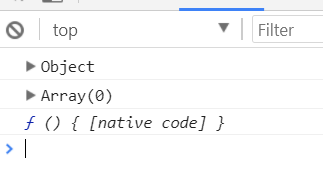

3、所有的函数，都有一个prototype属性，属性值也是一个普通的对象（显式原型）
```javascript
console.log(fn.prototype)
```
输出结果
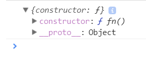
4、所有的引用类型（数组、对象、函数），__proto__属性值指向它的构造函数的“prototype”属性值
```javascript
console.log(obj.__proto__ === Object.prototype)  //true
```

5、当试图得到一个对象的某个属性时，如果这个对象本身没有这个属性，那么会去它的__proto__（即它的构造函数的prototype）中寻找

```javascript
function Foo(name, age){
    this.name = name
}
Foo.prototype.alertName = function(){
    alert(this.name)
}
//创建示例
var f = new Foo('zhangsan')
f.printName = function(){
    console.log(this.name);
}
//测试
f.printName()
f.alertName()
```
this：

永远指向f自身，故能读取属性

**循环对象自身的属性**
```javascript
var item
for (item in f){
    //高级浏览器已经在for in中屏蔽了来自原型的属性
    //但是建议还是加判断
    if(f.hasOwnProperty(item)){
        console.log(item)
    }
}
```
### 原型链
```javascript
function Foo(name, age){
    this.name = name
}
Foo.prototype.alertName = function(){
    alert(this.name)
}
//创建示例
var f = new Foo('zhangsan')
f.printName = function(){
    console.log(this.name);
}
//测试
f.printName()
f.alertName()
f.toString() // 要去f.__proto__.__proto__中查找
```
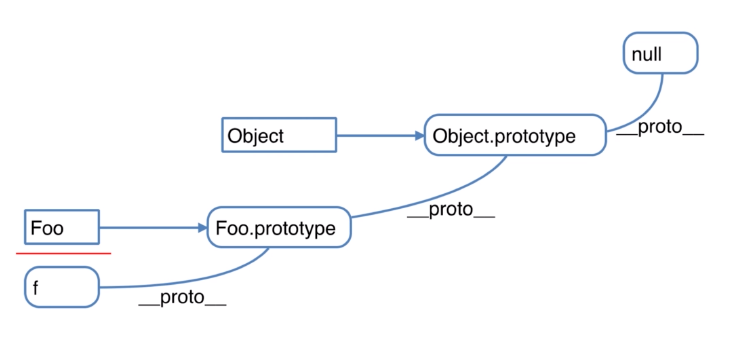

注意，toString()是Object.prototype中的方法，f通过读取__proto__的方式寻找该方法，但它的上一级原型并没有这个方法，故寻找隐式原型的隐式原型，最终在Object中找到了toString()方法。

### Instanceof的用法介绍

用于判断引用类型属于哪个构造函数的方法

F instanceof Foo 的判断逻辑是：

F 的 __proto__ 一层一层往上，能否对应到 Foo.prototype

再试着判断 f instanceof Object

题目：

1、如何准确判断一个变量是数组类型
```javascript
var arr = []
arr instanceof Array	// true
typeof arr 	//Object
```
2、写一个原型链继承的例子

封装DOM查询：
```javascript
function Elem(id){
    this.elem = document.getElementById(id)
}
Elem.prototype.html = function(val){
    var elem = this.elem
    if(val){
        elem.innerHTML = val
        return this   //链式操作
    }else{
        return elem.innerHTML
    }
}
Elem.prototype.on = function(type, fn){
    var elem = this.elem
    elem.addEventListener(type,fn)
    return this
}
var div1 = new Elem('div1')
//console.log(div1.html())

div1.html('<p>hello world</p>')
div1.on('click',function(){
    alert('clicked')
})
//链式操作
div1.html('<p>hello world</p>').on('click',function(){
    alert('clicked')
})
```
3、描述new一个对象的过程
```javascript
function Foo(name,age){
    this.name = name
    this.age = age
    this.class = 'class-1'
    //return this  //默认有这一行
}
var f = new Foo('zhangsan',20)
```
1. 创建一个新对象
2. this指向这个新对象
3. 执行代码，即对this赋值
4. 返回this


# \[JavaScript\]JS基础知识（中）
## 作用域和闭包
### 执行上下文

范围：一段\<script>或者一个函数

全局：变量定义、函数声明（一段\<script>）

函数：变量定义、函数声明、this、arguments（函数）
```javascript
console.log(a) //undefined
var a = 100
   
fn('zhangsan')  //zhangsan 20
function fn(name){
    //函数内
    age = 20
    console.log(name, age)
    var age
      
    bar(100)
    function bar(num){
        console.log(num)
    }
}
```
在第2行执行之前，a被声明为undefined，而在第5行执行时，函数fn直接被提前完整声明了，所以可以正确执行。

在第6~15行，是函数内的执行上下文，同理，在第8行中读取age的属性，自动为age完成了“var age”的声明，故程序可正常执行。

建议定义要放前面，方便他人阅读。

在函数fn中，bar(100)也会去寻找function bar()的声明，故也能正常输出数字。

关于this、argument，在函数执行之前，this就已经确定了值。
#### 注意“函数声明”和“函数表达式”的区别
```javascript
//函数声明
function fn(){
    //声明
}
//函数表达式
var fn = function(){
    //表达式
}
```
注意，执行第1行时，如果是用函数声明的方式定义函数，则可以执行，而使用函数表达式的方式，则报错，因为找不到函数的定义。
#### this
作为构造函数执行：
```javascript
function Foo(name){
    this.name = name
}

var f = new Foo("zhangsan")
```
作为对象属性执行：
```javascript
var obj = {
    name: 'A',
    printName: function(){
        console.log(this.name)
    }
}
obj.printName()
```
作为普通函数执行：
```javascript
function fn(){
    console.log(this)   //this === window
}
fn()
```
call apply bind：
```javascript
function fn1(name,age){
    alert(name)
    console.log(this)
}
fn1.call({x:100},'zhangsan',20)
fn1.apply({x:100},['zhangsan',20])

var fn2 = function(name,age){
    alert(name)
    console.log(this)
}.bind({y:200})
fn2('zhangsan',20)
```
call、apply和bind可以修改this的值。其中要注意bind必须要用函数表达式的方式才能执行。
#### 作用域
js中，无块级作用域：
```javascript
if(true){
    var name = 'zhangsan'
}
console.log(name)   //zhangsan
```
外部可以访问if语句块中的name

有函数和全局作用域：
```javascript
var a = 100
function fn(){
    var a = 200
    console.log('fn',a) //fn 200
}
console.log('global',a) //global 100
fn()
```
由于有函数作用域和全局作用域，故两次输出a的值不同。定义到函数里的变量，外部不可调用、改变。

#### 作用域链
关于自由变量：
```javascript
var a = 100
function fn(){
    var b = 200 //当前作用域中没有定义的变量，即“自由变量”
    console.log(a)
    console.log(b)
}
fn()
```
在fn函数中，并没有定义a，但是fn从其父级作用域中寻找变量。

函数的作用域是由函数定义的时候指定的，而不是函数执行时指定的。

关于作用域链：
```javascript
var a = 100
function f1(){
    var b = 200
    function f2(){
        var c = 300
        console.log(a)  //自由变量
        console.log(b)  //自由变量
        console.log(c)
    }
    f2()
}
f1()
```
F1的父级作用域是全局作用域，f2的父级作用域是f1，因此当打印a时，js向父级作用域中寻找，而f1作用域没有，则再往f1的父级作用域，即全局作用域中寻找，再全局作用域中找到a，而b也同理。

这个寻找的过程是从作用域链中一步步寻找得到的，这就是作用域链。
### 闭包
#### 函数作为返回值的情况：
```javascript
function F1(){
    var a = 100
    
    //返回一个函数（函数作为返回值）
    return function(){
        console.log(a)
    }
}

//f1得到一个新函数
var f1 = F1()
a = 200
f1()  // 10
```
F1函数返回了一个函数。将返回的函数赋值给了f1，之后执行f1。

在第5行中，a是自由变量，故到它的父级作用域中寻找，而F1()函数中定义了a = 100，所以a的值为100。

#### 函数作为参数传递的情况：
```javascript
function F1(){
    var a = 100
    
    //返回一个函数（函数作为返回值）
    return function(){
        console.log(a)
    }
}
var f1 = new F1()

function F2(fn){
    a = 200
    fn()
}
F2(f1); //还是 100
```
#### 题目：
1、说一下对变量提升的理解：

变量定义
函数声明（注意和函数表达式的区别）

2、说明this几种不同的使用场景

作为构造函数执行
作为对象属性执行
作为普通函数执行
Call apply bind

3、创建10个&lt;a&gt;标签，点击的时候弹出来对应的序号

错误代码：
```javascript
var i,a
for(i = 0;i &lt; 10;i++){
    a = document.createElement('a')
    a.innerHTML = i + '&lt;br/&gt;'
    a.addEventListener('click',function(e){
        e.preventDefault()
        alert(i)
    })
    document.body.appendChild(a)
}
```
执行结果：无论点击哪个链接，都弹出10。原因是在全局作用域中，i在循环结束时的值为10，所以不管之前定义时i的值为多少，总是返回当前作用域的i的值。

正确解法：使用自执行函数（就是不用调用，只要定义完成，立即执行的函数）

正确代码：
```javascript
var i
for(i = 0;i &lt; 10;i++){
    (function(i){
        //存在自己的函数作用域
        var a = document.createElement('a')
        a.innerHTML = i + '&lt;br/&gt;'
        a.addEventListener('click',function(e){
        e.preventDefault()
        alert(i)
    })
    document.body.appendChild(a)
    })(i)   
}
```
结果截图：
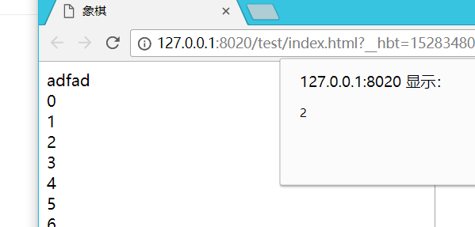

# \[JavaScript\]JS基础知识（下）
## 异步和单线程
### 异步
```javascript
console.log(100)
setTimeout(function(){
    console.log(200)
},1000)
console.log(300)
//输出：
//100
//300
//200（过了1秒后）
```
### 同步
```javascript
console.log(100)
alert(200)
console.log(300)
//在弹窗弹出200时，控制台是不打印300的，直到弹框结束才打印300
```
同步会阻塞下面代码的执行，什么时候消除阻塞，才会继续往下走。

异步不会阻塞，只是继续等待。

异步同步的差异在于，会不会阻塞后续代码的执行。

### 何时需要异步？
在可能发生等待的情况。

等待过程中不能像alert一样阻塞程序执行。

因此，所有的“等待的情况”都需要异步。

### 前端使用异步的场景
定时任务：setTimeout（设置多少毫秒之后执行函数体）,setInterval（设置每多少毫秒之后执行函数体）
```javascript
console.log(100)
setTimeout(function(){
    console.log(200)
},1000)
console.log(300)
//输出：
//100
//300
//200（过了1秒后）
```
网络请求：ajax请求：
```javascript
console.log('start')
$.get('./data1.json',function(data1){
	console.log(data1)
})
console.log('end')
```
动态&lt;img&gt;加载：
```javascript
console.log('start')
var img = document.createElement('img')
img.onload = function(){
    console.log('loaded')
}
img.src = 'img/HBuilder.png'
console.log('end')
```
事件绑定：
```javascript
console.log('start')
document.getElementById('div1').addEventListener('click',function(){
    alert('clicked')
})
console.log('end')
```

### 异步和单线程
```javascript
console.log(100)
setTimeout(function(){
    console.log(200)
},1000)
console.log(300)
//输出：
//100
//300
//200（过了1秒后）
```
执行第1行，打印100，

执行setTimeout后，传入setTimeout函数会被暂存起来，不会立即执行（单线程的特点，不能同时干两件事），

执行最后一行，打印300，

待所有程序执行完，处于空闲状态时，会马上查看有没有暂存起来的要执行的函数，

发现暂存起来的setTimeout中的函数无需等待时间，就立即发过来执行。
### 题目
1、同步和异步的区别是什么？分别举一个同步和异步的例子。

同步会阻塞代码执行，而异步不会。

Alert是同步，setTimeout是异步。

2、一个关于setTimeout的笔试题：
```javascript
console.log(1)
setTimeout(function(){
    console.log(2)
},0)
console.log(3)
setTimeout(function(){
    console.log(4)
},1000)
console.log(5)
```
输出：1 3 5 2 4

3、前端使用异步的场景有哪些？

都需要等待，单线程，为了不阻塞，只能等待。

### 其他知识
#### 日期
```javascript
Date.now()			//当前时间的毫秒数
var dt = new Date()
dt.getTime() 		//获取毫秒数
dt.getFullYear() 	//年
dt.getMonth() 		//月（0~11）
dt.getDate()		//日（0~31）
dt.getHours()		//小时（0~23）
dt.getMinutes()		//分钟（0~59）
dt.getSeconds()		//秒	 (0~59)
```
#### Math
获取随机数Math.random()
#### 数组API
forEach 遍历所有元素：
```javascript
var arr = [1,2,3]
//参数为 元素,下标，元素在前，下标在后
arr.forEach(function(item, index){
    //遍历数组中的所有元素
    console.log(index,item)
})
```
every 判断所有元素是否都符合条件：
```javascript
var arr = [1,2,3]
var result = arr.every(function(item, index){
    //用来判断所有的数组元素，是否都满足一个条件
    if(item &lt; 2){
        return true
    }
})
console.log(result)	//false
```
some 判断是否有至少一个元素符合条件：
```javascript
var arr = [1,2,3]
var result = arr.some(function(item, index){
    //用来判断所有的数组元素，只要有一个满足条件即可
    if(item &lt; 2){
        return true
    }
})
console.log(result)	//true
```

sort 排序
```javascript
var arr = [1,4,2,3,5]
var arr2 = arr.sort(function(a,b){
	//从小到大排序
	return a - b
})
console.log(arr2)
```
map 对元素重新组装，生成新数组
```javascript
var arr = [1,2,3,4]
var arr2 = arr.map(function(item,index){
    //将元素重新组装，并返回
    return '&lt;b&gt;' + item + '&lt;/b&gt;'
})
console.log(arr2)
```
filter 过滤符合条件的元素：
```javascript
var arr = [1,2,3]
var arr2 = arr.filter(function(item,index){
    //通过某一个条件过滤数组
    if(item &gt;= 2){
        return true
    }
})
console.log(arr2)
```
#### 对象API
for in
```javascript
var obj = {
    x:100,
    y:200,
    z:300
}
var key
for(key in obj){
    if(obj.hasOwnProperty(key)){
        console.log(key,obj[key])
    }
}
```
#### 题目
1、获取2017-06-10格式的日期
```javascript
function formatDate(dt){
	if(!dt){
		dt = new Date()
	}
	var year = dt.getFullYear()
	var month = dt.getMonth() + 1
	var date = dt.getDate()
	if(month &lt; 10){
		//强制类型转换
		month = '0' + month
	}
	if(date &lt; 10){
		//强制类型转换
		date = '0' + date
	}
	//强制类型转换
	return year + '-' + month + '-' + date
}
var dt = new Date()
var formatDate = formatDate(dt)
console.log(formatDate)
```
2、获取随机数，要求是长度一致的字符串格式
```javascript
var random = Math.random()
random = random + '0000000000'//后面加上10个零
random = random.slice(0,10)
console.log(random)
```
3、写一个能遍历对象和数组的通用forEach函数
```javascript
//对数组:
var arr = ['a','b','c']
forEach(arr,function(item,index){
    console.log(index,item)
})
//对对象:
var obj = {
    'one':'a',
    'two':'b'
}
for(key in obj){
    console.log(key,obj[key])
}
//组合后:
function forEach(obj,fn){
    var key
    if(obj instanceof Array){
        //准确判断是不是数组
        obj.forEach(function(item,index){
            fn(index,item)
        })
    }else{
        //不是数组就是对象
        for(key in obj){
            fn(key,obj[key])
        }
    }
}
```

# \[JavaScript\]JS WEB API（上）
### JS WEB API
Ecma262 + w3c
### DOM操作
1、DOM是哪种基本的数据结构？树

2、DOM操作的常用API有哪些？

获取DOM节点，以及节点的property和attribute

获取父节点，获取子节点

新增节点，删除节点

3、DOM节点的attr和property有何区别？

Property只是一个js对象的属性的修改

Attribute是对html标签属性的修改
### DOM本质
浏览器把拿到的HTML代码，结构化一个浏览器能识别并且js可操作的一个模型而已。
### DOM节点操作
#### 获取DOM节点
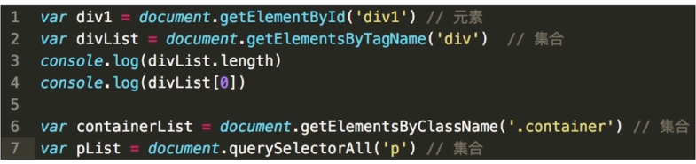
prototype
获取的是js对象
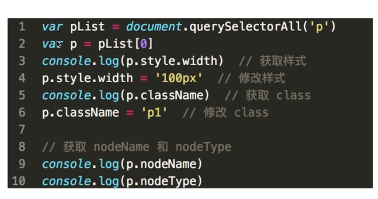
attribute
获取的是DOM节点
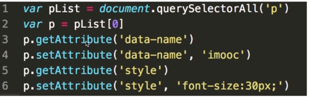
#### DOM结构操作
新增节点
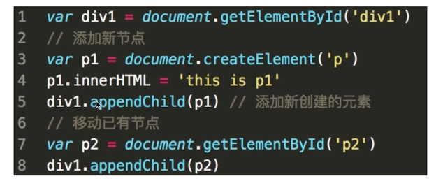
获取父元素、获取子元素、删除节点
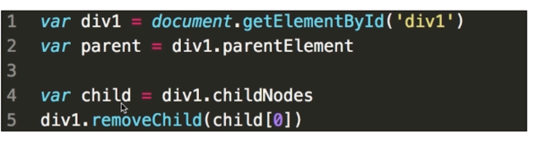
### BOM操作
Navigator、Screen
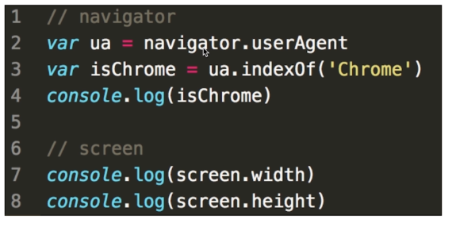
Location、History
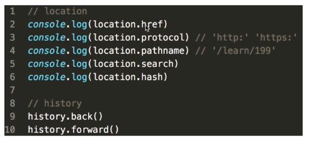

1、如何检测浏览器的类型？

Navigator

2、拆解url的各部分

location