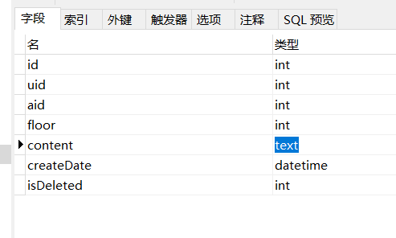
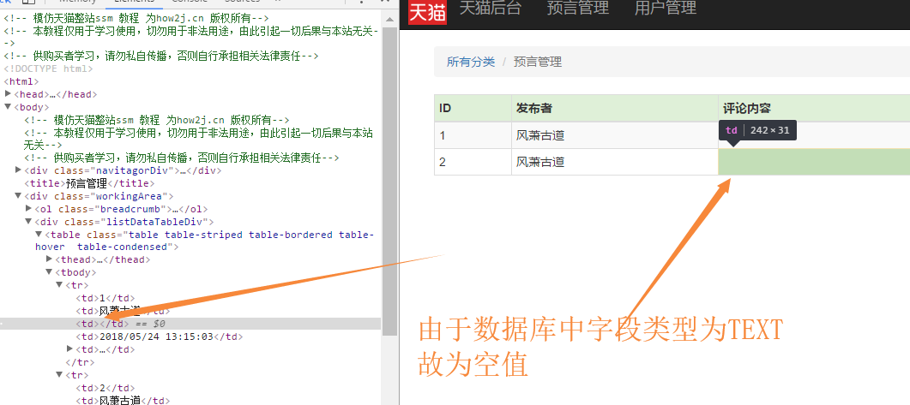
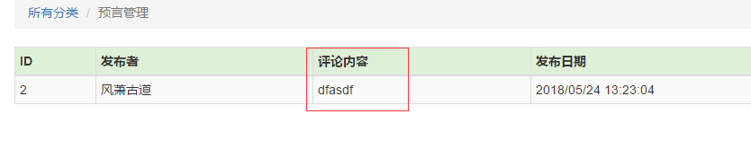

这个标题有点奇怪。不过我要说的就是，在[Mybatis逆向工程](http://how2j.cn/k/mybatis/mybatis-generator/1376.html)自动生成的Mapper中，对TEXT字段的定义和其他的字段不一样。
<!--more-->
Comments表设计：

可以看到，content字段为TEXT。

然而，直接调用selectByExample()方法，查询不到content字段的内容：


而究其原因，是因为在自动生成的CommentsMapper.xml中，对TEXT字段的定义是不一样的。
```xml
<resultMap id="BaseResultMap" type="com.windypath.seer.pojo.Comments">
    <id column="id" jdbcType="INTEGER" property="id" />
    <result column="uid" jdbcType="INTEGER" property="uid" />
    <result column="aid" jdbcType="INTEGER" property="aid" />
    <result column="floor" jdbcType="INTEGER" property="floor" />
    <result column="createDate" jdbcType="TIMESTAMP" property="createDate" />
    <result column="isDeleted" jdbcType="INTEGER" property="isDeleted" />
  </resultMap>
  <resultMap extends="BaseResultMap" id="ResultMapWithBLOBs" type="com.windypath.seer.pojo.Comments">
    <result column="content" jdbcType="LONGVARCHAR" property="content" />
  </resultMap>
```
在代码中可以清晰地看到，content字段放在了“extends”里，而没有和其他的字段放在一起。jdbcType也定义成了LONGVARCHAR，我认为这样做是担心这个字段里装的数据量过大，增加查询负担，所以把它放进extends里。

而selectByExample()的初衷也许是查找信息列表。我发现在selectByPrimaryKey()中，只查询某一条数据的情况下，TEXT字段就会被查询出来。

因此我将TEXT改成了varchar(1000)，问题解决。

（逆向工程修改后要重新生成一次覆盖旧的东西！）
