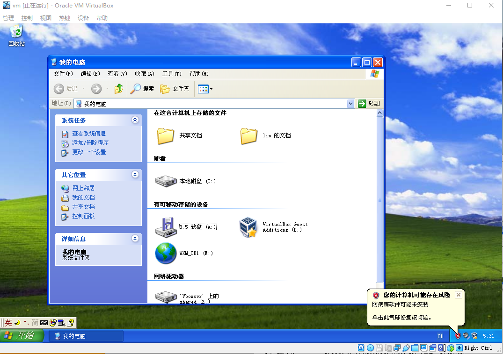

# 在这里直接下载我最后完成的虚拟机镜像
虚拟机镜像下载：

链接：https://pan.baidu.com/s/1yfY0SjDrtOeuTiEWf7YizA?pwd=374l 

提取码：374l 

我本地的VirtualBox 版本：6.1
<!--more-->
# 我可以先聊聊怀旧吗
也许对于老外来说，Win95是他们的青春，所以他们做了[React95](https://github.com/arturbien/React95)这样的UI库，或者大家一起努力写了个操作系统[serenity](https://github.com/SerenityOS/serenity)。但是对于咱们国内的用户而言，当家用PC走进千家万户时，映入眼帘的是——Windows XP。

一位中国台湾同胞[sh1zuku](https://sh1zuku.csie.io/#/)编写开发了一个网页版的Windows XP模拟器:[项目链接](https://github.com/ShizukuIchi/winXP)，[在线演示](https://winxp.vercel.app/)，还有另一位来自越南的老哥[khang-nd](https://khang-nd.vercel.app/)写了Windows 7的网页模拟器[在线演示](https://win7simu.visnalize.com/)。

我自然没有能力和时间去编写类似系统的开发，但是有一个想法从我的脑中浮现：那么我就装一个Windows XP虚拟机到电脑上就好了。

# 你可能会选择的做法
1. 安装VirtualBox；
2. 下载镜像：从[MSDN Itellyou](https://msdn.itellyou.cn/)中找到Windows XP的镜像，下载；
3. 在VirtualBox中安装镜像;
4. 启动镜像，安装系统

那么你会发现，安装的Windows XP只有30天试用。在二十一世纪初期，盗版泛滥，微软采取了非常强硬的措施限制盗版。即使你安装时输入了正确的序列号，微软也会要求你使用电话等方式进行激活。

但是我们是来怀旧的啊！

# 正确的做法
不能再使用这种正版的镜像了，需要使用别人处理好的，不需要激活的镜像。

这里我找到了github上的一位老哥提供的链接[github WinXPImage](https://github.com/lucianoferrari/winxpimage)，但是他的镜像是位于谷歌云盘上的。我把它下载之后放进百度网盘里了：

链接：https://pan.baidu.com/s/1ypKeaZixJXnbqAo4ZT0YLQ?pwd=30dd 
提取码：30dd 

在VirtualBox安装此镜像后，你将获得一个无限期使用的，**英文版**的Windows XP。

但你不一定能启动起来，你需要在导入OVA文件后，在OVA文件的目录下，执行以下命令：
``` cmd
vbox-img geometry --filename Windows_XP_Professional-disk1.vdi --format VDI --cylinders 5874 --heads 255 --sectors 56
```
来自于[github issue](https://github.com/lucianoferrari/winxpimage/issues/1) streeg 老哥给出的解决方案。

# 如何汉化Windows XP？
如果只是用英文版Windows XP，那么就达不到我们“怀旧”的目的了。
Windows XP英文版默认没有中文语言包。
我翻遍互联网，终于在一个[犄角旮旯](https://msdn.alicesworld.tech/Windows%20XP)里找到了语言包mui_win_xp_pro_n_cd1.iso。

我把它下载之后放进百度网盘里了：

链接：https://pan.baidu.com/s/18mW9OCRejMDoEpUcih-zlA?pwd=peu4 
提取码：peu4 

然后,
1. 设置VirtualBox里Windows XP虚拟机和物理机共享文件夹，[具体方法](https://www.jianshu.com/p/060103d48244)
2. 将mui_win_xp_pro_n_cd1.iso通过共享文件夹从物理机传进虚拟机中
3. 安装，[具体方法](https://www.docin.com/p-2998336055.html)

最后重启虚拟机即可。

上图!

