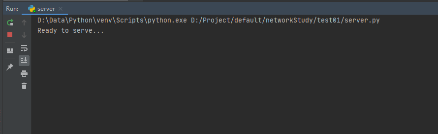
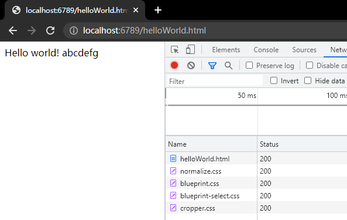
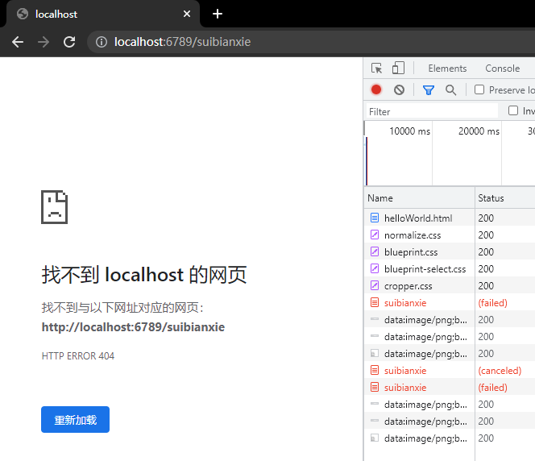
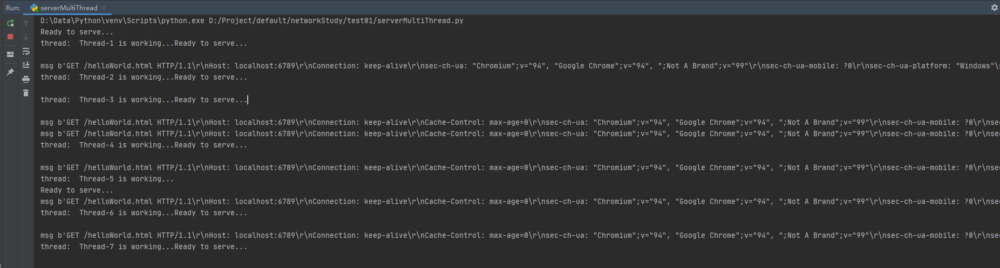

> 来自书籍《计算机网络-自顶向下方法-第6版(课本)》第120页，第二章应用层的课后题第一题。
<!--more-->
## 基础题目

**题目**：在这个编程作业中，你将用Python语言开发一个简单的Web服务器，它仅能处理一个请求。具体而言，你的Web服务器将：（1）当一个客户（浏览器）联系时创建一个连接套接字；（2）从这个连接接收HTTP请求；（3）解释该请求以确定所请求的特定文件；（4）从服务器的文件系统获得请求的文件；（5）创建一个由请求的文件组成的HTTP响应报文，报文前面有首部行；（6）经TCP连接向请求的浏览器发送响应。如果浏览器请求一个在该服务器中不存在的文件，服务器应当返回一个“404 Not Found”差错报文。

参考或者说学习了github上[moranzcw](https://github.com/moranzcw)的仓库：[Computer-Networking-A-Top-Down-Approach-NOTES](https://github.com/moranzcw/Computer-Networking-A-Top-Down-Approach-NOTES)的内容，完成了这道题。

代码https://github.com/moranzcw如下：

``` python
# import socket module
from socket import *

serverSocket = socket(AF_INET, SOCK_STREAM)
# Prepare a sever socket
# Fill in start
# 定义ip和端口号，然后bind绑定socket
host = ''
port = 6789
serverSocket.bind((host, port))
serverSocket.listen(1)
# Fill in end
while True:
    # Establish the connection
    print('Ready to serve...')
    connectionSocket, addr = serverSocket.accept()
    # Fill in start  #Fill in end
    try:
        message = connectionSocket.recv(1024)  # Fill in start  #Fill in end
        filename = message.split()[1]
        f = open(filename[1:])
        outputdata = f.read()  # Fill in start  #Fill in end
        # Send one HTTP header line into socket
        # Fill in start
        header = ' HTTP/1.1 200 OK\nConnection: close\nContent-Type: text/html\nContent-Length: %d\n\n' % (
            len(outputdata))
        connectionSocket.send(header.encode())

        # Fill in end

        # Send the content of the requested file to the client
        for i in range(0, len(outputdata)):
            connectionSocket.send(outputdata[i].encode())
        connectionSocket.close()
    except IOError:
        # Send response message for file not found
        # Fill in start
        header = ' HTTP/1.1 404 Found'
        connectionSocket.send(header.encode())
        connectionSocket.close()
        # Fill in end

        # Close client socket
        # Fill in start
        # Fill in end
serverSocket.close()

```

同时在这个文件的同级目录下，有一个html文件：helloWorld.html
```html
<head>Hello world!</head>
<body>abcdefg</body>
```

在Python中启动项目：



然后打开浏览器，在地址栏内输入：http://localhost:6789/helloWorld.html


可以看到浏览器正常收到HTTP响应报文，显示正常。

如果输入的地址不是helloWorld.html，则会报404。


## 进阶题目
### 进阶题目1

> 题目也是翻译自github老哥之手，感谢。

**题目**：目前，这个Web服务器一次只处理一个HTTP请求。请实现一个能够同时处理多个请求的多线程服务器。使用线程，首先创建一个主线程，在固定端口监听客户端请求。当从客户端收到TCP连接请求时，它将通过另一个端口建立TCP连接，并在另外的单独线程中为客户端请求提供服务。这样在每个请求/响应对的独立线程中将有一个独立的TCP连接。

不难得知，只要用线程包装一下处理socket的方法即可。

代码如下：
```python
# import socket module
import threading
from socket import *


def sonTcpConnect(connectionSocket):
    # Fill in start  #Fill in end
    try:
        print("thread:  " + threading.currentThread().name + " is working...")
        message = connectionSocket.recv(1024)  # Fill in start  #Fill in end
        print("msg", message)
        filename = message.split()[1]
        f = open(filename[1:])
        outputdata = f.read()  # Fill in start  #Fill in end
        # Send one HTTP header line into socket
        # Fill in start
        header = ' HTTP/1.1 200 OK\nConnection: close\nContent-Type: text/html\nContent-Length: %d\n\n' % (
            len(outputdata))
        connectionSocket.send(header.encode())

        # Fill in end

        # Send the content of the requested file to the client
        for i in range(0, len(outputdata)):
            connectionSocket.send(outputdata[i].encode())
        connectionSocket.close()
    except IOError:
        # Send response message for file not found
        # Fill in start
        header = ' HTTP/1.1 404 Found'
        connectionSocket.send(header.encode())
        connectionSocket.close()
        # Fill in end

        # Close client socket
        # Fill in start
        # Fill in end


serverSocket = socket(AF_INET, SOCK_STREAM)
# Prepare a sever socket
# Fill in start
# 定义ip和端口号，然后bind绑定socket
host = ''
port = 6789
serverSocket.bind((host, port))
serverSocket.listen(100)
# Fill in end
while True:
    # Establish the connection
    print('Ready to serve...')
    connectionSocket, addr = serverSocket.accept()
    t = threading.Thread(target=sonTcpConnect, args=(connectionSocket,))
    t.start()
serverSocket.close()
```


有一个要注意的地方是，在53行，args这个参数的括号内必须要加上逗号，原因是因为args是一个元组，需要在元素后面增加逗号。（资料来源：[https://blog.csdn.net/chpllp/article/details/54381141](https://blog.csdn.net/chpllp/article/details/54381141)）

多次在浏览器请求之后，控制台输出如下：


> 说实话感觉可能有些bug ,// TODO记得修

### 进阶题目2：

题目：

不使用浏览器，编写自己的HTTP客户端来测试你的服务器。您的客户端将使用一个TCP连接用于连接到服务器，向服务器发送HTTP请求，并将服务器响应显示出来。您可以假定发送的HTTP请求将使用GET方法。
客户端应使用命令行参数指定服务器IP地址或主机名，服务器正在监听的端口，以及被请求对象在服务器上的路径。以下是运行客户端的输入命令格式。

> client.py server_host server_port filename

意思就是用python发送HTTP请求到服务器就可以了。

```python
from socket import *
import sys
clientSocket = socket(AF_INET, SOCK_STREAM)
host = str(sys.argv[1])
port = int(sys.argv[2])

clientSocket.connect((host, port))
msg = 'GET ' + str(sys.argv[3])
clientSocket.send(msg.encode())
result = b""
while True:
    recv_data = clientSocket.recv(1024)
    if recv_data:
        result += recv_data
        if result.rfind(b"0\r\n") != -1:
            break
    else:
        break

print('Received', repr(result))
```

这里要注意的是，如果没有用While True循环接收，可能只会接收到HTTP响应报文的请求头了。

结果如下：
