# \[Spring\]Spring学习笔记（一）
## Spring 概念
1. spring是开源轻量级框架
2. - AOP：面向切面编程，扩展功能不是修改源代码实现
   - IOC ：控制反转，有一个类，在类里面有方法（不是静态方法）
    把对象的创建通过spring配置创建类对象
3. 一站式框架
    三层：
    - web层 springMVC
    - Service层 ioc
    - Dao层  jdbcTemplate
4. spring版本
当前最新版本：[https://projects.spring.io/spring-framework/#quick-start](https://projects.spring.io/spring-framework/#quick-start)
官网建议用Maven/Gradle安装
<!--more-->
## Spring的ioc操作
1. 把对象的创建交给spring进行管理
2. ioc操作两部分：
    - Ioc的配置文件方式
    - Ioc的注解方式
## IOC底层原理
1. ioc底层原理使用技术
    1. xml配置文件
    2. Dom4j解决xml
    3. 工厂设计模式
    4. 反射

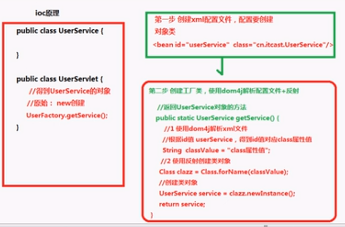

## IOC使用方法（简单样例）：

1. 导入jar包（用Maven/Gradle直接导入）
2. 编写要操作的类（简单的User类）
3. 创建Spring配置文件，通过配置创建类：
    1. 在src下创建xml文件，官方建议为applicationContext.xml
    2. 引入schema约束，来源：[https://docs.spring.io/spring/docs/4.2.x/spring-framework-reference/html/xsd-configuration.html](https://docs.spring.io/spring/docs/4.2.x/spring-framework-reference/html/xsd-configuration.html)
        要加入的代码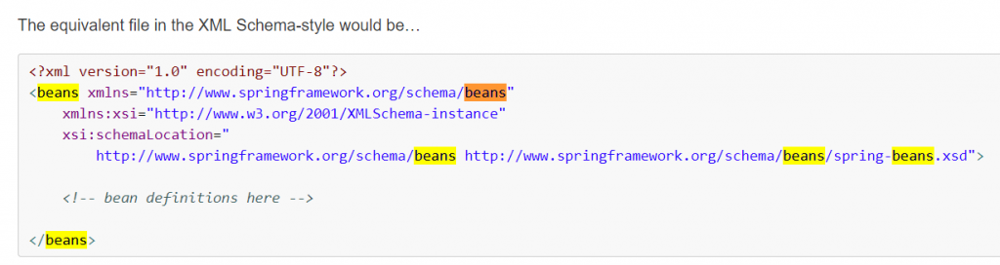
    3. 配置对象创建
        ```xml
        <bean id="对象名" class="类的路径（org.springframework.abcdef）"></bean>
        ```
    4. 编写测试代码
    ```java
        import org.junit.Test;
        import org.springframework.context.ApplicationContext;
        import org.springframework.context.support.ClassPathXmlApplicationContext;

        public class testIOC {
            @Test
            public void testMain() {
                ApplicationContext context = new ClassPathXmlApplicationContext("a.xml");
                Main m = (Main) context.getBean("m");
                System.out.println(m);
                m.add();
            }
        }
    ```
注：Maven自带的Junit版本为3.8.2，无法使用注解方式，故应手动修改为4.0以上版本才可使用注解。
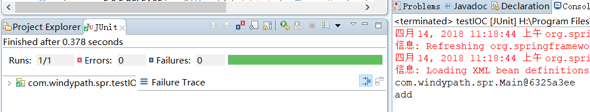
测试结果如上图

## 在spring里面通过配置文件创建对象

Beans 实例化有三种方式：

1. 第一种 使用类的无参数构造创建（重点）
    类里面没有无参数的构造，会出现异常
2. 第二种 使用静态工厂创建
    创建静态方法返回类对象  
    根据类调用静态方法
    <bean id=”bean2” class=”****” factory-method=”getBean2”></bean>
3. 第三种 使用实例工厂创建
    创建不是静态的方法，返回类对象
    先创建工厂对象
    <bean id=”bean3factory” class=”bean3类”></bean>
    再创建目标类，通过工厂对象里的方法构造
    <bean id=”bean3” factory-bean=”bean3factory” factory-method-”getBean3”></bean>

## Bean标签常用属性
1. id属性  起名称，任意命名
    Id属性值不能包含特殊符号，根据id值得到配置对象
2. class属性：创建对象所在类的全路径
3. name属性：与id本身功能一样，但name可以加特殊符号（遗留问题）
4. scope属性：
    singleton 单例   默认值  只有一个对象
    Prototype 多例     多实例对象
    不常用：
    Request  创建对象并把对象放到request域内
    Session创建对象并把对象放到session域内
    Globalsession 创建对象并把对象放到globalsession域内
## 属性注入
1. 创建对象的时候，向类里面的属性设置值
2. 属性注入的三种方式：
    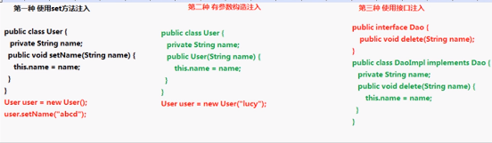

    1. 有参构造：（constructor-arg，构造函数为User(string username)  ）
        ```xml
        <bean id="demo1" class="类"> 
            <constructor-arg name="username" value="值"></constructor-arg> 
        </bean>
        ```
    2. Set方法构造：（property，构造函数没有参数，但类中有set方法）
        ```xml
        <bean id="demo2" class="类"> 
            <property name="bookname" value="值"></property> 
        </bean>
        ```
        注入对象类型属性（属性可能是自定义对象）
        1. 创建service类和dao类，同时在service得到dao对象
        2. 具体实现过程
            1. 在service里面把dao作为类型属性
            2. 生成dao类型属性的set方法
            3. 配置文件中设置注入关系
            ```xml
            <bean id=”userDao” class=”dao”></bean> 
            <bean id=”userService” class=”service”> 
                <!-- 不写value 写ref属性 对应ID --> 
                <property name=”userDao” ref=”userDao”></property> 
            </bean>
            ```

P名称空间注入：
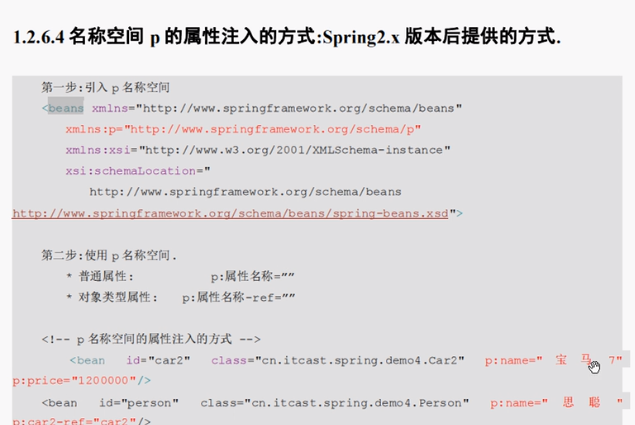

### 注入复杂类型属性
- 数组
- list集合
- map集合
- properties类型

数组与list集合
```xml
<bean id=”person” class=”类”> 
    <!-- 数组 list--> 
    <property name=”arrs”> 
        <list> 
            <value>aaa</value> 
            <value>ada</value> 
            <value>aba</value> 
        </list> 
    </property> 
    <!-- map --> 
    <property name=”map”> 
        <map> 
            <entry key=”aa” value=”lucy”></entry> 
            <entry key=”bb” value=”ldcy”></entry> 
            <entry key=”cc” value=”luacy”></entry> 
        </map> 
    </property> 
    <property name=”properties”> 
        <props> 
            <prop key=”driverclass”>com.mysql.jdbc.Driver</prop> 
            <prop key=”username”>user</prop> 
            …… 
        </props> 
    </property> 
</bean>
```
### IOC和DI区别
- IOC：控制反转，把对象创建交给spring进行配置
- DI：依赖注入，向类里面的属性中设置值
- 关系：依赖注入不能单独存在，需要在ioc基础之上完成操作
### Spring整合Web项目原理
1. 加载spring核心配置文件
    通过new来创建对象，虽然功能可以实现，但是效率很低
2. 实现思想：把加载配置文件和创建对象过程，在服务器启动时候完成。
3. 实现原理：
    1. servletContext对象
    2. 监听器
    3. 具体使用（原理、已封装）
        在服务器启动时，为每个项目创建ServletContext对象
        在servletContext对象创建手，使用监听器可以具体到ServletContext对象在什么时候创建
        使用监听器监听到ServletContext对象创建时候，
        加载spring配置文件，把配置文件配置对象创建
        把创建出来的对象放到SERVLETcONTEXT域对象里面（setAttribute方法）
        获取对象时候，到ServletContext域得到（getAttribute方法）

# \[Spring\]Spring学习笔记（二） 
## Spring的bean管理（注解）
### 注解介绍
- 代码里面特殊标记，使用注解可以完成功能
- 注解写法 @注解名称(属性名称=属性值)
- 注解使用在类上面，方法上面 和 属性上面
### Spring注解开发准备工作
1. 导入jar包
    1. 导入基本的jar包
    2. 导入aop的jar包
2. 创建类，创建方法
3. 创建Spring配置文件，引入约束
    1. ioc基本功能，引入约束
    2. 做Spring的ioc注解开发，引入新的约束
    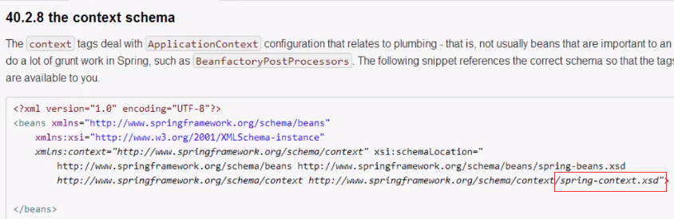

### 注解创建对象
配置文件中，开启注解扫描

到包里面扫描类、方法、属性上面是否有注解

<context:component-scan base-package=”包名”></context:component-scan>

只扫描属性上面的注解

<context:annotation-config></context-annotation-config>

### 注解注入属性
1. 在创建对象的类上面使用注解实现
```java
@Component(value=”user”) //<bean id=”user” class=”” />
Public class User{
……
```
2. 创建对象有4个注解
注：功能一样
- @Component
- @Controller
- @Service
- @Repository
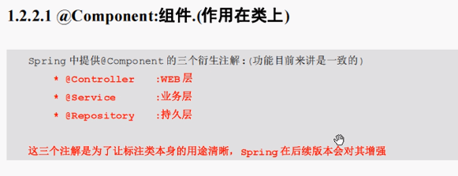
3. 创建对象是 单实例 还是多实例
@Scope(value=”prototype/singleton”)

### 注解注入属性
创建service类，创建dao类

```java
@Service(value=”userService”)
Public class UserService{
    //得到dao对象
    //定义dao类型属性
    //在dao属性上面使用注解 完成对象注入
    @Autowired
    Private UserDao userDao;
    //使用注解方式的时候不需要使用set方法
    Public void add(){
   ……
    userDao.add();
}
}
```

通过类名寻找对应的对象进来，自动注入/装配。
注入属性的两个对象

@Autowired  自动装配

@Resource(name)   注入指定对象，name为对象名

配置文件和注解混合使用

创建对象操作使用配置文件方式实现，然后注入属性的操作使用注解方式实现。

### AOP概念

[AOP百度百科](https://baike.baidu.com/item/AOP/1332219?fr=aladdin)

1. AOP：面向切面（方向）编程，扩展功能不修改源代码实现
2. AOP采取横向抽取机制，取代了传统纵向集成体系重复性代码（性能监视、事务管理、安全检查、缓存）

### AOP原理：
原理图
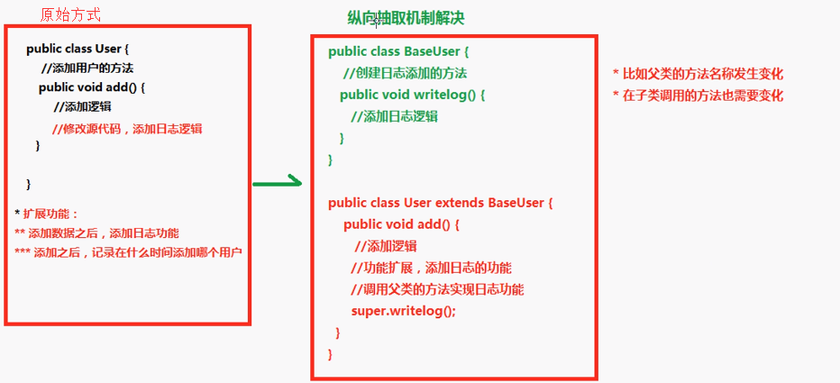
横向机制：
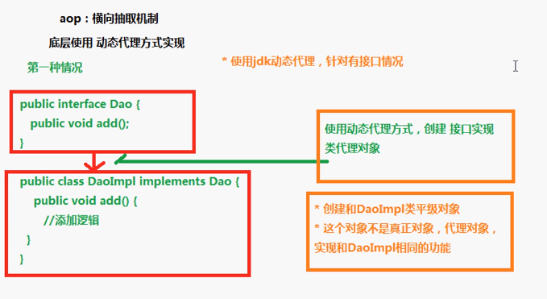
无接口情况：
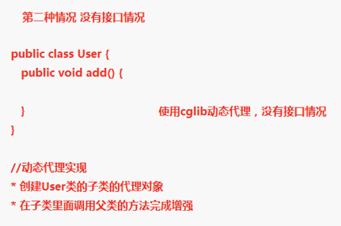
使用动态代理实现。

### AOP术语
- Joinpoint(连接点):所谓连接点是指那些被拦截到的点。在spring中,这些点指的是方法,因为spring只支持方法类型的连接点.
    类里面哪些方法可以被增强，这些方法被称为连接点。
- Pointcut(切入点):所谓切入点是指我们要对哪些Joinpoint进行拦截的定义.
    在类里面可以有很多的方法被增强，比如实际操作中，只是增强了类里面add方法和update方法，实际增强的方法被称为切入点
- Advice(通知/增强):所谓通知是指拦截到Joinpoint之后所要做的事情就是通知.通知分为前置通知,后置通知,异常通知,最终通知,环绕通知(切面要完成的功能)
    增强的逻辑，称为增强，比如扩展日志功能，这个日志功能称为增强
    前置通知：在方法之前执行
    后置通知：在方法之后执行
    异常通知：方法出现异常
    最终通知：在后置之后执行
    环绕通知：在方法之前和之后执行
- Introduction(引介):引介是一种特殊的通知在不修改类代码的前提下, Introduction可以在运行期为类动态地添加一些方法或Field.（一般不用）
    用动态的方式向类中加属性/方法
- Target(目标对象):代理的目标对象（要增强的类）
- Weaving(织入):是指把增强应用到目标对象来创建新的代理对象的过程.spring采用动态代理织入，而AspectJ采用编译期织入和类装在期织入。
    是把advice应用到target的过程
- Proxy（代理）:一个类被AOP织入增强后，就产生一个结果代理类
- Aspect(切面): 是切入点和通知（引介）的结合
    把增强应用到具体方法上面，把增强用到切入点的过程。
### Spring的aop操作
1. 在Spring里面进aop操作，使用aspectJ实现
    1. aspectj不是spring的一部分，和spring一起使用进行aop操作
    2. Spring2.0以后增加了对aspectj的支持
2. 使用aspectj实现aop有两种方式
    1. 基于aspectj的xml配置
    2. 基于aspectj的注解方式
### AOP操作准备
1. 除了导入基本的jar包外，还需要导入aop相关的jar包。
2. 创建spring核心配置文件，导入aop的约束
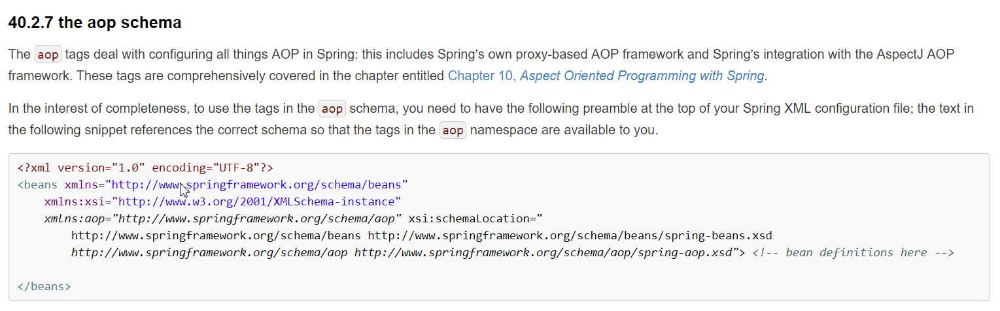

来源：[https://docs.spring.io/spring/docs/4.2.x/spring-framework-reference/html/xsd-configuration.html](https://docs.spring.io/spring/docs/4.2.x/spring-framework-reference/html/xsd-configuration.html)

### 使用表达式配置切入点
1. 切入点，实际增强的方法
2. 常用的表达式
    规则：execution(<访问修饰符>?<返回类型><方法名>(<参数>)<异常>)
    1. execution(* cn.itcast.aop.Book.add(..))    某个方法
    2. execution(* cn.itcast.aop.Book.*(..))     某个类中的所有方法
    3. execution(* *.*(..))  //所有类中的所有方法
    4. 匹配所有save开头的方法execution(* save*(..))
### Aspectj的aop操作
```xml
<!--配置对象-->
<bean id=”book”&nbsp;class=”类”></bean>
<bean id=”myBook”&nbsp;class=”类”></bean>
<!--配置aop操作-->
<aop:config>
<!--配置切入点-->
<aop:pointcut expression=”execution(* cn.itcast.aop.Book.*(..))”&nbsp;id=”pointcut1”&nbsp;/>
<!--配置切面-->
<aop:aspect ref=”myBook”>
<!--配置增强类型 method，增强类里面使用哪个方法作为前置-->
<!--前置-->
<aop:before method=”before1”&nbsp;pointcut-ref=”pointcut1”/>
<!--后置-->
<aop:after-returning method=”after1”&nbsp;pointcut-ref=”pointcut1”&nbsp;/>
<!--环绕-->
<aop:around method=”around1”&nbsp;pointcut-ref=”pointcut1”&nbsp;/>
</aop:aspect>
</aop:config>
```
环绕：
```java
//MyBook类
Public void around1(ProceedingJoinPoint proceedingJoinPoint){
    //方法之前
    System.out.println(“方法之前”);
    //执行被增强的方法
    proceedingJoinPoint.proceed();
    //方法之后
    System.out.println(“方法之后”);
}
```

### Log4j介绍
1. 通过log4j可以看到程序运行过程中更详细的信息
    1. 经常使用log4j查看日志
2. 使用
    1. 导入log4j的jar包
    2. 赋值log4j的配置文件，复制到src下面Log4j.properties
3. 设置日志级别
    1. info看到基本信息
    2. debug 看到详细信息
### Spring整合web项目演示
1. 演示问题
    每次访问action时，都会加载spring配置文件
    action调用service，service调用dao
2. 解决方案
    1. 在服务器启动的时候，创建对象加载配置文件。
    2. 底层使用监听器，servletcontext对象
3. 在spring里面不需要我们自己写代码实现，帮忙封装
    1. 封装了一个监听器，只需要配置监听器就可以了
    2. 需先导入整合web项目的jar包，spring-web

    ```xml
    <!--Web.xml-->
    <listener>
    <listener-class>
        Org.springframework.web.context.ContextLoaderListener
    </listener-class>
    </listenner>
    ```
    3. 指定加载spring配置文件位置
        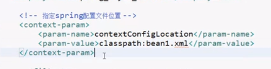