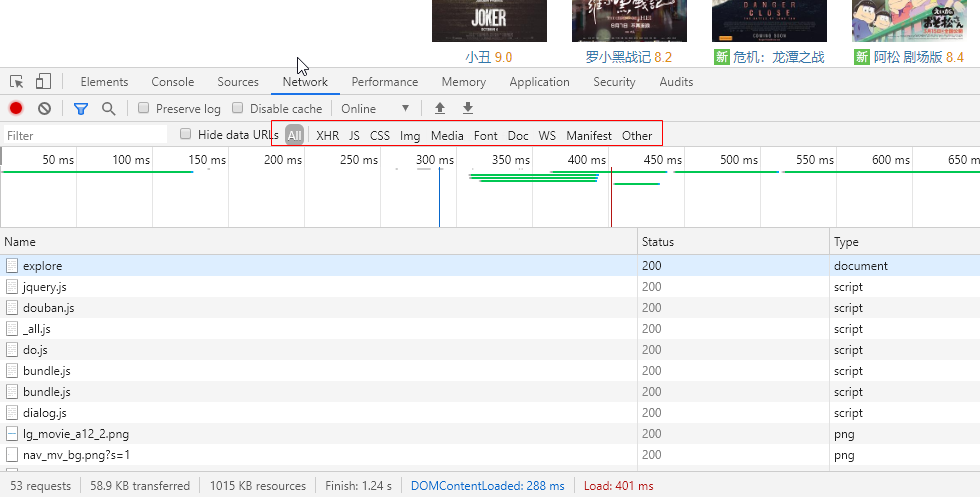
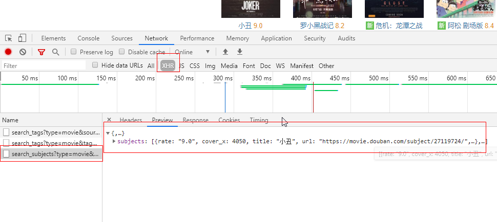
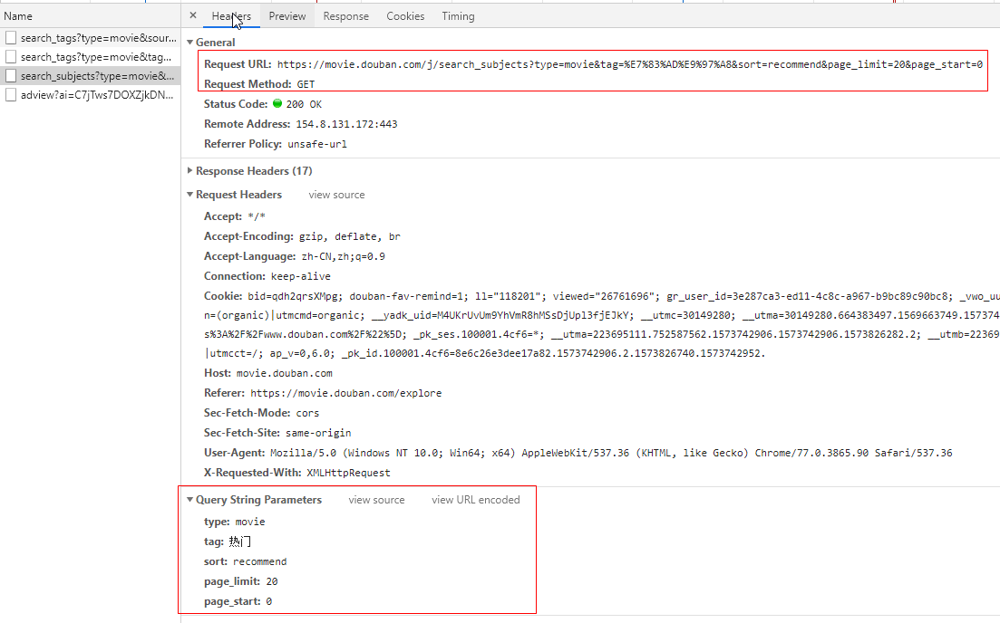
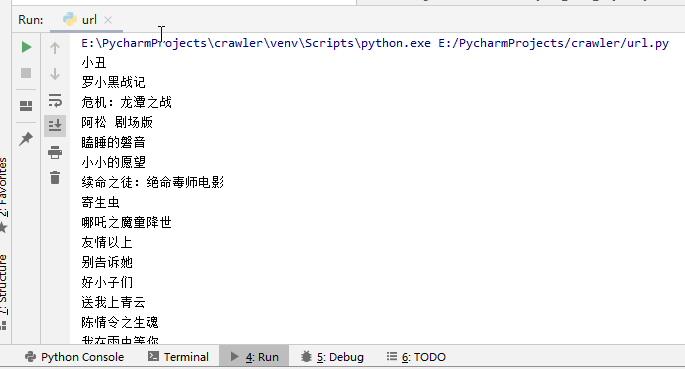
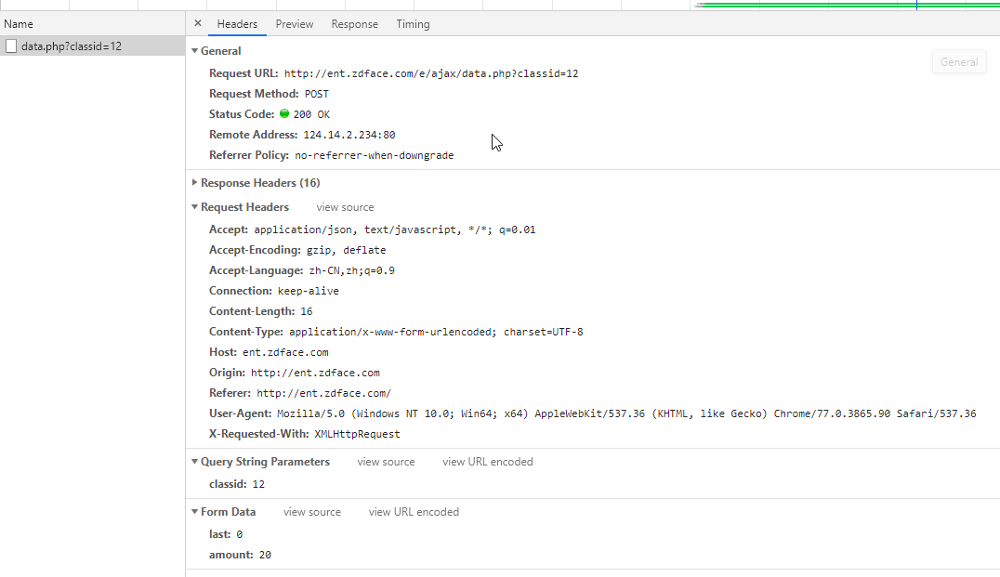
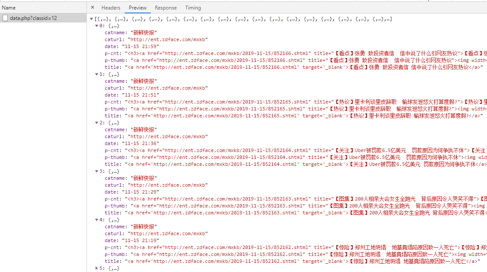
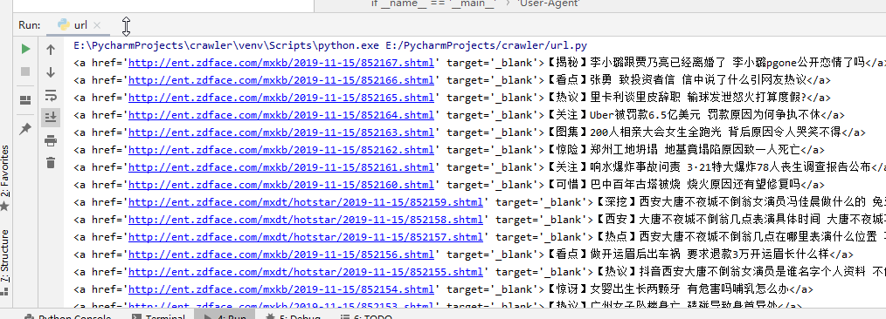
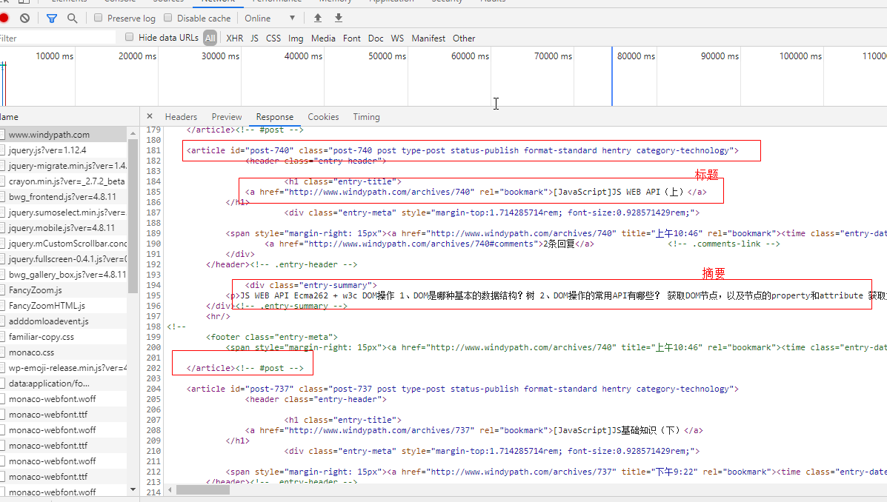

爬虫的目的是采集网站的数据。而网站渲染数据有两种方式。我个人将其称为前端渲染和后端渲染。
<!--more-->
## 前端渲染

前端渲染指的是网页并不直接展示数据，而是在读取完网页之后，再次向服务器请求数据。在得到数据之后再渲染到网页中。

## 后端渲染

后端渲染指的是服务器收到请求之后，将数据在后端写入网页，然后将带有数据的网页直接展示在浏览器中。

## 爬取方式

目前我并没有使用scrapy、webmagic等爬虫框架，仅使用python的requests模块，json模块和BeautifulSoup框架。

前端渲染的爬取方式

步骤：使用requests请求数据，再用json.loads()方法将返回的数据解析，最后操作得到的数据对象即可。

我们这里以豆瓣为例。

### 分析该网页。

爬取的url：

https://movie.douban.com/explore#!type=movie&tag=%E7%83%AD%E9%97%A8&sort=recommend&page_limit=20&page_start=0

将url放进浏览器，先点开F12，然后访问。这里我使用谷歌浏览器


可以看到，红框内的All、XHR、JS等。这是一个筛选框，用来筛选该网页请求的数据。

All代表所有，XHR代表异步请求，JS代表Js文件，Css……

对于前端渲染，必然有异步的过程，所以选择XHR。

通过观察，发现第三行是“选电影”列表的数据。


这时，我们点击Headers，查看其请求的详细信息。

可以看到，这是一个Get请求，在下面的Qurey String Parameters可以看到该请求的参数。

数据对应的网页内容为：

### 测试这个请求。

浏览器可以发起这个请求得到相应，但我们的代码不一定能做到。有一部分原因是网站开发者本身不希望数据被爬取。所以我们需要测试这个接口。这里推荐Postman，先对接口进行测试，查看是否有些Headers或者参数是不需要的，以简化代码量。

Postman的用法下回分解吧。

### 编写代码。
```python
#!/usr/bin/env python
# -*- coding: utf-8 -*-
# @Time    : 2019/11/15 22:11
# @Author  : Johnathan Lin

import requests
import json

if __name__ == '__main__':
    # 请求头，一般写上User-Agent防止爬虫，遇到有验证状态的网站要填写Cookie
    headers = {
        'User-Agent': 'Mozilla/5.0 (Windows NT 10.0; Win64; x64) AppleWebKit/537.36 (KHTML, like Gecko) Chrome/77.0.3865.90 Safari/537.36'
    }
    # 请求Url
    url = 'https://movie.douban.com/j/search_subjects?type=movie&tag=%E7%83%AD%E9%97%A8&sort=recommend&page_limit=20&page_start=0'
    # 发送请求
    request = requests.get(url, headers=headers)
    json_data = str(request.content, encoding='utf-8')
    # 解析数据
    json_data_obj = json.loads(json_data)
    for data in json_data_obj['subjects']:
        print(data['title'])
```
爬取结果：

这里建议养成写上User-Agent的习惯。

对于Get请求，将数据装在url的“？”后面即可，但对于Post请求，一般建议写在data对象里。

我们以网站http://ent.zdface.com/为例。

F12看到一个异步请求：


注意这里同时有Query String Parameters和Form Data。Query String Parameters是装在url后的参数，而Form Data是POST请求传入的参数。

查看其Preview，发现是某一板块下的数据。


找到网页对应部分内容：

开始爬取，注意这回参数要写进data对象里。
```python
#!/usr/bin/env python
# -*- coding: utf-8 -*-
# @Time    : 2019/11/15 22:11
# @Author  : Johnathan Lin

import requests
import json


if __name__ == '__main__':
    # 请求头，一般写上User-Agent防止爬虫，遇到有验证状态的网站要填写Cookie
    headers = {
        'User-Agent': 'Mozilla/5.0 (Windows NT 10.0; Win64; x64) AppleWebKit/537.36 (KHTML, like Gecko) Chrome/77.0.3865.90 Safari/537.36'
    }
    # 请求参数
    data = {
        'last': '0',
        'amount': '20'
    }
    # 请求Url
    url = 'http://ent.zdface.com/e/ajax/data.php?classid=12'
    # 发送POST请求
    request = requests.post(url, data=data, headers=headers)
    json_data = str(request.content, encoding='utf-8')
    # 解析数据
    json_data_obj = json.loads(json_data)
    for data in json_data_obj:
        print(data['title'])
```
爬取结果：

## 后端渲染：

后端渲染网站的爬取过程依旧是发起请求->解析。

这里使用BeautifulSoup解析。

这个框架本身并不难。不需要看什么教程，仔仔细细把官方的中文文档读一遍下来，就知道怎么用了。

文档地址：https://www.crummy.com/software/BeautifulSoup/bs4/doc.zh/

我选择我自己的网站作为后端渲染的网页爬取样例。

我 爬 我 自 己
> 这是之前用wordpress的时候写的文章，目前可能不适用了。

目标url：www.windypath.com

F12看一下。

一般来说，后端渲染的网站，只要挑第一个看就可以了。而如果你点XHR，将什么都看不到。


这是一个Get请求。点击Response：


可以看到，每一篇文章都是用<article>标签展示的，其中里面在<h1>下的<a>标签装着标题内容，<a>标签的href就是文章的url。

也就是说，我们要获取文章列表url，可以通过<article>标签找到标题的<a>标签。

BeautifuSoup功能虽强大，但它提供的一些find()，findAll()并不实用，直接实用select()方法，参数为CSS选择器的字符串，像操控CSS选择元素一样找到元素，是比较灵活方便有效的方式。

注：BeautifulSoup支持许多解析器，用来解析html文档，这里我只用过lxml，记得装bs4的时候也要装lxml。

于是我们写成以下代码：
```python
#!/usr/bin/env python
# -*- coding: utf-8 -*-
# @Time    : 2019/11/15 22:11
# @Author  : Johnathan Lin

import requests
import json
from bs4 import BeautifulSoup

if __name__ == '__main__':
    # 请求头，一般写上User-Agent防止爬虫，遇到有验证状态的网站要填写Cookie
    headers = {
        'User-Agent': 'Mozilla/5.0 (Windows NT 10.0; Win64; x64) AppleWebKit/537.36 (KHTML, like Gecko) Chrome/77.0.3865.90 Safari/537.36'
    }
    # 请求Url
    url = 'http://www.windypath.com/'
    # 发送请求
    request = requests.get(url, headers=headers)
    html = str(request.content, encoding='utf-8')
    # 解析数据
    html_content = BeautifulSoup(html, 'lxml')
    for article in html_content.select('article'):
        a_tag = article.select('header > h1 > a')[0]
        print('文章标题：' + a_tag.get_text().strip() + ',文章url：' + a_tag['href'])
```

输出结果：
