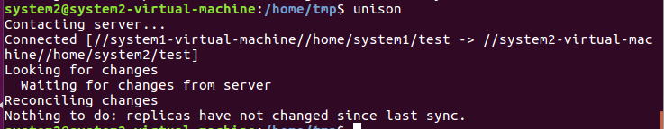
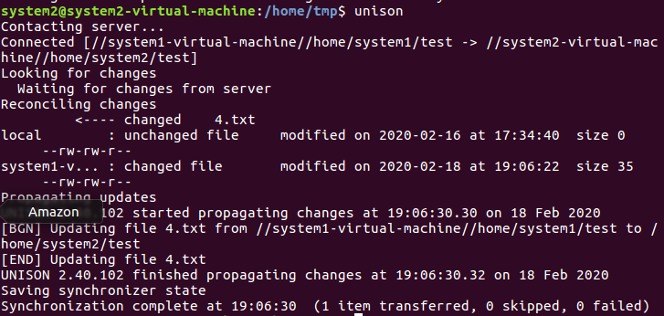
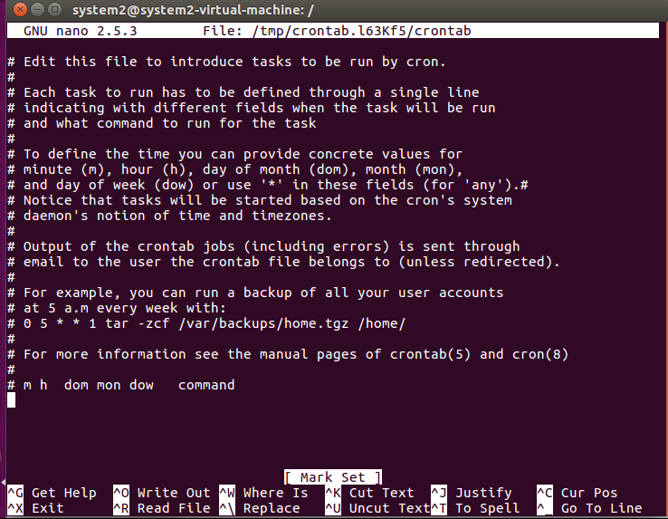
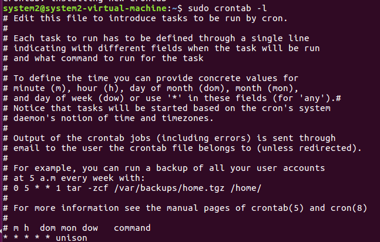

> 这是一篇在公司写的文档，但不涉及公司隐私。几乎所有内容参考于：[https://www.cnblogs.com/welcomer/p/5068287.html](https://www.cnblogs.com/welcomer/p/5068287.html)
<!--more-->
## 引言
### 编写目的

编写本文档是为了让读者快速上手使用Unison进行两台Linux服务器文件进行同步。

## 前景

Unison是windows和unix平台下都可以使用的双向文件同步工具，它能使两个文件夹（本地或网络上的）保持内容的一致。 unison 拥有其它一些同步工具或文件系统的相同特性，但也有自己的特点：

1. 跨平台使用；
2. 对内核和用户 权限 没有特别要求；
3. unison 是双向的，它能自动 处理两分拷贝中更新没有冲突的部分，有冲突的部分将会显示出来让用户选择更新策略；

只要是能连通的两台主机 ，就可以运行 unison ，可以直接使用 socket 连接或安全的 ssh 连接方式，对带宽 的要求不高，使用类似 rsync 的压缩传输协议。

Unison双向同步的一个缺点是,对于同名文件在两个同步文件夹中都被修改时,unison是不会去同步的,因为unison无法判断以那个为准。

### 定义

本文档介绍如何同步两台服务器，为表述方便，将第一台服务器命名为“服务器1”，操作该服务器的用户为“system1”；将第二台服务器命名为“服务器2”，操作该服务器的用户命名为“system2”。

### 参考资料

《使用Unison同步服务器目录》 [https://www.cnblogs.com/welcomer/p/5068287.html](https://www.cnblogs.com/welcomer/p/5068287.html)

## 安装与初始化

由于在目录同步时需要跨服务器通过ssh连接，因此不建议使用root用户，建议新建普通用户进行操作。

在两台或多台服务器之间同步，只需要在第一台服务器上安装Unison，再用scp连接将可执行的unison文件复制到第二台服务器上即可。

### 安装Unison

由于使用源码包安装Unison需要安装Ocaml依赖，且Unison默认将文件复制到“/用户名/bin/”目录下，会导致在make install步骤时提示错误，所以建议使用apt-get或yum安装。

**Ubuntu下安装**：在配置好阿里云的apt-get源之后，使用sudo apt-get install unison安装。

**CentoOS下安装**：使用yum install unison安装。

### 将Unison复制到服务器2

使用apt-get或yum安装Unison后，默认放在/usr/bin/unison。

1、使用ssh连接到远程主机：
```shell
scp /usr/bin/unison root@服务器2的IP地址:/root/
```
注意：在Ubuntu下，如果服务器没有安装openssh-server，则无法被其他服务器连接，解决方法：

1. 使用sudo apt-get install openssh-server安装
2. 在/etc/ssh/sshd_config文件中，把将PermitRootLogin prohibie-password 修改为：PermitRootLogin yes
3. 重启ssh服务即可使用。

2、登录服务器2，使用复制命令，将可执行文件unison从/root/移到/usr/bin/下。

``` shell
cp /root/unison /usr/bin/
```
3、在两台服务器上都输入unison –version，查看是否安装成功。如果返回了版本号，则安装成功。
``` shell
[root@服务器名 ~]$ unison -version 

unison version 2.40.128
```

## Unison的配置
### 配置ssh key信任

即配置公私钥。从这里开始，建议使用普通用户进行操作。

#### 新建普通用户

1. 使用useradd –m 用户名 新建用户，再使用passwd 用户名 为用户设置密码。
2. 使用 su 用户名 ，从root用户转到普通用户。

本文使用用户system1指代服务器1的用户，system2指代服务器2的用户。

#### 在服务器1上配置服务器2的信任
##### 在服务器1新建ssh key

在服务器1的system1用户下，

1. 使用命令 ssh-keygen –t rsa 命令生成公私钥，在提示保存私钥（key）和公钥（public key）的位置时，使用默认值；
2. 在提示是否需要私钥密码（passphrase）时，直接敲回车，即不使用私钥密码。
3. 系统将生成一对密钥，id_rsa（私钥文件）和id_rsa.pub（公钥文件），保存在/home/system1/.ssh/目录下。

##### 将公钥添加到服务器2

1、将~/.ssh/id_rsa.pub公钥文件上传到服务器2
``` shell
[system1@服务器1~]$ scp ~/.ssh/id_rsa.pub system2@服务器2ip地址:/home/system2/
```
2、使用system2登录服务器2

（1）在~目录下新建文件夹.ssh，并使用chmod赋予权限
```shell
mkdir .ssh 
chmod 700 .ssh
```
（2）将刚才system1生成的公钥id_rsa.pub移动到刚才system2新建的.ssh目录下，并重命名为authorized_keys，并使用chmod赋予权限

```shell
mv ~/id_rsa.pub ~/.ssh/authorized_keys

chmod 600 ~/.ssh/authorized_keys
```

至此，配置服务器1信任服务器2完成。

#### 在服务器2上配置服务器1的信任

执行方法与服务器1完全一致。在服务器2上，使用system2登录，然后使用ssh-keygen –t rsa 生成公私钥，使用scp复制公钥到服务器1的system1的~目录下，在服务器1上将服务器2的id_rsa.pub公钥移动到~/.ssh/下并改名为authorized_keys。

#### 重启ssh服务

在两台服务器上分别使用如下命令以重启ssh服务。

```shell
/etc/init.d/ssh stop 

/etc/init.d/ssh start

```

###  Unison配置文件
#### 新建测试目录

在两个服务器的~目录下分别新建test目录，此目录将作为之后被同步的目录。
```
[system1@服务器1 ~]$ mkdir test 

[system2@服务器2 ~]$ mkdir test
```

#### 首次使用Unison同步

在两台服务器上分别执行一次unison，如果出现提示确认，则直接敲回车选择默认值。

``` shell
[system1@服务器1~]$unison /home/system1/test/ ssh://system2@服务器2//home/system2/test/
[system2@服务器2~]$unison /home/system2/test/ ssh://system1@服务器1//home/system1/test/
```

在首次同步之后，Unison会在用户的~目录下新建一个.unison目录，里面会有一个default.prf，这是unison同步的配置文件，编辑这个文件，之后就可以直接使用unison命令执行同步。

#### 编辑配置文件default.prf

对服务器1的default.prf进行如下编辑：
```
#Unison preferences file 
root = /home/system1/test 
root = ssh://system2@服务器2//home/system2/test/ 
#force = 
#ignore = 
batch = true 
#repeat = 1 
#retry = 3 
#owner = true 
#group = true 
perms = -1 
fastcheck = false
rsync = false 
sshargs = -C 
xferbycopying = true 
log = true 
logfile = /home/system1/.unison/unison.log
```

对服务器2的default.prf进行如下编辑：
```
#Unison preferences file 
root = /home/system2/test 
root = ssh://system1@服务器1//home/system1/test/ 
#force = 
#ignore = 
batch = true 
#repeat = 1 
#retry = 3 
#owner = true 
#group = true 
perms = -1 
fastcheck = false 
rsync = false 
sshargs = -C 
xferbycopying = true 
log = true logfile = /home/system2/.unison/unison.log
```


相关注解如下：

force表示会以本地所指定文件夹为标准，将该目录同步到远端。这里需要注意，如果指定了force参数，那么Unison就变成了单项同步了，也就是说会以force指定的文件夹为准进行同步，类似与rsync。

Unison双向同步基本原理是：假如有A B两个文件夹，A文件夹把自己的改动同步到B，B文件夹也把自己的改动同步到A，最后A B两文件夹的内容相同，是AB文件夹的合集。

Unison双向同步的一个缺点是，对于一个文件在两个同步文件夹中都被修改时，unison是不会去同步的，因为unison无法判断以那个为准。

ignore = Path表示忽略指定目录，即同步时不同步它。

batch = true，表示全自动模式，接受缺省动作，并执行。

-fastcheck true 表示同步时仅通过文件的创建时间来比较，如果选项为false，Unison则将比较两地文件的内容。

log = true 表示在终端输出运行信息。

logfile 指定输出的log文件。

## 运行
### 执行unison命令进行同步

在终端下，直接输入命令unison即可同步。

在没有发生更改时，运行的结果为：


在目标目录test下有文件发生改变时，运行结果为：

### 设置定时任务自动同步

使用crontab进行自动同步。

(1)使用crontab –e 命令编辑定时任务。


(2)在文件最后一行输入cron表达式 + 要执行的命令，如果要每分钟执行一次同步，则输入：
```
* * * * * unison
```

然后按下ctrl+O，会提示保存，按回车确认保存；

最后按下ctrl+X退出。

(3)在终端输入crontab –l 查看当前正在运行的定时任务
