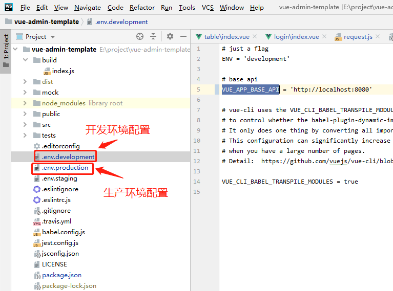
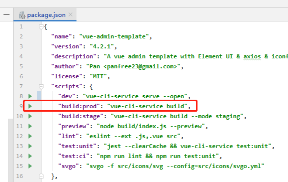
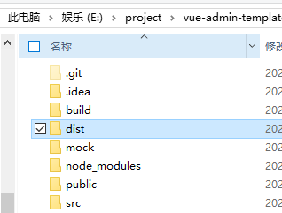
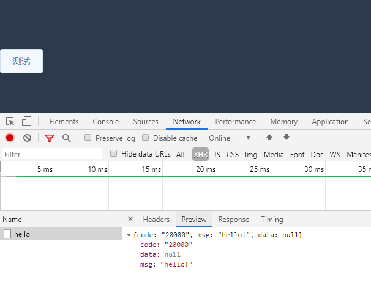

## 写在前面的话

前后端分离的项目中，需要分别部署前端与后端项目。前端项目使用npm打包，将得到的dist文件夹下的内容上传到服务器后，用nginx的alias指向文件夹即可访问，而后端项目使用maven打包，需使用tomcat在后台启动，再通过nginx转发，供前端项目调用。
<!--more-->
## 打包
### 前端的打包

前端项目使用的是vue-element-admin的基础版本：vue-admin-template

根据教程从github上下载后，在webstorm中运行成功。

原项目中只有前端，但可以完成简单的数据交互，根据使用手册介绍，该项目使用了mockjs模拟数据。

而我们需要做前后端交互，故不使用mockjs。

### 修改为访问后端的路径

方法很简单，在根目录下的.env.development文件下，将VUE_APP_BASE_API改为你的本地后端地址。

```
.env.development
VUE_APP_BASE_API = 'http://localhost:8080'
```
在根目录下的.env.production文件下，将VUE_APP_BASE_API改为你的云服务器的后端地址。
```
.env.production
# just a flag
ENV = 'production'
 
# base api
VUE_APP_BASE_API = 'http://？？？？？？？/springbootdemo'
```

这里可能会有一些小bug，主要是要与服务器的路径对应起来。

根据该项目package.json内所设置的，使用npm run build:prod打包，生成dist文件夹

最后得到dist文件夹。

## 后端的打包
编写接口
首先，编写Controller，写一些接口。
```java
package com.windypath.demo.controller;

import com.windypath.demo.response.ResponseData;
import com.windypath.demo.response.ResponseDataUtil;
import org.springframework.web.bind.annotation.RequestMapping;
import org.springframework.web.bind.annotation.RestController;

@RequestMapping("/")
@RestController
public class MainController {

    @RequestMapping("/hello")
    public ResponseData hello() {

        return ResponseDataUtil.buildSuccess("hello!");
    }
    @RequestMapping("/")
    public ResponseData root() {

        return ResponseDataUtil.buildSuccess("root!");
    }
}
```
此处使用的ResponseData来自于[https://blog.csdn.net/weixin_33863087/article/details/89540234](https://blog.csdn.net/weixin_33863087/article/details/89540234)
处理跨域
新增一个config包装入跨域的配置类，来自于[https://www.cnblogs.com/tonggc1668/p/11215932.html](https://www.cnblogs.com/tonggc1668/p/11215932.html)

打成war包
注意，原始的springboot项目默认将项目打成jar包，需要设置。

这里我备份一下我的pom.xml
```xml
<?xml version="1.0" encoding="UTF-8"?>
<project xmlns="http://maven.apache.org/POM/4.0.0" xmlns:xsi="http://www.w3.org/2001/XMLSchema-instance"
         xsi:schemaLocation="http://maven.apache.org/POM/4.0.0 https://maven.apache.org/xsd/maven-4.0.0.xsd">
    <modelVersion>4.0.0</modelVersion>
    <parent>
        <groupId>org.springframework.boot</groupId>
        <artifactId>spring-boot-starter-parent</artifactId>
        <version>2.1.9.RELEASE</version>
        <relativePath/> <!-- lookup parent from repository -->
    </parent>
    <packaging>war</packaging>
    <groupId>com.windypath</groupId>
    <artifactId>demo</artifactId>
    <version>0.0.1-SNAPSHOT</version>
    <name>demo</name>
    <description>Demo project for Spring Boot</description>

    <properties>
        <project.build.sourceEncoding>UTF-8</project.build.sourceEncoding>
        <project.reporting.outputEncoding>UTF-8</project.reporting.outputEncoding>
        <java.version>1.8</java.version>
    </properties>

    <dependencies>
        <dependency>
            <groupId>org.springframework.boot</groupId>
            <artifactId>spring-boot-starter-web</artifactId>
        </dependency>

        <dependency>
            <groupId>org.springframework.boot</groupId>
            <artifactId>spring-boot-starter-test</artifactId>
            <scope>test</scope>
        </dependency>
        <!--去除内嵌tomcat-->
        <dependency>
            <groupId>org.springframework.boot</groupId>
            <artifactId>spring-boot-starter-tomcat</artifactId>
            <scope>provided</scope>
        </dependency>

        <!-- https://mvnrepository.com/artifact/org.projectlombok/lombok -->
        <dependency>
            <groupId>org.projectlombok</groupId>
            <artifactId>lombok</artifactId>
            <version>1.18.10</version>
            <scope>provided</scope>
        </dependency>
        <!-- https://mvnrepository.com/artifact/org.apache.tomcat.embed/tomcat-embed-websocket -->
        <!--websocket依赖包-->
        <dependency>
            <groupId>org.apache.tomcat.embed</groupId>
            <artifactId>tomcat-embed-websocket</artifactId>
            <version>8.5.23</version>
        </dependency>
        <!--servlet依赖-->
        <dependency>
            <groupId>javax.servlet</groupId>
            <artifactId>javax.servlet-api</artifactId>
            <version>3.1.0</version>
            <scope>provided</scope>
        </dependency>
    </dependencies>

    <build>
        <!--生成war包的名称-->
        <finalName>springbootdemo</finalName>
        <plugins>
            <plugin>
                <groupId>org.springframework.boot</groupId>
                <artifactId>spring-boot-maven-plugin</artifactId>
            </plugin>

            <plugin>
                <groupId>org.apache.maven.plugins</groupId>
                <artifactId>maven-war-plugin</artifactId>
                <version>2.6</version>
                <configuration>
                    <failOnMissingWebXml>false</failOnMissingWebXml>
                </configuration>
            </plugin>

            <plugin>
                <groupId>org.apache.maven.plugins</groupId>
                <artifactId>maven-compiler-plugin</artifactId>
                <version>3.1</version>
                <configuration>
                    <source>1.8</source><!--这里版本需和服务器版本保持一致-->
                    <target>1.8</target>
                </configuration>
            </plugin>
        </plugins>
    </build>

</project>
```

需要注意的点是，第11行设置导出的格式为war，然后要去除内嵌的tomcat，还要引入一个servlet的依赖。最后在<build>标签内还要指定maven-war-plugin和maven-compiler-plugin两个插件。

同时，启动类也需要更改。
```java
package com.windypath.demo;

import org.springframework.boot.SpringApplication;
import org.springframework.boot.autoconfigure.SpringBootApplication;
import org.springframework.boot.builder.SpringApplicationBuilder;
import org.springframework.boot.web.servlet.support.SpringBootServletInitializer;

@SpringBootApplication
public class Application extends SpringBootServletInitializer {

    public static void main(String[] args) {
        SpringApplication.run(Application.class, args);
    }
    @Override
    protected SpringApplicationBuilder configure(SpringApplicationBuilder application){
        return application.sources(Application.class);
    }
}
```

需要继承一个SpringBootServletInitializer 才能使用。

最后点击右边maven的package，在目录下的target找到.war的文件，打包就算完成了。

## Linux服务器配置
tomcat依赖java，所以需要先装java。

### tomcat配置
然后再装tomcat，这里建议使用源代码安装（其实解压就可以用了）

配置tomcat的conf/server.xml。

由于本次我们的后端只负责接收请求，故不需要配置<Engine>标签，只需要修改监听的端口号就行了。
```xml
    <Connector port="10081" protocol="org.apache.coyote.http11.Http11NioProtocol"
			   connectionTimeout="60000" maxConnections="10000"
               maxThreads="2000" acceptCount="2000" maxPostSize="20971520" redirectPort="8443" executor="tomcatThreadPool" URIEncoding="UTF-8" />
```

### 后端部署
将刚才springboot打的war包放入webapps文件夹下，然后进入bin，启动。

输入./startup.sh 启动

关闭的话，./shutdown.sh会报错，看不太懂，但是我们可以用ps -ef |grep tomcat查看正在运行的tomcat，然后用kill -9 进程号 将其关闭

### Nginx配置
这里依旧建议源代码安装（注意安装过程中可能会提示缺了什么插件，去查找然后装好就行了）

安装方法：

[https://segmentfault.com/a/1190000007116797#articleHeader8](https://segmentfault.com/a/1190000007116797#articleHeader8)

然后，建一个文件夹专门放前端项目。

将dist文件夹整个上传到服务器中，改个名。

配置Nginx
```conf
#user  nobody;
worker_processes  1;

#error_log  logs/error.log;
#error_log  logs/error.log  notice;
#error_log  logs/error.log  info;

#pid        logs/nginx.pid;


events {
    worker_connections  1024;
}


http {
    include       mime.types;
    default_type  application/octet-stream;

    sendfile        on;

	upstream springbootdemo {
        server ？？？？:10081;
    }
	
    server {
        listen       20081;                          #端口
        server_name  springbootdemo_20081;

        client_max_body_size 20m;
        client_body_buffer_size 128k;

        #配置前端地址文件
        location /springbootdemo_fe {
	        alias /usr/local/webserver/apps/springbootdemo_fe;
        }

        #配置后台地址文件
        location /springbootdemo {
            proxy_pass http://springbootdemo;
	    proxy_redirect off;
	    proxy_set_header Host $host;
	    proxy_set_header X-Real-IP $remote_addr;
	    proxy_set_header X-Forwarded-For $proxy_add_x_forwarded_for;
	    proxy_set_header Cookie $http_cookie;
	    proxy_http_version 1.1;
            proxy_set_header Upgrade $http_upgrade;
            proxy_set_header Connection "upgrade";
	    proxy_read_timeout 3600s;
	}
}

}
```

我们刚才在后端配置的时候写的端口号是10081，故在upstream内也写这个端口号。

而用户真正访问的端口是20081。

alias指向前端的文件夹，需是完整路径。

后端则用proxy_pass指向tomcat监听的端口。

nginx的启动：进入/sbin下，

启动 ./nginx

停止 ./nginx -s stop

## 启动顺序
先启动tomcat，再启动nginx即可。

## 结果
