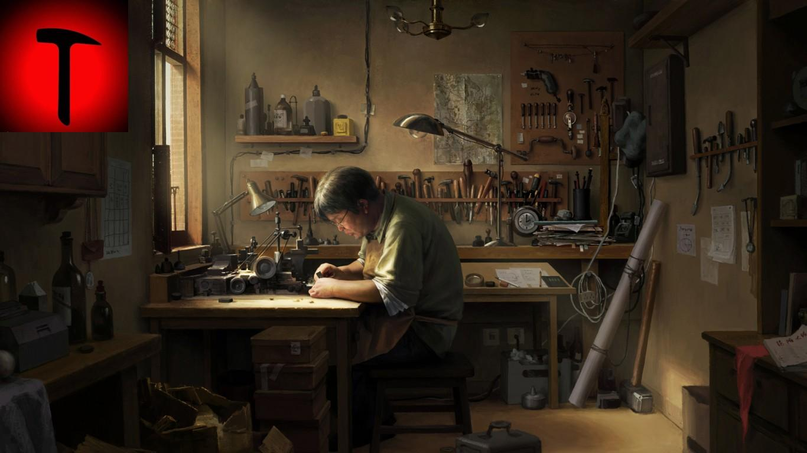

## 我做独立博客的原因

记得以前有看到一篇由独立博客站长的博文，介绍独立博客如何搭建，搭建完后的注意事项。其中就有说到独立博客上线后，可以发布一篇《我为什么要做独立博客》的博文。而我认为这个题目是一个问句，自问自答略显古怪。所以我的这篇文章的名字就是《我做独立博客的原因》。

当我与好友聊起最近为了wordpress的主题与其插件不兼容而必须修改代码焦头烂额时，他反问我：“做博客的话新浪博客不就可以了吗？”我犹豫了一会儿。是的，新浪博客的模板完全免费，有很多的各界大牛，多种多样的功能，与微博绑定且只要开通发几篇像模像样的文章，就很快会被搜索引擎收录。而且也因为与微博绑定，只要一发布，刷微博的好友们马上能看见，这是十分便利的，都不需要自己做SEO优化网站。

可是，我从很早以前就很想自己搭建一个网站了。14岁那年自己偷偷借书用Dreamweaver 8写一个魔兽争霸战队的官方网站，但我完全是像做word一样在写静态网站，且对网站的配色没有系统的学习，做出来几个静态页面，不伦不类。然而最重要的是，我并不会写动态的代码，甚至于对数据库等一无所知。后来慢慢了解access可以装在网站文件目录下，拼命地寻找免费空间。但那个时候，免费空间都是吸引客户的手段，或者是骗取身份信息。我不是什么天才，也没有足够的时间去学习这部分知识。在我父母与我自己的眼中这就是在玩而已，与学习毫无关系。因此ASP的代码对于14岁的孩子实在太过深奥。

今年18周岁了，我还是不会ASP，但是我已经知道借助程序搭建一个网站。虽然这并非我的本意。我明白开源的wordpress背后有多少人为它编写主题与插件，使它成为一个优秀的博客，甚至不仅是博客，也是CMS的建站平台。我下一步的目标是要自己写一个主题，编写几个插件，最后自己从头开始写自己的Blog程序。
<!--more-->
## 我会在独立博客中发布什么样的文章？

目前分为三类：日常、转载、读后感。我在平时对于生活有着许多感悟，我需要一个平台来倾诉。因此这是必不可少的。因为我觉得自己的文字过于稚嫩，所以我会转载一些别人的优秀文章来丰富自己的博客。读后感是我对书的感悟。我不是个喜欢读书的人，但我明白读书的重要性，甚至我认为不读好书，思维会停滞不前，思想滞后是十分可怕的。

目前我自己写的文章水平不高，文笔稚嫩，各位看官若是看到不好的地方请务必指正。不要顾及情面，毕竟人只有犯错才会进步。作为一个刚刚成年、稚气未脱的大男孩，我现在无法去装成熟，或者说我必须经历时间的洗礼才能渐渐成熟。

在我的水平渐渐提高后，我会在建一个文章分类，专门收录自己的原创文章。

另外，我会涉猎视频制作，也许再过几个月大家就能看到我制作的视频了。

最后，用一句罗永浩的话来表达我现在的感受：

我不是为了输赢，我就是认真。

