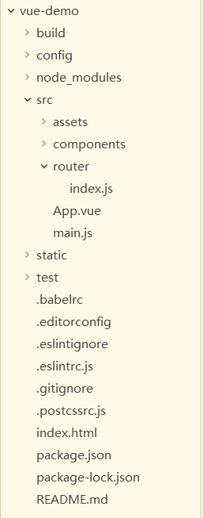
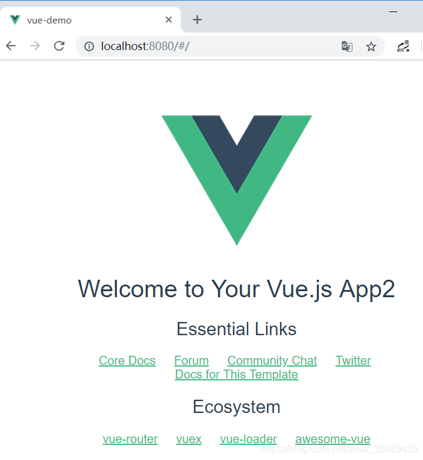
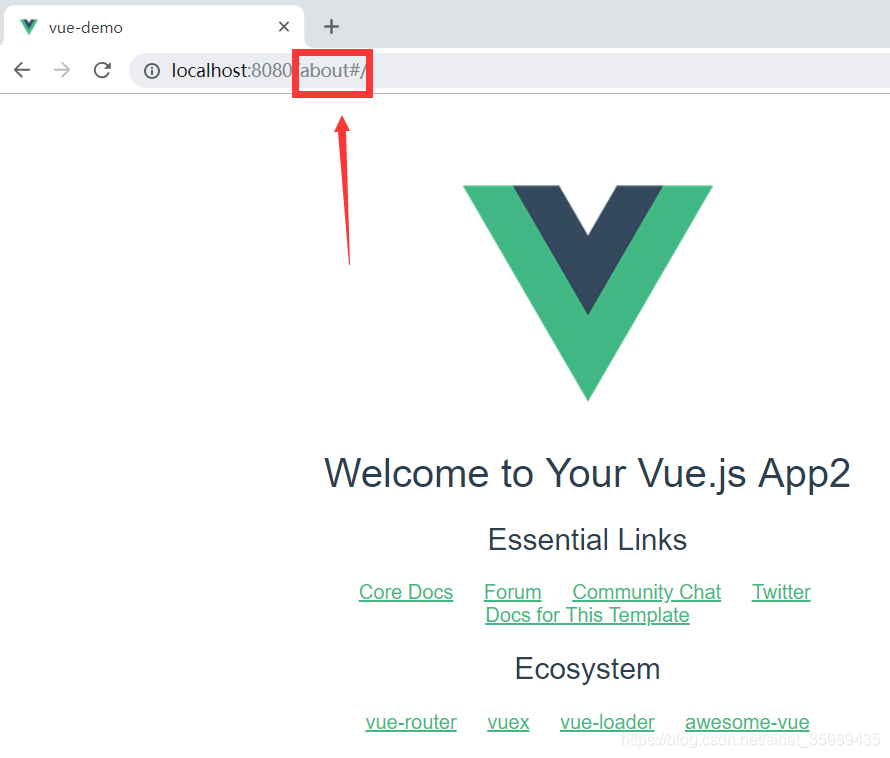
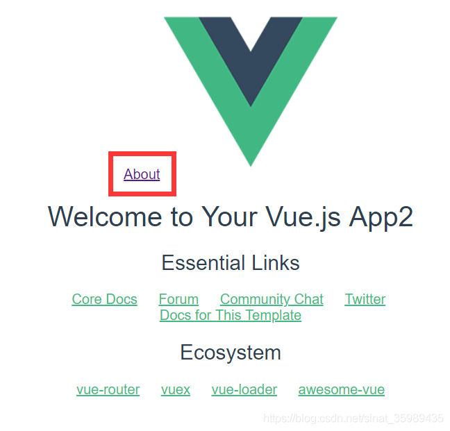
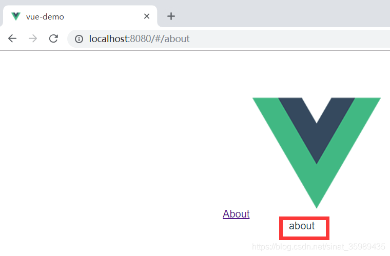

​
vue-cli（vue脚手架）超详细教程：[vue-cli（vue脚手架）超详细教程_Yin_Xiaobo的博客-CSDN博客_vue-cli(vue脚手架)超详细教程](https://blog.csdn.net/wulala_hei/article/details/85000530)
<!--more-->
这个教程里面是使用 vue init webpack app-name，但官方文档中建议的命令是 vue create app-name

但这两个命令创建的项目是有些不一样的，vue init是版本2的方法，vue create是版本3的方法。但网上搜索了一圈，有人说两种方法都是vue.js + webpack结合的。

当然了现在还不是很熟悉babel，所以根本看不懂。。

这回我使用vue init webpack vue-demo，一阵操作之后，得到：

这样的一个结构。注意，src/router下有个index.js，里面装着路由：
```javascript
import Vue from 'vue'
import Router from 'vue-router'
import HelloWorld from '@/components/HelloWorld'

Vue.use(Router)

export default new Router({
  routes: [
    {
      path: '/',
      name: 'HelloWorld',
      component: HelloWorld
    }
  ]
})
```
同时在components文件夹下有一个 HelloWorld.vue，里面装着一个模板文件。

注意到在/src/router/index.js里，第三行引入了HelloWorld的component，然后放在路由中，根目录指向的component。

所以在执行npm run dev之后，就可以直接打开HelloWorld了。


这个页面就是通过根目录的路由得到的。

然后我们添加一个路由：

```javascript
import Vue from 'vue'
import Router from 'vue-router'
import HelloWorld from '@/components/HelloWorld'
import About from '@/components/About'
Vue.use(Router)

export default new Router({
  routes: [
    {
      path: '/',
      name: 'HelloWorld',
      component: HelloWorld
    },
    {
      path: '/about',
      name: 'about',
      component: About
    }
  ]
})
```
​
增加一个about路由。

然后再components文件夹下加入一个About.vue。然后编译通过，但直接通过http://localhost:8080/about/ 访问，会回到根目录的HelloWorld页。

为什么呢？

原来Vue-Router用的是Hash模式，文档：[不同的历史模式 | Vue Router](https://router.vuejs.org/zh/guide/essentials/history-mode.html)

就是说怕直接访问没有安排的路由，会报404错误，所以就自动跳转回来了。

​

之所以有个#也是因为hash模式。

所以怎么访问路由呢？

在App.vue里，加入一行 <router-link to="/about">About</router-link>
```html
<template>
  <div id="app">
    <router-link to="/about">About</router-link>
    
   
    <router-view/>
  </div>
</template>
```

然后，再次访问时就有一个超链接：



从超链接中点击，就能访问那个路由了。



这里多提一句，那个#有些扎眼，但在文档中他说如果没有#，则需要在后端设置404的跳转。